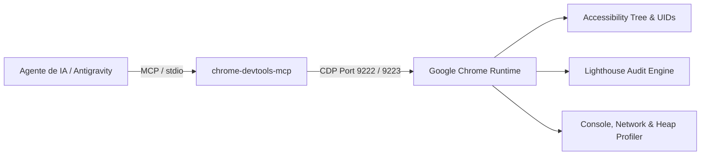

# SKILL: Chrome DevTools para Agentes (Padrão Oficial Google)

> **Fonte Canônica:** [developer.chrome.com/docs/devtools/agents](https://developer.chrome.com/docs/devtools/agents?hl=pt-br)  
> **Arquitetura:** Chrome DevTools MCP (`chrome-devtools-mcp@latest`) + Chrome DevTools Protocol (CDP)

---

## 1. Visão Geral e Topologia de Portas

O Chrome DevTools para Agentes concede aos modelos de IA a capacidade de inspecionar, navegar, emular e auditar instâncias reais do Google Chrome em tempo de execução.

### Topologia Canônica de Portas
*   **Porta 9222 (Instância Padrão):** Navegador regular de desenvolvimento e visualização de usuário.
*   **Porta 9223 (Instância Admin / Headless):** Instância isolada para automações administrativas e auditorias em lote.
*   **Comando de Invocação Rápida:** `/browser <ação ou URL>` (subagente integrado no Antigravity 2.0).

---

## 2. Protocolo de Grounding Visual e Árvore de Acessibilidade

Para máxima robustez e **imunidade a alterações cosméticas de CSS ou classes Tailwind**, os agentes devem priorizar a semântica nativa da plataforma:

1.  **Captura de Snapshot Estruturado:**
    Invocar `take_snapshot` para extrair a árvore de nós com `uid` unívoco e atributos semânticos (`role`, `name`, `value`, `heading level`).
2.  **Identificação e Interação por UID:**
    *   Para cliques, focos e hovers, fornecer o `uid` exato obtido no snapshot (ex.: `uid="3_156"`).
    *   Evitar seletores CSS arbitrários ou XPath complexos que quebram com atualizações de layout.
3.  **Inspeção Pontual e Element-Level Screenshot:**
    *   Ao capturar evidências visuais de componentes específicos, usar `take_screenshot` passando o `uid` do nó pai ou container.
    *   Utilizar formato `webp` com qualidade $\ge 80$ para máxima fidelidade e economia de tokens.

---

## 3. Ciclo de Validação Zero-Rework (Pre-Commit Frontend Loop)

Antes de finalizar qualquer alteração de interface ou marcar tarefa como concluída, o agente deve seguir o loop determinístico:

$$\text{Código / Diff} \longrightarrow \text{Build Turbopack} \longrightarrow \text{CDP Navigation} \longrightarrow \text{Visual Inspection} \longrightarrow \text{Zero-Rework Pass}$$

1.  **Deploy Local / Servidor Ativo:** Garantir que o servidor esteja ouvindo (ex.: `http://localhost:3000`).
2.  **Navegação e Hidratação:** Navegar via `navigate_page` e aguardar a estabilização do DOM (`wait_for` ou checagem de `document.readyState === 'complete'`).
3.  **Simulação de Hover e Estados Dinâmicos:**
    *   Verificar cursores de gráficos (ex.: Recharts) para assegurar que não existam caixas brancas opacas (`#f5f5f5`) cobrindo dados.
    *   Validar menus suspensos, tooltips e gavetas em resoluções desktop ($1280\text{px}$) e mobile ($375\text{px}$).
4.  **Auditoria Proativa de Core Web Vitals e Acessibilidade:**
    *   **LCP (Largest Contentful Paint):** $\le 2.5\text{s}$
    *   **CLS (Cumulative Layout Shift):** $\le 0.1$
    *   **INP (Interaction to Next Paint):** $\le 200\text{ms}$
    *   **TTFB (Time to First Byte):** $\le 800\text{ms}$
    *   **WCAG Contrast:** Contraste mínimo de $4.5:1$ para texto normal e $3:1$ para elementos gráficos.

---

## 4. Diagnóstico Ativo: Console, Rede e Heap Memory

*   **Console Audit:** Invocar `list_console_messages` com filtro `types: ["error"]`. O critério de aceite SOTA é **0 erros de console**.
*   **Network Inspection:** Invocar `list_network_requests` para verificar que requisições HTTP retornem `status: 200` ou `304`, sem respostas `4xx` ou `5xx`.
*   **Memory Profiling:** Monitorar `window.performance.memory.usedJSHeapSize`. Detectar e eliminar vazamentos em listeners de WebWorker, SSE ou WebSocket.

---

## 5. Boas Práticas e Resolução de Armadilhas Comuns

*   **Armadilha do Hover sem UID:** A ferramenta `hover` do MCP exige o parâmetro `uid` extraído de `take_snapshot`. Não passar coordenadas x/y soltas sem UID correspondente.
*   **Armadilha de Viewport vs. FullPage:** Quando a página utiliza contêineres com overflow e scroll dinâmico, preferir capturar por `uid` do card alvo ou utilizar `fullPage: true` com recorte programático via script Python.
*   **Armadilha de Variáveis de Tema:** No Tailwind v4, variáveis `@theme` recebem prefixo `--color-` (ex.: `var(--color-accent-rose)`). Nunca utilizar nomes legados sem o prefixo.
