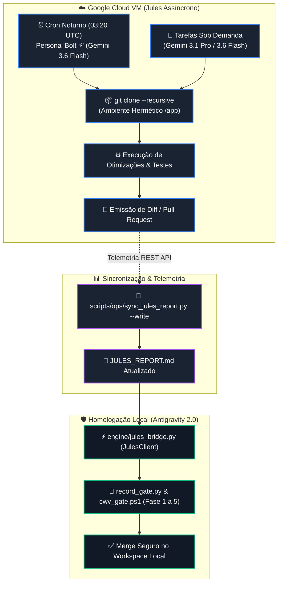

# SKILL: Google Jules Cloud — Orquestração Assíncrona & Engenharia em Nuvem

> **Plataforma Oficial:** [jules.google.com](https://jules.google.com/)  
> **API REST v1alpha:** `https://jules.googleapis.com/v1alpha`  
> **Módulo Canônico:** [`engine/jules_bridge.py`](file:///c:/Users/rapha/.gemini/Site/engine/jules_bridge.py)  
> **Relatório Dinâmico:** [`JULES_REPORT.md`](file:///c:/Users/rapha/.gemini/Site/JULES_REPORT.md)  
> **Sincronizador Oficial:** [`scripts/ops/sync_jules_report.py`](file:///c:/Users/rapha/.gemini/Site/scripts/ops/sync_jules_report.py)  
> **Governança:** Protocolo Master Chico SOTA v8.0 GOLD (Seção X — Jules Cloud MCP Bridge)

---

## 1. Matriz de Modelos & Alinhamento de Produção

Conforme verificado nas preferências do ecossistema ([jules.google.com/settings/general](https://jules.google.com/settings/general)), o Google Jules opera estritamente com dois modelos de fronteira:

| Modelo | Tier / Modo | Propósito Primário | Características Operacionais |
| :--- | :--- | :--- | :--- |
| **`Gemini 3.6 Flash`** | **Padrão (Default)** | Micro-otimizações diárias, refatores rápidos, cron noturno `Bolt ⚡`. | Máxima velocidade de clone/análise, consumo marginal de tokens, execução em < 120s. |
| **`Gemini 3.1 Pro`** | **Avançado (Deep)** | Auditorias arquiteturais densas, teoremas matemáticos PMev, migrações pesadas. | Raciocínio profundo multi-step, geração massiva de testes, resolução de conflitos complexos. |

### Configuração da Conta & Cotas
- **Assinatura:** `Jules in Pro` (Workflows intensivos contínuos)
- **Teto Operacional:** Até **100 sessões concorrentes por dia** para o repositório `RaphaelVitoi/Site`.
- **Credenciais:** Chave `JULES_API_KEY` persistida em `HKCU:\Environment:JULES_API_KEY` (Pure ASCII, zero plaintext no Git).

---

## 2. Topologia Operacional Autopoiética (Ciclo Diário Não-Concorrente)

O ecossistema opera sob estrita **não-concorrência** e **isolamento térmico**:



---

## 3. Playbook de Invocação Rápida via Python Bridge

```python
from engine.jules_bridge import JulesClient, JulesSessionRequest, JULES_MODEL_FLASH, JULES_MODEL_PRO

client = JulesClient()

# 1. Disparar otimizacao rapida de performance (Gemini 3.6 Flash):
status = client.create_session(
    JulesSessionRequest(
        source="sources/github/RaphaelVitoi/Site",
        prompt="Bolt ⚡: Identificar e otimizar funcoes de ordenacao no frontend/src/lib/telemetry-client.ts",
        branch="master",
        auto_approve_plan=True,
        model=JULES_MODEL_FLASH,
    )
)
print(f"Sessao criada: {status.session_id} | Status: {status.state}")

# 2. Consultar status da sessao:
current_status = client.get_session_status(status.session_id)
print(f"Status atual: {current_status.state}")

# 3. Baixar e inspecionar o patch/diff gerado:
if current_status.state == "COMPLETED":
    diff = client.get_diff(status.session_id)
    print(f"Arquivos alterados: {diff.files_changed}")
    print(diff.diff_content)
```

---

## 4. Retorno de Investimento Diário (ROI Quantitativo & Qualitativo)

1. **Zero Sobrecarga de CPU/RAM Local:** Todas as 100 sessões possíveis rodam em contêineres Google Cloud de alta performance sem interferir no runtime do Next.js local (porta 3000) ou CDP (porta 9222).
2. **Manutenção Preventiva Autopoiética:** O cron `Bolt ⚡` atua como um sistema imunológico contínuo que poda dependências zumbis, refatora imports e previne regressões durante a noite.
3. **Auditoria em Malha Fechada:** `JULES_REPORT.md` oferece visibilidade total para auditoria imediata ao início de cada dia de trabalho.
