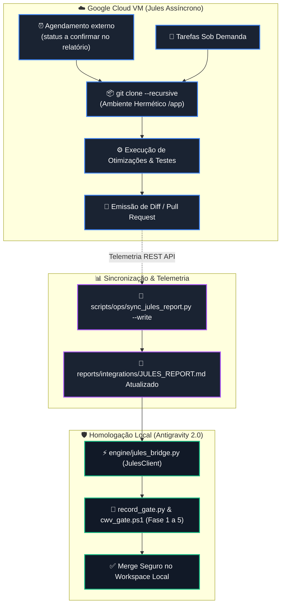

# SKILL: Google Jules Cloud — Orquestração Assíncrona & Engenharia em Nuvem

> **Plataforma Oficial:** [jules.google.com](https://jules.google.com/)  
> **API REST v1alpha:** `https://jules.googleapis.com/v1alpha`  
> **Módulo Canônico:** [`engine/jules_bridge.py`](../../../engine/jules_bridge.py)
> **Relatório Dinâmico:** [`JULES_REPORT.md`](../../../reports/integrations/JULES_REPORT.md)
> **Sincronizador Oficial:** [`scripts/ops/sync_jules_report.py`](../../../scripts/ops/sync_jules_report.py)
> **Governança:** Protocolo Master Chico SOTA v8.0 GOLD (Seção X — Jules Cloud MCP Bridge)

---

## 1. Alinhamento de Produção — a escolha é na UI, não pelo portão MCP

> **O MODELO NÃO É CONFIGURÁVEL POR REQUISIÇÃO, E ESTA SKILL NÃO O ROTEIA.**
>
> **Mesmo padrão do Stitch** (Tier 0, 2026-09-04): o seletor de modelo existe e é
> do operador, mas vive nas **preferências da interface**
> ([jules.google.com/settings/general](https://jules.google.com/settings/general)) —
> não no portão de entrada.
>
> Medido em 2026-09-04 nos dois lados da fronteira. A `createSession` da API
> v1alpha aceita `prompt`, `title`, `sourceContext`, `requirePlanApproval` e
> `automationMode`; as ferramentas do MCP `google-jules` aceitam `source`,
> `prompt`, `branch` e `auto_approve_plan`. Nenhuma das duas expõe seleção de
> modelo.
>
> A versão anterior desta seção trazia uma matriz de roteamento e um exemplo
> passando `model=...` para `JulesSessionRequest`. Aquele exemplo lançaria
> `TypeError`: a dataclass é `frozen/slots` e nunca teve o campo. Instrução de
> automação que não alcança mecanismo é promessa ao operador, e foi retirada por
> ordem do Tier 0.
>
> Para trocar o modelo do Jules, use as preferências da própria plataforma.

### Configuração da Conta & Cotas
- **Assinatura:** `Jules in Pro` (Workflows intensivos contínuos)
- **Cotas:** São próprias da conta e podem mudar; consulte a interface oficial no momento do despacho. O bridge não declara nem garante um teto fixo.
- **Credenciais:** Chave `JULES_API_KEY` persistida em `HKCU:\Environment:JULES_API_KEY` (Pure ASCII, zero plaintext no Git).

---

## 2. Topologia Operacional: Nuvem, Sincronização e Homologação

As sessões rodam no serviço do Jules; sincronização e homologação continuam sendo
responsabilidades locais distintas. A agenda externa não é presumida ativa por
esta skill:



---

## 3. Playbook de Invocação Rápida via Python Bridge

```python
from engine.jules_bridge import JulesClient, JulesSessionRequest

client = JulesClient()

# 1. Disparar otimizacao rapida de performance:
status = client.create_session(
    JulesSessionRequest(
        source="sources/github/RaphaelVitoi/Site",
        prompt="Bolt ⚡: Identificar e otimizar funcoes de ordenacao no frontend/src/lib/telemetry-client.ts",
        branch="master",
        auto_approve_plan=True,
    )
)
print(f"Sessao criada: {status.session_id} | Status: {status.state}")

# 2. Consultar status da sessao:
current_status = client.get_session_status(status.session_id)
print(f"Status atual: {current_status.state}")

# 3. Baixar e inspecionar o patch/diff gerado:
if current_status.state == "COMPLETED":
    diff = client.get_diff(status.session_id)
    print(f"Arquivos alterados: {diff.files_changed}")
    print(diff.diff_content)
```

---

## 4. Retorno de Investimento Diário (ROI Quantitativo & Qualitativo)

1. **Execução remota:** O trabalho solicitado ao Jules executa na infraestrutura do provedor; o bridge local ainda faz chamadas de API e a operação não garante consumo local zero.
2. **Automação:** Use o relatório mais recente para observar atividade atribuída ao cron `Bolt ⚡`; a skill não presume que o cron esteja ativo sem telemetria atual.
3. **Proveniência:** `reports/integrations/JULES_REPORT.md` é uma fotografia da última sincronização bem-sucedida; confira a data no cabeçalho antes de tratá-la como estado atual.
