# SKILL: Google Cloud Stitch — UI Generativa & Design Systems SOTA

> **Plataforma Web Oficial:** [stitch.withgoogle.com](https://stitch.withgoogle.com/)  
> **Servidor MCP Remoto:** `https://stitch.googleapis.com/mcp` (JSON-RPC 2.0)  
> **Módulo Canônico:** [`engine/stitch_bridge.py`](file:///c:/Users/rapha/.gemini/Site/engine/stitch_bridge.py)  
> **Relatório Dinâmico:** [`STITCH_REPORT.md`](file:///c:/Users/rapha/.gemini/Site/STITCH_REPORT.md)  
> **Sincronizador Oficial:** [`scripts/ops/sync_stitch_report.py`](file:///c:/Users/rapha/.gemini/Site/scripts/ops/sync_stitch_report.py)  
> **Projeto Vinculado:** `projects/18242753218562483944` (*Nexus PMev & Poker Racional UI*)  
> **Design System Ativo:** `Obsidian Analytics` (`assets/6f9c8c6e7114422393d45b0c4ca02808`)

---

## 1. Matriz de Modelos de UI & Roteamento Visual

Conforme auditado diretamente na interface oficial do Stitch ([stitch.withgoogle.com](https://stitch.withgoogle.com/)), o motor generativo opera com dois tiers especializados:

| Modo / Tier | Modelo Canônico | Papel no Ecossistema | Fidelidade Estética |
| :--- | :--- | :--- | :--- |
| ✨ **Balanced (Padrão)** | **`Gemini 3.8 Flash`** | Produção final de telas, respeito estrito a tokens, renderização de HUDs translúcidos e painéis matemáticos. | **Padrão-Ouro**: Raciocínio espacial avançado, contraste WCAG AAA e glassmorphism complexo. |
| ⚡ **Speed** | **`Gemini 3.5 Flash-Lite`** | Exploração ágil de alternativas, brainstorming de wireframes e ciclos de baixa latência (*rapid collaboration*). | **Ágil / Eficiente**: Geração em segundos com fidelidade estrutural sólida. |

> [!NOTE]
> Os modelos legados `Gemini 3 Flash` e `Gemini 3.1 Pro` foram descontinuados na produção do Stitch e substituídos por este duo.

---

## 2. Design System Canônico: `Obsidian Analytics`

O Stitch sintetiza as diretrizes estéticas do Poker Racional a partir de [frontend/src/app/globals.css](file:///c:/Users/rapha/.gemini/Site/frontend/src/app/globals.css):

* **Fundo & Superfícies:** `Canvas Deep` (`#030610`), `Space Base` (`#0F1729`), `Panel Surface` (`#344154` com backdrop blur de 20px).
* **Bordas & Brilhos:** Contornos perimetrais de 1px com brilho dourado (`rgba(242, 183, 43, 0.15)`).
* **Paleta Semântica PMev:**
  - 🟡 **Gold (`#f2b72b`):** Ações primárias, marcas SOTA e métricas de alta relevância.
  - 🟢 **Emerald (`#54dea2`):** Regiões de lucro, valor esperado positivo (+EV) e zonas seguras.
  - 🔴 **Rose (`#EE445E`):** Zonas de risco estocástico, vazamentos (*leaks*) e insolvência.
  - 🟣 **Math Indigo (`#6467F2`):** Operadores lógicos, equações KaTeX e equilíbrios de Nash.
* **Tipografia Dupla:** `Geist` para interfaces executivas e `JetBrains Mono` para dados tabulares, EV e stack sizes.

---

## 3. Esteira de Prototipagem Não-Concorrente (Stitch → Next.js)

```mermaid
flowchart LR
    subgraph Conceito["💡 1. Formulação"]
        Req["Demanda de UI\n(Ex: Scanner Gravitacional)"]
    end

    subgraph StitchCloud["🎨 2. Stitch MCP Cloud"]
        Gen["generate_screen_from_text\n(Gemini 3.8 Flash / 3.5 Flash-Lite)"]
        Var["generate_variants\n(3 a 5 variações)"]
        DS["apply_design_system\n(Obsidian Analytics)"]
        Gen --> Var --> DS
    end

    subgraph Componentizacao["⚡ 3. Código Next.js"]
        HTML["get_screen\n(Extração de HTML/CSS)"]
        React["Componentes React 19 / Tailwind 4\n(frontend/src/components/)"]
        HTML --> React
    end

    subgraph Homologacao["🛡️ 4. Validação SOTA"]
        Gate["cwv_gate.ps1 (Fase 1 e 2)\nLighthouse + Core Web Vitals"]
    end

    Req --> Gen
    DS --> HTML
    React --> Gate

    classDef cloud fill:#1a2332,stroke:#ec4899,stroke-width:2px,color:#fff;
    classDef react fill:#111927,stroke:#3b82f6,stroke-width:2px,color:#fff;
    classDef gate fill:#111927,stroke:#10b981,stroke-width:2px,color:#fff;
    class Gen,Var,DS cloud;
    class HTML,React react;
    class Gate gate;
```



---

## 4. Playbook de Invocação Rápida via Python Bridge

```python
from engine.stitch_bridge import StitchClient, STITCH_MODEL_BALANCED, STITCH_MODEL_SPEED

client = StitchClient()

# 1. Gerar nova tela com alta qualidade visual (Gemini 3.8 Flash):
screen = client.generate_screen_from_text(
    project_id="18242753218562483944",
    prompt="Painel de Comparacao de Nash com radar poligonal glassmorphism e realce dourado",
    model_tier=STITCH_MODEL_BALANCED,
    device_type="DESKTOP",
    design_system="assets/6f9c8c6e7114422393d45b0c4ca02808",
)

# 2. Listar todas as telas do projeto:
screens = client.list_screens("18242753218562483944")
print(f"Total de telas: {len(screens)}")

# 3. Sincronizar relatorio geral:
# python scripts/ops/sync_stitch_report.py --write
```

---

## 5. Retorno de Investimento Diário (ROI Quantitativo & Qualitativo)

1. **Aceleração 10x no Ciclo de Ideação:** Protótipos de dashboards complexos são gerados em segundos, eliminando rascunhos manuais em Figma.
2. **Imunidade contra "Drift" de Design:** O Design System `Obsidian Analytics` atua como guardião automatizado, impedindo que telas geradas divirjam das cores, fontes ou contrastes canônicos do Site.
3. **Conversão Direta para Tailwind CSS 4:** Telas inspecionadas via `get_screen` entregam diretamente classes utilitárias modernas compatíveis com o `@theme` do projeto.
