# SKILL: Google Cloud Stitch — UI Generativa & Design Systems SOTA

> **Plataforma Web Oficial:** [stitch.withgoogle.com](https://stitch.withgoogle.com/)  
> **Servidor MCP Remoto:** `https://stitch.googleapis.com/mcp` (JSON-RPC 2.0)  
> **Módulo Canônico:** [`engine/stitch_bridge.py`](../../../engine/stitch_bridge.py)
> **Relatório Dinâmico:** [`STITCH_REPORT.md`](../../../reports/integrations/STITCH_REPORT.md)
> **Sincronizador Oficial:** [`scripts/ops/sync_stitch_report.py`](../../../scripts/ops/sync_stitch_report.py)
> **Projeto Vinculado:** `projects/18242753218562483944` (*Nexus PMev & Poker Racional UI*)  
> **Design System Ativo:** `Obsidian Analytics` (`assets/6f9c8c6e7114422393d45b0c4ca02808`)

---

## 1. Motor Generativo — a escolha é na UI, não pelo portão MCP

Na verificação de 2026-09-04, o seletor de modelo era **do operador**, no compositor de prompt da interface
([stitch.withgoogle.com](https://stitch.withgoogle.com/)) — verificado em tela
pelo Tier 0 na mesma data.

> [!IMPORTANT]
> **A escolha é na UI. Esta skill não roteia modelo, e o bridge não tem
> constante de tier.**
>
> `Balanced` e `Speed` são rótulos do **seletor da interface**, não valores do
> **portão de entrada** do MCP. `generate_screen_from_text` só repassa `modelId`
> para os enums oficiais do gateway — e esse enum é conservado deliberadamente,
> porque é o contrato da porta e não acompanha o nome comercial do modelo do dia.
>
> A versão anterior desta seção trazia uma matriz de roteamento, e o bridge
> expunha `STITCH_MODEL_BALANCED`/`STITCH_MODEL_SPEED`. Medido em 2026-09-04:
> chamar o método com `SPEED` produzia **exatamente a mesma requisição** que a
> chamada padrão, sem erro e sem aviso — o rótulo da UI não é aceito pela porta.
> Instrução de automação que não alcança mecanismo é promessa ao operador, e foi
> retirada por ordem do Tier 0.
>
> Pelo bridge, omitir o modelo é o uso correto. Para escolher entre `Speed` e
> `Balanced`, use o seletor da própria interface do Stitch.

---

## 2. Design System Canônico: `Obsidian Analytics`

O Stitch sintetiza as diretrizes estéticas do Poker Racional a partir de [frontend/src/app/globals.css](../../../frontend/src/app/globals.css):

* **Fundo & Superfícies:** `Canvas Deep` (`#030610`), `Space Base` (`#0F1729`), `Panel Surface` (`#344154` com backdrop blur de 20px).
* **Bordas & Brilhos:** Contornos perimetrais de 1px com brilho dourado (`rgba(242, 183, 43, 0.15)`).
* **Paleta Semântica PMev:**
  - 🟡 **Gold (`#f2b72b`):** Ações primárias, marcas SOTA e métricas de alta relevância.
  - 🟢 **Emerald (`#54dea2`):** Regiões de lucro, valor esperado positivo (+EV) e zonas seguras.
  - 🔴 **Rose (`#EE445E`):** Zonas de risco estocástico, vazamentos (*leaks*) e insolvência.
  - 🟣 **Math Indigo (`#6467F2`):** Operadores lógicos, equações KaTeX e equilíbrios de Nash.
* **Tipografia Dupla:** `Geist` para interfaces executivas e `JetBrains Mono` para dados tabulares, EV e stack sizes.

---

## 3. Esteira de Prototipagem Não-Concorrente (Stitch → Next.js)

```mermaid
flowchart LR
    subgraph Conceito["💡 1. Formulação"]
        Req["Demanda de UI\n(Ex: Scanner Gravitacional)"]
    end

    subgraph StitchCloud["🎨 2. Stitch MCP Cloud"]
        Gen["generate_screen_from_text\n(modelo escolhido na UI)"]
        Var["generate_variants\n(3 a 5 variações)"]
        DS["apply_design_system\n(Obsidian Analytics)"]
        Gen --> Var --> DS
    end

    subgraph Componentizacao["⚡ 3. Código Next.js"]
        HTML["get_screen\n(Extração de HTML/CSS)"]
        React["Componentes React 19 / Tailwind 4\n(frontend/src/components/)"]
        HTML --> React
    end

    subgraph Homologacao["🛡️ 4. Validação SOTA"]
        Gate["cwv_gate.ps1 (Fase 1 e 2)\nLighthouse + Core Web Vitals"]
    end

    Req --> Gen
    DS --> HTML
    React --> Gate

    classDef cloud fill:#1a2332,stroke:#ec4899,stroke-width:2px,color:#fff;
    classDef react fill:#111927,stroke:#3b82f6,stroke-width:2px,color:#fff;
    classDef gate fill:#111927,stroke:#10b981,stroke-width:2px,color:#fff;
    class Gen,Var,DS cloud;
    class HTML,React react;
    class Gate gate;
```



---

## 4. Playbook de Invocação Rápida via Python Bridge

```python
from engine.stitch_bridge import StitchClient

client = StitchClient()

# 1. Gerar nova tela:
#    Sem model_tier -- a escolha entre Balanced e Speed vive no seletor da UI do
#    Stitch, nao no portao MCP. Ver secao 1.
screen = client.generate_screen_from_text(
    project_id="18242753218562483944",
    prompt="Painel de Comparacao de Nash com radar poligonal glassmorphism e realce dourado",
    device_type="DESKTOP",
    design_system="assets/6f9c8c6e7114422393d45b0c4ca02808",
)

# 2. Listar todas as telas do projeto:
screens = client.list_screens("18242753218562483944")
print(f"Total de telas: {len(screens)}")

# 3. Sincronizar relatorio geral:
# python scripts/ops/sync_stitch_report.py --write
```

---

## 5. Retorno de Investimento Diário (ROI Quantitativo & Qualitativo)

1. **Ideação visual:** Geração de telas e variantes acelera a exploração de alternativas; tempo e qualidade dependem do prompt e exigem revisão.
2. **Referência de design:** `Obsidian Analytics` fornece tokens e diretrizes, mas não garante por si só conformidade automática nem elimina drift.
3. **Integração revisável:** Conteúdo obtido por `get_screen` pode orientar componentes Tailwind/Next.js; valide acessibilidade, responsividade e fidelidade antes de produção.
