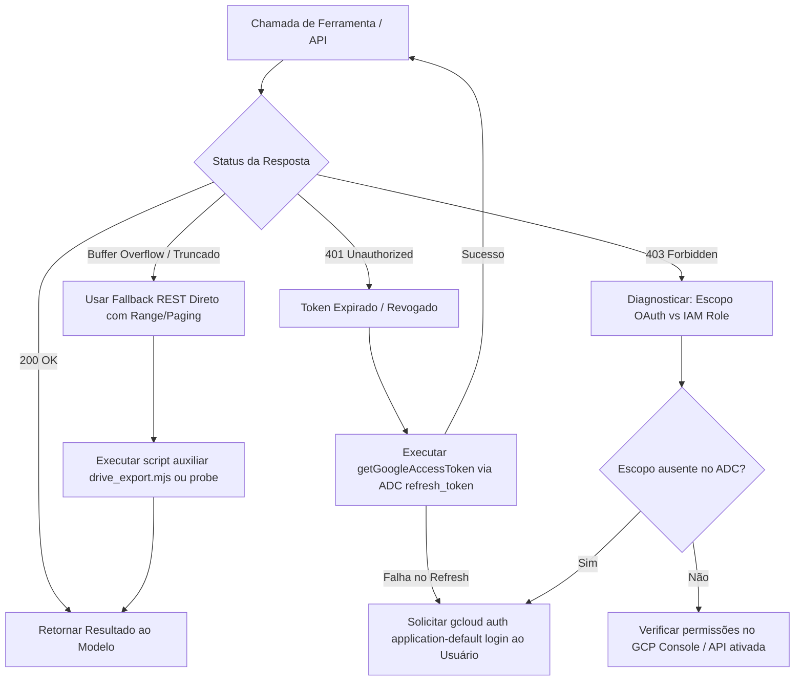

# Google Workspace SOTA Master Skill (`google-workspace`)

> **Padrão-Ouro de Integração, Automação e Orquestração do Ecossistema Google Workspace**  
> Cobre Google Drive, Google Calendar, Gmail e Google Sheets sob governança Chico SOTA v8.0 GOLD.

---

## 1. Topologia de Integração & Servidores MCP

O ecossistema opera de forma modular com quatro servidores MCP dedicados conectados via protocolo SSE/HTTP ao gateway oficial do Google Cloud:

| Serviço | Servidor MCP | Endpoint Canônico | Escopo OAuth2 Obrigatório |
| :--- | :--- | :--- | :--- |
| **Google Drive** | `google-workspace-drive` | `https://drive.googleapis.com/mcp/v1` | `https://www.googleapis.com/auth/drive.readonly` *(ou `drive`)* |
| **Google Calendar**| `google-workspace-calendar` | `https://calendar-json.googleapis.com/mcp/v1` | `https://www.googleapis.com/auth/calendar.readonly` *(ou `calendar`)* |
| **Google Sheets** | `google-workspace-sheets` | `https://sheets.googleapis.com/mcp/v1` | `https://www.googleapis.com/auth/spreadsheets.readonly` *(ou `spreadsheets`)* |
| **Gmail** | `google-workspace-gmail` | `https://gmail.googleapis.com/mcp/v1` | `https://www.googleapis.com/auth/gmail.readonly` *(ou `gmail`)* |

### Configuração Canônica nos Arquivos `mcp_config.json`
Os servidores são declarados em:
- `C:\Users\rapha\.gemini\config\mcp_config.json`
- `C:\Users\rapha\.gemini\antigravity\mcp_config.json`
- `C:\Users\rapha\.gemini\antigravity-ide\mcp_config.json`

Estrutura canônica de cada entrada:
```json
"google-workspace-drive": {
  "url": "https://drive.googleapis.com/mcp/v1"
}
```

---

## 2. Protocolo Pre-Flight Passo Zero (Autenticação e Tokens)

Antes de qualquer operação com Google Workspace, o agente deve validar o estado da autenticação local:

### 2.1 Fontes Canônicas de Credenciais
1. **OAuth Desktop Client:** `C:\Users\rapha\.gemini\gcp_oauth_client.json`  
   *(Contém `client_id` e `client_secret` do aplicativo aprovado no Google Cloud Console).*
2. **Application Default Credentials (ADC):**  
   `%APPDATA%\gcloud\application_default_credentials.json`  
   *(Contém os tokens ativos, `refresh_token` e os escopos autorizados).*

### 2.2 Reautenticação Manual (Se o token for revogado ou expirar os escopos)
Caso `gcloud` ou qualquer chamada retorne `invalid_grant` ou escopo insuficiente:
```powershell
gcloud auth application-default login `
  --client-id-file="C:\Users\rapha\.gemini\gcp_oauth_client.json" `
  --scopes="openid,https://www.googleapis.com/auth/userinfo.email,https://www.googleapis.com/auth/cloud-platform,https://www.googleapis.com/auth/drive.readonly,https://www.googleapis.com/auth/spreadsheets.readonly,https://www.googleapis.com/auth/calendar.readonly,https://www.googleapis.com/auth/gmail.readonly"
```

### 2.3 Obtenção Programática Silenciosa de Access Token
Em scripts utilitários locais (Node.js ou Python), utilize o `refresh_token` do ADC sem necessitar de login interativo:

```javascript
// Exemplo em Node.js: Obter Access Token a partir do ADC
import fs from "fs";
import path from "path";

export async function getGoogleAccessToken() {
  const adcPath = path.join(process.env.APPDATA, "gcloud", "application_default_credentials.json");
  const adc = JSON.parse(fs.readFileSync(adcPath, "utf8"));
  
  const tokenRes = await fetch("https://oauth2.googleapis.com/token", {
    method: "POST",
    headers: { "Content-Type": "application/x-www-form-urlencoded" },
    body: new URLSearchParams({
      client_id: adc.client_id,
      client_secret: adc.client_secret,
      refresh_token: adc.refresh_token,
      grant_type: "refresh_token"
    })
  });
  
  if (!tokenRes.ok) {
    throw new Error(`Falha ao renovar token: ${tokenRes.status} ${await tokenRes.text()}`);
  }
  const data = await tokenRes.json();
  return data.access_token;
}
```

---

## 3. Playbooks Operacionais Detalhados

### 3.1 Playbook: Google Drive (`google-workspace-drive`)

#### Diretrizes de Busca de Alta Precisão
- Sempre inclua `trashed = false` para filtrar itens na lixeira.
- Combine operadores booleanos (`and`, `or`) e use `contains` para termos aproximados.
- Tipos MIME comuns:
  - Google Docs: `application/vnd.google-apps.document`
  - Google Sheets: `application/vnd.google-apps.spreadsheet`
  - Pastas: `application/vnd.google-apps.folder`
  - Vídeos: `mimeType contains 'video/'`
  - Áudios: `mimeType contains 'audio/'`

#### Localização de Gravações e Notas de Reuniões do Google Meet
- **Anotações do Gemini:** Arquivos cujo nome contenha `Anotações do Gemini` ou `Reunião iniciada às` (`mimeType = 'application/vnd.google-apps.document'`).
- **Pastas do Meet:** Identificadores no padrão `xxx-yyyy-zzz` (ex.: `tig-xybo-vup`, `czt-cdwd-tox`).
- **Exportação Rápida de Conteúdo de Docs:**
  Para ler o texto integral de uma anotação de reunião sem carregar HTML pesado:
  ```http
  GET https://www.googleapis.com/drive/v3/files/{fileId}/export?mimeType=text/plain
  Authorization: Bearer {access_token}
  ```

---

### 3.2 Playbook: Google Calendar (`google-workspace-calendar`)

#### Consultas de Agenda e Conflitos
- Use timestamps RFC 3339 / ISO 8601 estritos (ex.: `2026-09-04T09:00:00-03:00`).
- Parâmetros `timeMin` e `timeMax` devem delimitar a janela necessária para não sobrecarregar o contexto com eventos passados.
- Ao listar eventos, inspecione `summary`, `start`, `end`, `hangoutLink` (link do Google Meet) e `attendees`.

#### Criação de Eventos com Google Meet
- Ao criar um evento com `create_event`, especifique:
  - `calendar_id: "primary"`
  - `start_time` e `end_time` (formato ISO 8601)
  - `summary` (título conciso e descritivo)
  - `description` (pauta estruturada em markdown)

---

### 3.3 Playbook: Google Sheets (`google-workspace-sheets`)

#### Leitura Eficiente de Dados
- Utilize intervalos estruturados (ex.: `AbaPrincipal!A1:Z100`) em vez de carregar a planilha inteira.
- Para obter nomes de abas e estrutura dimensional, use `get_spreadsheet`.
- Para extrair matriz de valores, use `get_values(spreadsheet_id, range)`.

#### Atualização e Inserção de Linhas
- `update_values`: Modifica células pontuais ou blocos contínuos.
- Evite múltiplas chamadas atômicas de 1 célula; formate os dados em matriz bidimensional `values: [[val1, val2], [val3, val4]]`.
- Formatação de valores: Números puros como números, datas no formato ISO (`YYYY-MM-DD`), textos sem quebras espúrias.

---

### 3.4 Playbook: Gmail (`google-workspace-gmail`)

#### Filtros de Busca Avançados
Utilize a sintaxe padrão do Gmail no parâmetro de busca:
- `is:unread`: E-mails não lidos.
- `from:usuario@dominio.com`: Filtrar remetente.
- `has:attachment`: Mensagens com anexos.
- `after:2026/08/01 before:2026/09/01`: Janela temporal estrita.
- `subject:(relatório OR sprint)`: Palavras-chave no assunto.

#### Criação de Rascunhos e Envio
- Prefira `create_draft` para permitir revisão prévia pelo usuário antes do disparo, a menos que envio autônomo imediato seja solicitado explicitamente.
- Trate o conteúdo em texto claro formatado ou HTML limpo.

---

## 4. Matriz de Resiliência & Tratamento de Falhas



### Regras de Ouro de Execução:
1. **Nunca exponha segredos de cliente ou tokens no chat.** Sempre mantenha em `HKCU` ou variáveis protegidas.
2. **Limite de Payload:** Para arquivos grandes de mídia no Drive (vídeos, áudios), **não** tente baixar o conteúdo binário diretamente no contexto. Extraia apenas metadados (`id`, `name`, `size`, `createdTime`, `webViewLink`).
3. **Docs & Transcrições:** Para ler Google Docs e transcrições do Meet, utilize o endpoint de exportação de texto puro (`/export?mimeType=text/plain`), reduzindo o consumo de tokens em até 90% comparado à estrutura JSON de formatação do Docs.

---

## 5. Scripts Utilitários Integrados

A skill disponibiliza ferramentas CLI em sua pasta `scripts/`:

1. **`scripts/probe_workspace.mjs`**: Executa healthcheck das 4 APIs (Drive, Sheets, Calendar, Gmail) e reporta latência e status:
   ```bash
   node scripts/probe_workspace.mjs
   ```
2. **`scripts/drive_export.mjs`**: Baixa instantaneamente o texto puro de um Google Doc ou transcrição do Meet pelo File ID:
   ```bash
   node scripts/drive_export.mjs <FILE_ID> [ARQUIVO_DESTINO]
   ```
