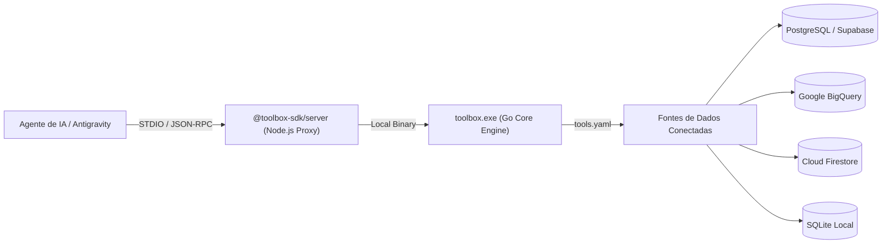

# SKILL: Google Cloud MCP Toolbox for Databases

> **Repositório Oficial:** [github.com/googleapis/mcp-toolbox](https://github.com/googleapis/mcp-toolbox)  
> **Pacote NPM:** `@toolbox-sdk/server@>=0.26.0` (Binário Go: `toolbox v1.9.0+`)  
> **Configuração Canônica:** `C:\Users\rapha\.gemini\config\tools.yaml`

---

## 1. Visão Geral da Arquitetura

O **MCP Toolbox for Databases** é o servidor MCP oficial de código aberto do Google para integração agêntica com mais de 30 fontes de dados relacionais, analíticas e NoSQL.



---

## 2. Regra de Ouro de Configuração no Windows OS

> [!CAUTION]
> **Prevenção do Erro `ERROR_INVALID_FUNCTION` (`Incorrect function`):**
> Nunca aponte `--config` ou flags legadas como `--tools-file` para um **diretório**. No Windows, a chamada de leitura de baixo nível do Go em pastas falha com erro de função incorreta, derrubando o servidor com `EOF`.

### Sintaxe Canônica de Flags
*   **Para Arquivo Específico:** `--config=C:\Users\rapha\.gemini\config\tools.yaml`
*   **Para Múltiplos Arquivos:** `--configs=file1.yaml,file2.yaml`
*   **Para Diretório de Configurações:** `--config-folder=C:\Users\rapha\.gemini\config\tools_dir`
*   **Para Fontes Pré-construídas Sem Arquivo:** `--prebuilt=postgres` ou `--prebuilt=bigquery`

---

## 3. Registro no `mcp_config.json`

O registro padrão-ouro deve operar via STDIO sem expor portas HTTP abertas desnecessárias:

```json
"mcp-toolbox-for-databases": {
  "command": "C:\\Users\\rapha\\.gemini\\bin\\toolbox.exe",
  "args": [
    "--config=C:\\Users\\rapha\\.gemini\\config\\tools.yaml",
    "--allowed-origins=http://localhost,http://127.0.0.1",
    "--allowed-hosts=localhost,127.0.0.1",
    "--stdio",
    "--user-agent-metadata=antigravity"
  ]
}
```

---

## 4. Estrutura Canônica do `tools.yaml`

O arquivo [`C:\Users\rapha\.gemini\config\tools.yaml`](file:///C:/Users/rapha/.gemini/config/tools.yaml) centraliza as conexões:

```yaml
# ==============================================================================
# MCP TOOLBOX FOR DATABASES — CANONICAL SOTA SPECIFICATION
# ==============================================================================

sources:
  supabase_postgres:
    type: postgres
    host: ${SUPABASE_DB_HOST:-localhost}
    port: 5432
    database: postgres
    user: ${SUPABASE_DB_USER:-postgres}
    password: ${SUPABASE_DB_PASSWORD}
    sslmode: require
    pool:
      max_conns: 10
      min_conns: 2

  local_analytics_sqlite:
    type: sqlite
    database: "C:/Users/rapha/.gemini/Site/data/telemetry.db"

tools:
  execute_telemetry_query:
    source: local_analytics_sqlite
    statement: "SELECT * FROM sessions ORDER BY timestamp DESC LIMIT :limit;"
    parameters:
      - name: limit
        type: integer
        description: "Quantidade máxima de registros a retornar."
```

---

## 5. Práticas de Segurança e Guardrails

1.  **Isolamento de Origens (`--allowed-origins`):**
    Por padrão, o Toolbox adverte contra o uso de curingas `*`. Em ambientes de desenvolvimento locais com HTTP, restringir para `--allowed-origins=http://localhost:3000`.
2.  **Proteção contra DNS Rebinding (`--allowed-hosts`):**
    Restringir `--allowed-hosts=127.0.0.1,localhost`.
3.  **Auditoria via SQLCommenter (`--sql-commenter`):**
    Adicionar `--sql-commenter` para injetar metadados de rastreabilidade (agente, modelo, task ID) nos comentários das queries executadas no banco.
4.  **Permissões de Escrita vs Leitura:**
    Para conexões voltadas a agentes analíticos, utilizar credenciais de banco de dados com privilégios estritos de `SELECT` ou esquemas protegidos por Row Level Security (RLS).
