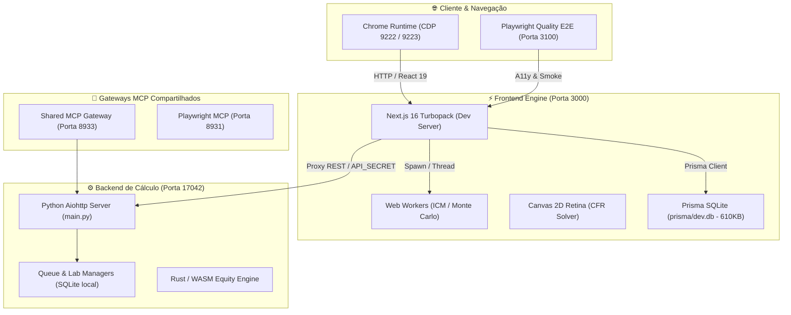

# SKILL: SOTA Server Lifecycle, Build & Warmup Orchestrator

> **Padrão:** Protocolo Chico SOTA v8.0 GOLD  
> **Escopo:** Ecossistema Fullstack Site — Backend Python Aiohttp (`17042`), Frontend Next.js 16 (`3000`), Prisma SQLite (`dev.db`), Gateways MCP (`8933`/`8931`) e Chrome DevTools CDP (`9222`).

---

## 1. Topologia de Servidores e Portas Canônicas

O ecossistema opera uma malha integrada de serviços locais interconectados:



### Matriz de Portas do Ecossistema

| Serviço | Porta | Processo | Endpoint de Verificação / Contrato |
| :--- | :---: | :--- | :--- |
| **Frontend Next.js** | `3000` | `node.exe` (Next dev / standalone) | `http://localhost:3000/` (HTTP 200) |
| **Backend Aiohttp** | `17042` | `python.exe` (`main.py`) | `http://127.0.0.1:17042/ping` (`{"status": "PONG"}`) |
| **Playwright QA Server** | `3100` | `node.exe` (`next start -p 3100`) | Isolado para bateria `playwright.quality.config.ts` |
| **Chrome DevTools CDP** | `9222` | `chrome.exe` (`--remote-debugging-port`) | `http://127.0.0.1:9222/json/version` |
| **Shared MCP Gateway** | `8933` | `mcp-proxy` (SSE centralizado) | Persistido via Windows Task Scheduler |
| **Shared Playwright MCP** | `8931` | `playwright-mcp` | Persistido via Windows Task Scheduler |

---

## 2. Protocolo de Ciclo de Vida em 5 Fases

Toda reinicialização, build e validação de integridade deve seguir o pipeline determinístico:

$$\text{Higienização} \longrightarrow \text{Backend Check} \longrightarrow \text{Build Turbopack} \longrightarrow \text{Subida Limpa} \longrightarrow \text{Warmup \& Hidratação}$$

### Fase 1: Pré-Compilação e Build de Produção
Garante que a tipagem estrita e os Web Workers estejam sincronizados antes da inicialização:
```bash
# 1. Compilar manifestos de Web Workers isolados
npm --workspace frontend exec -- tsc -b tsconfig.worker.json

# 2. Executar compilação otimizada do Turbopack
npm --workspace frontend run build
```
- **Invariante:** 70/70 páginas devem ser geradas (estáticas ou dinâmicas) sem falhas de SSR.

### Fase 2: Higienização Atômica de Processos Obsoletos
Previne o erro clássico `EADDRINUSE: address already in use :::3000` e compilações fantasmas em memória:
```powershell
# Encerramento gracioso de processos bloqueando a porta 3000
$conns = Get-NetTCPConnection -LocalPort 3000 -State Listen -ErrorAction SilentlyContinue
if ($conns) {
    $conns | Select-Object -ExpandProperty OwningProcess -Unique | ForEach-Object {
        Stop-Process -Id $_ -Force -ErrorAction SilentlyContinue
    }
}
```

### Fase 3: Prontidão do Backend Aiohttp (Porta 17042)
O frontend depende do backend para cálculos complexos, Oráculo Gemma e Laya:
```bash
# Verificar saúde imediata
curl -s http://127.0.0.1:17042/ping
# Se inativo, inicializar via script canônico com trava atômica:
node scripts/ops/ensure-dev-backend.mjs
```

### Fase 4: Subida Atômica do Servidor Next.js
Recarrega variáveis do `.env` atualizado (assegurando `DATABASE_URL="file:./prisma/dev.db"`):
```bash
# Inicialização a partir do diretório frontend
cd frontend
npm run dev
```

### Fase 5: Protocolo SOTA de Aquecimento de Rotas (Warmup Engine)
Elimina latências de compilação Just-in-Time (JIT) e valida hidratação nas rotas críticas:
1. `GET /` — Shell principal e tokens de design system.
2. `GET /simulador` — Carregamento dinâmico do `MasterSimulator` (`ssr: false`).
3. `GET /simulador/distorcoes` — Gráficos matemáticos de distorções ICM.
4. `GET /quiz` — Lente pedagógica e questionários interativos.
5. `GET /biblioteca` — Verificação de hidratação dos artigos populados no SQLite.
6. `GET /aulas` — Catálogo de módulos MTT.
7. `GET /templo/laya` — Workbench neural com telemetria ativa.

---

## 3. Comandos de Execução Rápida (1-Click Orchestrator)

O script operacional [`scripts/ops/Invoke-SotaServerLifecycle.ps1`](file:///c:/Users/rapha/.gemini/Site/scripts/ops/Invoke-SotaServerLifecycle.ps1) automatiza todas as 5 fases:

```powershell
# Execução completa (Higienização + Build + Subida + Warmup + Smoke QA)
pwsh -NoProfile -ExecutionPolicy Bypass -File scripts/ops/Invoke-SotaServerLifecycle.ps1

# Subida rápida (Pula build de produção, reinicia e aquece o dev server)
pwsh -NoProfile -ExecutionPolicy Bypass -File scripts/ops/Invoke-SotaServerLifecycle.ps1 -SkipBuild

# Apenas aquecimento (Warmup HTTP imediato de um servidor já ativo)
pwsh -NoProfile -ExecutionPolicy Bypass -File scripts/ops/Invoke-SotaServerLifecycle.ps1 -WarmupOnly
```

---

## 4. Diagnóstico de Problemas e Armadilhas Medidas

| Sintoma / Armadilha | Causa Raiz | Solução Mandatória |
| :--- | :--- | :--- |
| **Split-Brain SQLite** | `frontend/.env` apontando para `dev.db` vazio na raiz em vez de `prisma/dev.db`. | Garantir `DATABASE_URL="file:./prisma/dev.db"` e remover arquivo vazio da raiz. |
| **Timeout `networkidle` em Testes** | `/simulador` possui Web Workers, WebSockets ou polling contínuo que nunca deixam a rede ociosa. | Utilizar sempre `waitUntil: 'load'` no Playwright para páginas com simuladores interativos. |
| **Erro de Hidratação em Canvas 2D** | O componente acessa `window` ou DOM antes da montagem no cliente. | Usar carregamento dinâmico Next.js: `dynamic(() => import(...), { ssr: false })`. |
| **Conexão Recusada no Backend** | Backend na porta 17042 não subiu antes do Next.js. | Executar `node scripts/ops/ensure-dev-backend.mjs` que adquire lock idempotente e sobe o processo em background. |
| **Porta 3000 Travada em Segundo Plano** | Processo `node.exe` órfão rodando de sessão anterior. | Encerrar via `Invoke-SotaServerLifecycle.ps1` antes de chamar `npm run dev`. |

---

## 5. Invariantes de Qualidade e Critérios de Aceite SOTA

- **TTFB Médio de Rotas Aquecidas:** $\le 250\text{ms}$ para páginas dinâmicas, $\le 100\text{ms}$ para rotas estáticas.
- **Console Errors:** Zero mensagens de erro e zero avisos de hidratação (`minified react error` ou `hydration mismatch`).
- **Acessibilidade WCAG 2.2:** Zero violações axe nas páginas auditadas.
- **Homeostase do Quality Gate:** Aprovado com 0 Erros e 0 Warnings em [`scripts/ops/cwv_gate.ps1`](file:///c:/Users/rapha/.gemini/Site/scripts/ops/cwv_gate.ps1).
