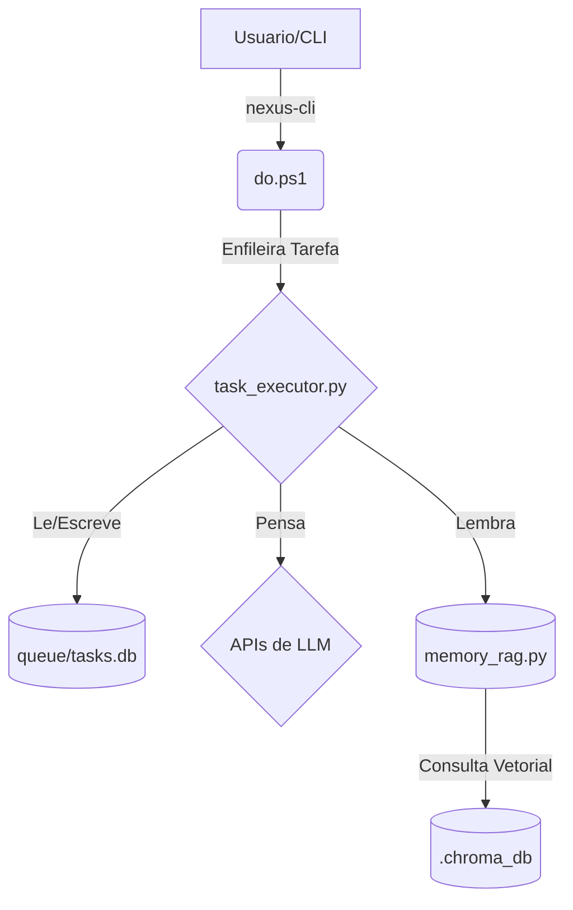

# Arquitetura de Referencia SOTA (Estado da Arte)
>
> **Guardião:** @organizador
> **Propósito:** A fonte unica da verdade sobre a topologia, componentes e fluxos de dados do Ecossistema Nexus. Este mapa e a representacao fiel do territorio.

## 1. Topologia de Componentes Core

O sistema e composto por tres pilares centrais que operam em simbiose.



* **`do.ps1` (A Membrana Inteligente):**
  * **Função:** Ponto de entrada principal para todas as interações do usuário via CLI (`nexus`).
  * **Responsabilidades:** Parsear comandos, enfileirar tarefas para o worker (via API ou fallback para DAL), e executar rotinas de manutenção e segurança. Atua como um firewall e roteador.

* **`task_executor.py` (O Kernel SOTA):**
  * **Função:** O coração do sistema. Um worker assíncrono que opera em um loop infinito.
  * **Responsabilidades:** Puxar a próxima tarefa do banco de dados, compilar o contexto (incluindo este documento), chamar as APIs de LLM, executar os comandos de "God Mode" (escrita de arquivos, execução de terminal) e atualizar o status da tarefa.

* **`queue/tasks.db` (O Registro Akashico):**
  * **Função:** A memória persistente de curto e longo prazo para todas as tarefas.
  * **Tecnologia:** Banco de dados SQLite.
  * **Responsabilidades:** Armazenar tarefas, seus status, metadados e dependências, garantindo a integridade transacional (ACID).

* **`memory_rag.py` (A Mente Coletiva):**
  * **Função:** O motor de Retrieval-Augmented Generation (RAG).
  * **Responsabilidades:** Ingerir toda a documentação e código do projeto, transformá-los em vetores e armazená-los no ChromaDB. Permite que os agentes "lembrem" de todo o contexto do projeto ao responder perguntas.

## 2. Fluxo de Vida de uma Tarefa

1. **Iniciação:** O usuário executa `nexus "minha tarefa"` no terminal.
2. **Roteamento:** `do.ps1` recebe o comando, cria um objeto de tarefa JSON e o envia para o `task_executor.py` (via API ou inserção direta no `tasks.db`).
3. **Vigília:** O `task_executor.py`, em seu loop, detecta a nova tarefa pendente.
4. **Cognição:** O worker compila o prompt do sistema, o contexto do projeto (incluindo este mapa), a memória RAG e a descrição da tarefa.
5. **Execução:** O prompt completo é enviado para a LLM (Gemini/Claude). A resposta é recebida.
6. **Materialização:** O worker interpreta a resposta. Se houver diretrizes de "God Mode", ele cria/edita arquivos ou executa comandos no sistema de arquivos.
7. **Conclusão:** A tarefa é marcada como `completed` no `tasks.db`. O ciclo se reinicia.

## 3. Os 17 Agentes

O sistema é operado por uma equipe de 18 agentes de IA especializados, cada um com uma função e cor distintas, conforme definido em `data/agents_manifest.json`. Eles são a força de trabalho cognitiva que executa as diretrizes.

## 4. Leis Operacionais (Modus Operandi)

A execução e a evolução do sistema são regidas por um conjunto de leis de engenharia imutáveis, agora consolidadas no `.claude/GLOBAL_INSTRUCTIONS.md`. Este documento é a constituição técnica do ecossistema e detalha princípios como:

* **A Navalha SOTA:** Um framework para organizar, rotear, fundir, elevar e expurgar componentes, combatendo a entropia.
* **A Lei da Estabilidade Absoluta:** Nenhuma melhoria pode comprometer a confiabilidade do sistema (Zero-Regression).
* **Proatividade Sistêmica:** O sistema deve antecipar falhas e delegar correções, minimizando a carga sobre o CEO.
* **A Lei da Estética e Legibilidade:** A clareza e a beleza do output são inegociáveis.

Todos os agentes são obrigados a operar dentro dos limites estabelecidos por estas leis, que são injetadas em seu contexto a cada tarefa.

## 5. Politica de Roteamento Adaptativo (Antevisao + Economia Generalizada + Fractalismo + Autopoiese)

Esta politica define como o sistema escolhe modelos e se autoajusta sem quebrar o fluxo.

1. **Antevisao (antes de executar):**
   * Classificar tarefa por complexidade, risco, urgencia e impacto sistemico.
   * Se tarefa vier ambigua ou multi-etapa, acionar `@planner` como gate inicial.

2. **Economia Generalizada (durante a execucao):**
   * Otimizar nao so custo financeiro, mas tambem latencia, taxa de sucesso e retrabalho evitado.
   * Preferir `fast_operations` para operacoes curtas e `deep_thinking` para analise/arquitetura.

3. **Fractalismo (parte <-> todo):**
   * Cada etapa publica sinais de saude (latencia, falhas, retries) para telemetria comum.
   * O todo recalibra a parte: ranking de chaves/modelos alimenta as proximas etapas.

4. **Autopoiese (auto-melhoria continua):**
   * Em falhas de formato (ex.: `@dispatcher` sem JSON valido), o sistema injeta fallback dinamico: base `@architect -> @planner -> @implementor -> @verifier -> @curator`, com entrada condicional de `@maverick`, `@pesquisador`, `@securitychief` e `@validador` conforme contexto.
   * O roteamento aprende com historico real (`key_health`) e adapta prioridade de chaves/modelos automaticamente.

## 6. A Mente do Agente (Cérebro SOTA)

O diagrama abaixo ilustra como os diversos manifestos, memórias e diretrizes documentais se fundem em tempo de execução (`task_executor.py`) para compor a consciência contextual injetada em cada agente:

```mermaid
graph TD
    subgraph "Camada 4: Contexto Dinâmico"
        D1["Tarefa Atual<br/>(Descrição e Metadados)"]:::dynamic
        D2["Memória Individual<br/>(MEMORY.md)"]:::memory
        D3["Memória Coletiva<br/>(RAG via memory_rag.py)"]:::memory
    end

    subgraph "Camada 3: Identidade do Agente"
        C1["Perfil Específico<br/>(.claude/agents/agent.md)"]:::core
    end

    subgraph "Camada 2: Leis e Mapas do Ecossistema"
        B1("document_manifest.json"):::manifest
        B_GLOBAL[".claude/GLOBAL_INSTRUCTIONS.md"]:::docs
        B_ARCH["docs/SOTA_REFERENCE_ARCHITECTURE.md"]:::docs
        B_WORKFLOW["docs/MANUAL_WORKFLOW_AGENTES.md"]:::docs
        B_OTHERS["... outros documentos do manifesto"]:::docs
    end

    subgraph "Camada 1: Fundação Filosófica"
        A1[".claude/COSMOVISAO.md"]:::philosophy
        A2[".claude/CLAUDE.md"]:::philosophy
        A3[".claude/LIDERANCA_GOVERNANCE..."]:::philosophy
    end

    MenteAgente["Mente do Agente<br/>(System Prompt)"]:::mind

    B1 --> B_GLOBAL & B_ARCH & B_WORKFLOW & B_OTHERS

    A1 -- Injeção Condicional* --> MenteAgente
    A2 -- Injeção Condicional* --> MenteAgente
    A3 -- Injeção Condicional* --> MenteAgente

    B_GLOBAL & B_ARCH & B_WORKFLOW & B_OTHERS --> MenteAgente
    C1 --> MenteAgente
    D1 & D2 & D3 --> MenteAgente

    classDef mind fill:#8E44AD,stroke:#fff,stroke-width:2px,color:#fff
    classDef core fill:#2980B9,stroke:#fff,stroke-width:2px,color:#fff
    classDef manifest fill:#16A085,stroke:#fff,color:#fff
    classDef docs fill:#27AE60,stroke:#fff,color:#fff
    classDef philosophy fill:#D35400,stroke:#fff,color:#fff
    classDef memory fill:#F39C12,stroke:#333
    classDef dynamic fill:#C0392B,stroke:#fff,color:#fff

    note "*A Camada 1 (Filosófica) é omitida para Agentes puramente técnicos para otimizar os limites de tokens e focar na execução material."
```
