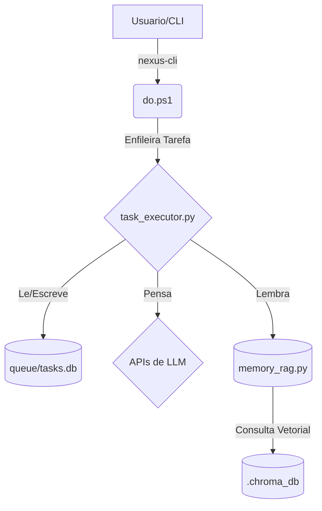

# Arquitetura de Referencia SOTA (Estado da Arte)
>
> **Guardião:** @organizador
> **Propósito:** A fonte unica da verdade sobre a topologia, componentes e fluxos de dados do Ecossistema Nexus. Este mapa e a representacao fiel do territorio.

## 1. Topologia de Componentes Core

O sistema e composto por tres pilares centrais que operam em simbiose.

* **`do.ps1` (A Membrana Inteligente):**
  * **Função:** Ponto de entrada principal para todas as interações do usuário via CLI (`nexus`).
  * **Responsabilidades:** Parsear comandos, enfileirar tarefas para o worker (via API ou fallback para DAL), e executar rotinas de manutenção e segurança. Atua como um firewall e roteador.

* **`task_executor.py` (O Kernel SOTA):**
  * **Função:** O coração do sistema. Um worker assíncrono que opera em um loop infinito.
  * **Responsabilidades:** Puxar a próxima tarefa do banco de dados, compilar o contexto (incluindo este documento), chamar as APIs de LLM, executar os comandos de "God Mode" (escrita de arquivos, execução de terminal) e atualizar o status da tarefa.

* **`queue/tasks.db` (O Registro Akashico):**
  * **Função:** A memória persistente de curto e longo prazo para todas as tarefas.
  * **Tecnologia:** Banco de dados SQLite.
  * **Responsabilidades:** Armazenar tarefas, seus status, metadados e dependências, garantindo a integridade transacional (ACID).

* **`memory_rag.py` (A Mente Coletiva):**
  * **Função:** O motor de Retrieval-Augmented Generation (RAG).
  * **Responsabilidades:** Ingerir toda a documentação e código do projeto, transformá-los em vetores e armazená-los no ChromaDB. Permite que os agentes "lembrem" de todo o contexto do projeto ao responder perguntas.

## 2. Fluxo de Vida de uma Tarefa

1. **Iniciação:** O usuário executa `nexus "minha tarefa"` no terminal.
2. **Roteamento:** `do.ps1` recebe o comando, cria um objeto de tarefa JSON e o envia para o `task_executor.py` (via API ou inserção direta no `tasks.db`).
3. **Vigília:** O `task_executor.py`, em seu loop, detecta a nova tarefa pendente.
4. **Cognição:** O worker compila o prompt do sistema, o contexto do projeto (incluindo este mapa), a memória RAG e a descrição da tarefa.
5. **Execução:** O prompt completo é enviado para a LLM (Gemini/Claude). A resposta é recebida.
6. **Materialização:** O worker interpreta a resposta. Se houver diretrizes de "God Mode", ele cria/edita arquivos ou executa comandos no sistema de arquivos.
7. **Conclusão:** A tarefa é marcada como `completed` no `tasks.db`. O ciclo se reinicia.

## 3. Os 17 Agentes

O sistema é operado por uma equipe de 18 agentes de IA especializados, cada um com uma função e cor distintas, conforme definido em `data/agents_manifest.json`. Eles são a força de trabalho cognitiva que executa as diretrizes.
