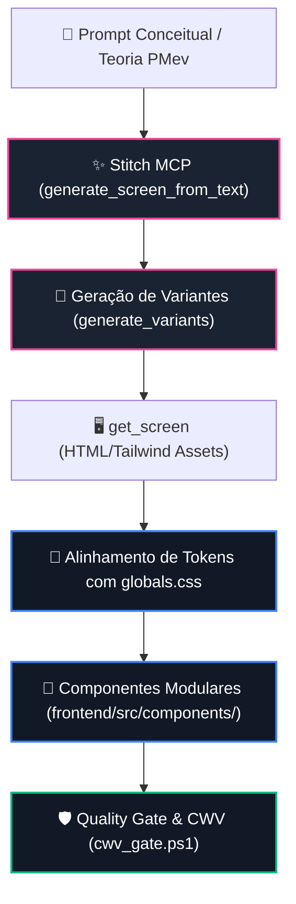

# Google Cloud Stitch MCP — Relatório de Governança e Ativos de UI

> **Repositório Monitorado:** `RaphaelVitoi/Site`
> **Governança:** Protocolo Master Chico SOTA v8.0 GOLD · Tríade Stitch, Exa & Jules
> **Data de Atualização:** `2026-09-04 22:05:44 UTC`
> **Origem dos Dados:** Google Cloud Stitch MCP (`https://stitch.googleapis.com/mcp`)

---

## 1. Resumo Executivo do Servidor Stitch MCP

| Dimensão | Valor | Status Operacional |
| :--- | :--- | :--- |
| **Projetos Stitch Ativos** | `1` | ✅ Conectado e Operacional |
| **Telas Cadastradas** | `1` | 🎨 Em expansão contínua |
| **Modelos Suportados** | `Gemini 3.8 Flash` (Balanced - Padrão) & `Gemini 3.5 Flash-Lite` (Speed) | SOTA visual duo ativo no Stitch |
| **Integração Frontend** | Tailwind CSS 4 + Next.js 16 | Tokens sincronizados em `globals.css` |

> [!NOTE]
> **Atualização de Modelos de Fronteira no Stitch:**
> Conforme verificado na interface de produção do Stitch (`stitch.withgoogle.com`), a geração de UI opera com dois tiers:
> - ⚡ **Speed**: `Gemini 3.5 Flash-Lite` (*rapid collaboration, still good quality*) — menor latência e custo marginal nulo.
> - ✨ **Balanced (Padrão)**: `Gemini 3.8 Flash` (*balance between speed and high quality*) — alta fidelidade estética e adesão a design systems.
> - *Nota de Descontinuação:* Os modelos da geração anterior (`Gemini 3 Flash` e `Gemini 3.1 Pro`) foram descontinuados na produção.

---

## 2. Projetos Registrados no Google Stitch

| ID do Projeto | Título | Visibilidade | Telas | Design Systems | Criado em (UTC) |
| :--- | :--- | :--- | :--- | :--- | :--- |
| `18242753218562483944` | **Nexus PMev & Poker Racional UI** | `PRIVATE` | `1` | `1` | `2026-09-04 21:43:23` |

---

## 3. Detalhamento dos Projetos e Telas

### Projeto `18242753218562483944` — Nexus PMev & Poker Racional UI
- **Nome Canônico:** `projects/18242753218562483944`
- **Tipo de Projeto:** `PROJECT_DESIGN` | **Origem:** `STITCH`
- **Última Atualização:** `2026-09-04T21:53:33.116138Z`
- **Permissão / Papel:** `OWNER`
- **Inventário de Telas (1):**
  - `projects/18242753218562483944/screens/3260535219730569926`: **DESIGN.md** (`DESKTOP`)
- **Design Systems Integrados (1):**
  - 🎨 **Obsidian Analytics** (`assets/6f9c8c6e7114422393d45b0c4ca02808`)
    - Tipografia: `GEIST` / `JetBrains Mono` | Acento Primário: `#f2b72b`
    - Filosofia Visual: *Dark Obsidian Glassmorphism*, bordas com brilho de 1px e contraste WCAG AAA.

---

## 4. Esteira de Prototipagem & Playbook Stitch → Next.js



### Comandos Operacionais via CLI e Python Bridge

```python
from engine.stitch_bridge import StitchClient

client = StitchClient()

# 1. Gerar nova tela para o Simulador Gravitacional PMev:
res = client.generate_screen_from_text(
    project_id="18242753218562483944",
    prompt="Painel SOTA de Scanner Gravitacional PMev com glassmorphism dark/gold e radar de insolvencia",
    model_tier="BALANCED",  # Gemini 3.8 Flash (ou SPEED para Gemini 3.5 Flash-Lite)
    device_type="DESKTOP",
)

# 2. Sincronizar relatorio atualizado:
# python scripts/ops/sync_stitch_report.py --write
```

---
*Relatório emitido pelo Sincronizador de UI Google Cloud Stitch — Protocolo Chico SOTA v8.0 GOLD*
