# MATRIZ DE GOVERNANÇA PIRAMIDAL SOTA v8.0 GOLD

> **Soberania Absoluta:** Raphael Vitoi  
> **Escopo:** Ecossistema Nexus, Monorepo Site, Antigravity 2.0, Nuvem & Infraestrutura  
> **Princípio Central:** Especialização Hierárquica, Harmonização de Extremos e Prevenção de Retrabalho

---

## 1. A Pirâmide Canônica de Governança

```mermaid
flowchart TB
    subgraph T0["👑 TIER 0: SOBERANIA & DIRECIONAMENTO HUMANO"]
        VITOI["Raphael Vitoi\n(Criador do PMev, Árbitro Epistêmico Supremo, CEO)"]
    end

    subgraph T1["🏛️ TIER 1: NÚCLEO DE COGNIÇÃO & ARQUITETURA MESTRE"]
        CORE_LLM["Claude 3.7 Sonnet / Opus · Gemini 3.7 Flash High / Pro\nAntigravity 2.0 (Daemon / IDE / CLI) · Codex"]
    end

    subgraph T2["🚀 TIER 2: SUPERAGENTES DE NUVEM & DEEP RESEARCH"]
        JULES["Google Jules\n(Cloud VMs / Batch Refactor)"]
        EXA["Exa AI\n(Neural Search / Game Theory Papers)"]
        STITCH["Stitch MCP\n(Generative UI / Design System SOTA)"]
        DEVIN["Devin\n(DevOps / CI-CD / Build Engineering)"]
    end

    subgraph T3["💼 TIER 3: ASSISTENTES & FROTA DE AGENTES ESPECIALISTAS"]
        COPILOT["GitHub Copilot\n(Workspace Companion / Scaffolding)"]
        FLEET["Frota de 19 Custom Agents\n(@arquiteto, @cientista, @guardiao, @redator...)"]
    end

    subgraph T4["⚡ TIER 4: SUBAGENTS & BOTS DE TAREFA ESPECÍFICA"]
        SUBAGENTS["Subagents Sob Demanda\n(research, flutter_a11y_agent)"]
        DEPENDABOT["Dependabot\n(Security Bumps / CVE Scanning)"]
        INTEGRATORS["Integradores de Workflow\n(Linear, Atlassian, Tactiq, YouTube Intelligence)"]
    end

    subgraph T5["🖥️ TIER 5: MODELOS LOCAIS, EDGE AI & ACELERAÇÃO NUMÉRICA"]
        LOCAL_LLM["Ollama & llama.cpp\n(gemma4:12b, qwen2.5-coder)"]
        NANO["Gemini Nano On-Device\n(Chrome Prompt API / Summarization)"]
        NUMERIC["Motores Numéricos & SIMD\n(AVX-512 / Vulkan / C++ Eigen 3.4.0)"]
    end

    subgraph T6["⚙️ TIER 6: BARRAMENTO DE AUTOMAÇÃO, APIS & QUALITY GATE"]
        APIS["FastAPI & aiohttp Async Pipeline\n(Rate Limiter / Anti-Starvation / DAL SQLite)"]
        MCP["FastMCP & MCPServer Mesh\n(50+ Provedores Unificados)"]
        GATE["Quality Gate M.O. 13.F\n(651 Pytest / Turbopack 55 Rotas / SHA-512 SRI)"]
    end

    T0 --> T1
    T1 --> T2
    T2 --> T3
    T3 --> T4
    T4 --> T5
    T5 --> T6

    classDef t0 fill:#2d1b00,stroke:#d4af37,stroke-width:3px,color:#fff;
    classDef t1 fill:#1e1e38,stroke:#8b5cf6,stroke-width:2px,color:#fff;
    classDef t2 fill:#1a2332,stroke:#3b82f6,stroke-width:2px,color:#fff;
    classDef t3 fill:#1f2937,stroke:#10b981,stroke-width:2px,color:#fff;
    classDef t4 fill:#2a1c2e,stroke:#ec4899,stroke-width:2px,color:#fff;
    classDef t5 fill:#14232e,stroke:#06b6d4,stroke-width:2px,color:#fff;
    classDef t6 fill:#18181b,stroke:#64748b,stroke-width:2px,color:#fff;

    class VITOI t0;
    class CORE_LLM t1;
    class JULES,EXA,STITCH,DEVIN t2;
    class COPILOT,FLEET t3;
    class SUBAGENTS,DEPENDABOT,INTEGRATORS t4;
    class LOCAL_LLM,NANO,NUMERIC t5;
    class APIS,MCP,GATE t6;
```

---

## 2. Matriz de Especialidades, Fraquezas e Mitigações por Camada

| Tier / Agente | Função & Especialidade Máxima | Fraqueza Intrínseca | Protocolo de Mitigação SOTA |
| :--- | :--- | :--- | :--- |
| **Tier 0: Raphael Vitoi** | Soberania conceitual, Teoria PMev, validação epistemológica de axiomas e decisões de produto. | Tempo e largura de banda de digitação manual. | Orquestração autônoma em background com apresentação condensada do produto final. |
| **Tier 1: Claude / Gemini / Codex** | Raciocínio profundo, arquitetura multi-arquivo, síntese diacrônica e aplicação do Quality Gate. | Custo computacional e latência em tarefas triviais repetitivas. | Delegação de tarefas pontuais para Tiers inferiores (2 a 5), retendo apenas a validação. |
| **Tier 2: Google Jules** | Refatorações assíncronas em larga escala em VMs Linux na nuvem com isolamento total. | Dificuldade com subárvores locais do Windows e dependências C++ não-rasas. | `jules_bridge.py` gerencia clone raso com `core/vendor/eigen` fixado e aterrissagem inspecionada. |
| **Tier 2: Exa AI** | Busca semântica de papers acadêmicos em Teoria dos Jogos e documentações atualizadas. | Não executa código nem gera arquitetura de projeto. | `ExaKnowledgeBridge` sintetiza fórmulas LaTeX e alimenta o `@cientista` e o Stitch. |
| **Tier 2: Stitch MCP** | Prototipagem generativa de telas e congelamento do Design System Dark Gold (`#090D16`, `#D4AF37`). | Não implementa a lógica do backend nem valida contratos de API. | `StitchDesignBridge` converte designs em tokens Tailwind para implementação no Next.js. |
| **Tier 2: Devin** | Resolução avançada de CI/CD, gerenciamento de dependências e automação DevOps. | Risco de modificar lockfiles sem respeitar a topologia do monorepo. | Portão M.O. 13.F exige lockfile raiz único e compilação limpa do Turbopack. |
| **Tier 3: GitHub Copilot** | Autocomplete instantâneo na IDE, PR descriptions e scaffolding rápido de testes. | Tendência a alucinar "Boy Scout refactorings" e tipagem fraca (`Any`). | `.github/copilot-instructions.md` impõe Target Lock, Pure ASCII, PEP 585/604 e KaTeX. |
| **Tier 3: Frota de 19 Agentes** | Especialização temática cirúrgica (`@arquiteto`, `@cientista`, `@guardiao`, etc.). | Desalinhamento se os manifestos divergirem. | `sync_agents_reality.ps1` sincroniza os 19 arquivos em fonte única viva. |
| **Tier 4: Dependabot** | Monitoramento contínuo de CVEs e atualizações de pacotes upstream. | Cria PRs isolados em subpastas que quebram o lockfile raiz. | Revisão humana/Tier 1; aplicação centralizada no `package.json` raiz via `overrides`. |
| **Tier 5: Ollama / llama.cpp** | Soberania de dados local, inferência offline de zero-custo para tarefas privadas (`gemma4:12b`). | Menor janela de contexto e poder de raciocínio que os modelos de nuvem Tier 1. | Utilizado como filtro prévio, sumarizador local e fallback para tarefas de baixa entropia. |
| **Tier 5: Gemini Nano** | Inferência ultrarrápida no navegador (CDP 9222/9223) sem chamada de rede externa. | Capacidade limitada a tarefas de Prompt API e sumarizações curtas. | Usado no DevTools MCP para diagnósticos em tempo real de Core Web Vitals e LoAF. |
| **Tier 6: FastAPI / aiohttp / MCP** | Barramento transacional, rate limiting, proteção anti-starvation e bridge para 50+ ferramentas. | Sem autonomia decisória. | Monitorado continuamente pelo `task_executor.py` e auditado pelo `record_gate.py`. |

---

## 3. Fluxo de Trabalho Sem Fricção de Concorrência

1. **Top-Down Intent:** O Tier 0 (Raphael Vitoi) define o objetivo estratégico.
2. **Decomposição Cognitiva:** O Tier 1 decompõe o objetivo em um DAG (Directed Acyclic Graph) estruturado.
3. **Despacho Assíncrono:**
   - Pesquisa conceitual -> Exa (Tier 2).
   - Prototipagem visual -> Stitch (Tier 2).
   - Codificação em lote -> Google Jules (Tier 2).
4. **Scaffolding e Assistência:** Copilot (Tier 3) apoia o desenvolvedor na escrita de testes locais.
5. **Convergência Local & Quality Gate:** O Tier 1 aterrissa os patches, executa a suíte de 651 testes Pytest e compila as 55 rotas Next.js.
6. **Entrega Soberana:** O produto final validado é entregue ao Tier 0 em formato de artefatos visuais de alta densidade.
