# MATRIZ DE GOVERNANÇA PIRAMIDAL SOTA v8.0 GOLD

> **Soberania Absoluta:** Raphael Vitoi  
> **Escopo:** Ecossistema Nexus, Monorepo Site, Antigravity 2.0, Nuvem & Infraestrutura  
> **Princípio Central:** Especialização Hierárquica, Harmonização de Extremos e Prevenção de Retrabalho

---

## 1. A Pirâmide Canônica de Governança (8 Tiers)

```mermaid
flowchart TB
    subgraph T0["👑 TIER 0: SOBERANIA & LIDERANÇA"]
        VITOI["Raphael Vitoi\n(Direcionamento estratégico, formulação conceitual PMev, CEO e desenvolvedor multidisciplinar, veto e validação)"]
    end

    subgraph T1["🏛️ TIER 1: NÚCLEO COGNITIVO MESTRE"]
        CORE_LLM["Claude 5 Sonnet / Opus · Gemini 3.7 Flash High / Pro · ChatGPT 5.6 Luna / Terra / Sol\nCodex · Antigravity 2.0 / Antigravity IDE / VS Code"]
    end

    subgraph T2["🚀 TIER 2: SUPERAGENTES DE NUVEM & DEEP RESEARCH"]
        JULES["Google Jules (Cloud VMs / Batch Refactor)"]
        EXA["Exa AI (Neural Search / Game Theory Papers)"]
        STITCH["Stitch MCP (Generative UI / Design System SOTA)"]
        DEVIN["Devin (DevOps / CI-CD / Build Engineering)"]
    end

    subgraph T3["💼 TIER 3: FROTA ESPECIALISTA & COMPANIONS"]
        FLEET["Frota de 19 Custom Agents (@arquiteto, @cientista, @guardiao, @redator...)"]
        COPILOT["GitHub Copilot (Workspace Companion / Scaffolding)"]
    end

    subgraph T4["⚡ TIER 4: SUBAGENTS DEDICADOS (EXECUÇÃO DINÂMICA)"]
        SUBAGENTS["Subagents Dinâmicos (generalist, research, flutter_a11y_agent, self, task-subagents)"]
    end

    subgraph T5["🤖 TIER 5: BOTS DE INTEGRAÇÃO & CVE SCANNERS"]
        DEPENDABOT["Dependabot (Security Bumps / CVE Scanning)"]
        INTEGRATORS["Integradores de Workflow (Linear, Atlassian, Tactiq, YouTube Intelligence)"]
    end

    subgraph T6["🖥️ TIER 6: MODELOS LOCAIS, EDGE AI & ACELERAÇÃO NUMÉRICA"]
        LOCAL_LLM["Ollama & llama.cpp (gemma4:31b-cloud, gemma4:e4@latest, qwen2.5-coder)"]
        NANO["Gemini Nano On-Device (Chrome Prompt API / Summarization)"]
        NUMERIC["Motores Numéricos & SIMD (AVX-512 / Vulkan / C++ Eigen 3.4.0)"]
    end

    subgraph T7["⚙️ TIER 7: BARRAMENTO DE AUTOMAÇÃO, APIS & QUALITY GATE"]
        APIS["FastAPI & aiohttp Async Pipeline (Rate Limiter / Anti-Starvation / DAL SQLite)"]
        MCP["FastMCP & MCPServer Mesh (50+ Provedores Unificados)"]
        GATE["Quality Gate M.O. 13.F (651 Pytest / Turbopack 55 Rotas / SHA-512 SRI)"]
    end

    T0 --> T1
    T1 --> T2
    T2 --> T3
    T3 --> T4
    T4 --> T5
    T5 --> T6
    T6 --> T7

    classDef t0 fill:#2d1b00,stroke:#d4af37,stroke-width:3px,color:#fff;
    classDef t1 fill:#1e1e38,stroke:#8b5cf6,stroke-width:2px,color:#fff;
    classDef t2 fill:#1a2332,stroke:#3b82f6,stroke-width:2px,color:#fff;
    classDef t3 fill:#1f2937,stroke:#10b981,stroke-width:2px,color:#fff;
    classDef t4 fill:#2d1537,stroke:#d946ef,stroke-width:2px,color:#fff;
    classDef t5 fill:#2a1c2e,stroke:#ec4899,stroke-width:2px,color:#fff;
    classDef t6 fill:#14232e,stroke:#06b6d4,stroke-width:2px,color:#fff;
    classDef t7 fill:#18181b,stroke:#64748b,stroke-width:2px,color:#fff;

    class VITOI t0;
    class CORE_LLM t1;
    class JULES,EXA,STITCH,DEVIN t2;
    class FLEET,COPILOT t3;
    class SUBAGENTS t4;
    class DEPENDABOT,INTEGRATORS t5;
    class LOCAL_LLM,NANO,NUMERIC t6;
    class APIS,MCP,GATE t7;
```



---

## 2. Matriz de Especialidades, Fraquezas e Mitigações por Camada

| Tier / Agente | Função & Especialidade Máxima | Fraqueza Intrínseca | Protocolo de Mitigação SOTA |
| :--- | :--- | :--- | :--- |
| **Tier 0: Raphael Vitoi (Soberania & Liderança)** | Direcionamento estratégico, formulação conceitual PMev, CEO e desenvolvedor de projetos multidisciplinares, veto e validação final de produto. | Tempo e largura de banda de digitação manual. | Orquestração autônoma em background com apresentação condensada do produto final. |
| **Tier 1: Núcleo Cognitivo Mestre (Claude 5 Sonnet/Opus · Gemini 3.7 Flash High/Pro · ChatGPT 5.6 Luna/Terra/Sol · Codex · Antigravity 2.0 / IDE / VS Code)** | Raciocínio profundo, integridade arquitetural multi-arquivo e aplicação do Quality Gate. | Custo computacional e latência em tarefas triviais repetitivas. | Delegação de tarefas pontuais para Tiers inferiores (2 a 6), retendo apenas a validação. |
| **Tier 2: Google Jules** | Refatorações assíncronas em larga escala em VMs Linux na nuvem com isolamento total. | Dificuldade com subárvores locais do Windows e dependências C++ não-rasas. | `jules_bridge.py` gerencia clone raso com `core/vendor/eigen` fixado e aterrissagem inspecionada. |
| **Tier 2: Exa AI** | Busca semântica de papers acadêmicos em Teoria dos Jogos e documentações atualizadas. | Não executa código nem gera arquitetura de projeto. | `ExaKnowledgeBridge` sintetiza fórmulas LaTeX e alimenta o `@cientista` e o Stitch. |
| **Tier 2: Stitch MCP** | Prototipagem generativa de telas e congelamento do Design System Dark Gold (`#090D16`, `#D4AF37`). | Não implementa a lógica do backend nem valida contratos de API. | `StitchDesignBridge` converte designs em tokens Tailwind para implementação no Next.js. |
| **Tier 2: Devin** | Resolução avançada de CI/CD, gerenciamento de dependências e automação DevOps. | Risco de modificar lockfiles sem respeitar a topologia do monorepo. | Portão M.O. 13.F exige lockfile raiz único e compilação limpa do Turbopack. |
| **Tier 3: Frota de 19 Agentes** | Especialização temática cirúrgica (`@arquiteto`, `@cientista`, `@guardiao`, etc.). | Desalinhamento se os manifestos divergirem. | `sync_agents_reality.ps1` sincroniza os 19 arquivos em fonte única viva. |
| **Tier 3: GitHub Copilot** | Autocomplete instantâneo na IDE, PR descriptions e scaffolding rápido de testes. | Tendência a alucinar "Boy Scout refactorings" e tipagem fraca (`Any`). | `.github/copilot-instructions.md` impõe Target Lock, Pure ASCII, PEP 585/604 e KaTeX. |
| **Tier 4: Subagents Dedicados** | Execução paralela e isolada de subtarefas (`generalist`, `research`, `flutter_a11y_agent`, `self`). | Contexto isolado e sem visão holística do monorepo. | Recebem escopo limitado estrito e herdam auto-grounding via `TierPolicyEngine`. |
| **Tier 5: Dependabot / Bots** | Detecção automatizada de CVEs e integrações de tickets (Linear, Tactiq). | Cria PRs isolados em subpastas que quebram o lockfile raiz. | Revisão humana/Tier 1; aplicação centralizada no `package.json` raiz via `overrides`. |
| **Tier 6: Modelos Locais & Edge AI (Ollama & llama.cpp: gemma4:31b-cloud, gemma4:e4@latest, qwen2.5-coder · Gemini Nano · C++ SIMD)** | Soberania de dados local, inferência offline de zero-custo para tarefas privadas. | Menor janela de contexto e poder de raciocínio que os modelos de nuvem Tier 1. | Utilizado como filtro prévio, sumarizador local e fallback para tarefas de baixa entropia. |
| **Tier 6: Gemini Nano** | Inferência ultrarrápida no navegador (CDP 9222/9223) sem chamada de rede externa. | Capacidade limitada a tarefas de Prompt API e sumarizações curtas. | Usado no DevTools MCP para diagnósticos em tempo real de Core Web Vitals e LoAF. |
| **Tier 7: FastAPI / aiohttp / MCP** | Barramento transacional, rate limiting, proteção anti-starvation e bridge para 50+ ferramentas. | Sem autonomia decisória. | Monitorado continuamente pelo `task_executor.py` e auditado pelo `record_gate.py`. |

---

## 3. Fluxo de Trabalho Sem Fricção de Concorrência

1. **Top-Down Intent:** O Tier 0 (Raphael Vitoi) define o objetivo estratégico.
2. **Decomposição Cognitiva:** O Tier 1 decompõe o objetivo em um DAG (Directed Acyclic Graph) estruturado.
3. **Despacho Assíncrono:**
   - Pesquisa conceitual -> Exa (Tier 2).
   - Prototipagem visual -> Stitch (Tier 2).
   - Codificação em lote -> Google Jules (Tier 2).
   - Tarefas pontuais paralelas -> Subagents Dedicados (Tier 4).
4. **Scaffolding e Assistência:** Copilot e Frota Custom (Tier 3) apoiam na escrita e scaffolding.
5. **Convergência Local & Quality Gate:** O Tier 1 aterrissa os patches, executa a suíte de testes Pytest e compila as rotas Next.js.
6. **Entrega Soberana:** O produto final validado é entregue ao Tier 0 em formato de artefatos visuais de alta densidade.

---

## 4. Barramento Universal Web & Auto-Browse (-Web Modernizado)

O antigo comando `-Web` (anteriormente um montador interativo de clipboard) foi refatorado e elevado a **motor global de pesquisa, auto-browse e handoff** em `engine/sota_web_browse.py`:

```mermaid
flowchart LR
    REQ["Requisição de Consulta\n(nexus web / -Web)"] --> TIER_POL{"Política de Tier\n(TierPolicyEngine)"}
    
    TIER_POL -->|Tier 3, 4, 5, 6\n(Grounding Fortemente Incentivado)| AUTO_SEARCH["Auto-Grounding AI / Search"]
    TIER_POL -->|Tier 0, 1, 2\n(Sob Demanda / Cirúrgico)| CDP_BROWSE["Chrome Dev CDP (9222/9223)"]
    TIER_POL -->|Handoff Explícito| CLIP["Clipboard Bridge SOTA"]

    AUTO_SEARCH --> AUDIT["Auditoria Transacional\n(logs/web_browsing_audit.jsonl)"]
    CDP_BROWSE --> AUDIT
    CLIP --> AUDIT

    classDef req fill:#1e1e38,stroke:#8b5cf6,stroke-width:2px,color:#fff;
    classDef pol fill:#14232e,stroke:#0ea5e9,stroke-width:2px,color:#fff;
    classDef tool fill:#1a2332,stroke:#10b981,stroke-width:2px,color:#fff;
    classDef log fill:#2a1c2e,stroke:#f59e0b,stroke-width:2px,color:#fff;

    class REQ req;
    class TIER_POL pol;
    class AUTO_SEARCH,CDP_BROWSE,CLIP tool;
    class AUDIT log;
```

---

## 5. Invariante Canônica de Commits & Edições Pontuais (M.O. 13.G)

Toda mutação no código fonte, artefatos ou registros deve conter obrigatoriamente:
1. **SHA:** Identificador criptográfico Git do commit correspondente.
2. **Assinatura:** Autor institucional e Tier hierárquico (ex: `Chico v8.0 GOLD [Tier 1.B]`, `Subagent-Research [Tier 4]`).
3. **Propósito:** Justificativa funcional explícita, identificando o impacto e os arquivos sob Target Lock.

```
commit <SHA-7>
Autor: <Agente> [<Tier-X>]
Propósito: <Descrição sintética da finalidade e benefício técnico>
```
