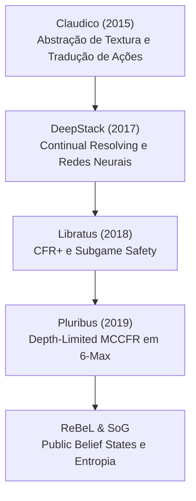

# De Claudico a Pluribus: A Genealogia dos Solvers e a Fronteira do PMev

A evolução da inteligência artificial em jogos de informação imperfeita redefiniu as fronteiras da Teoria dos Jogos. Esta evolução não trata apenas do ganho de *winrate*, mas da epistemologia matemática subjacente ao *Poker Racional*: como modelamos arrependimento, como resolvemos subjogos locais sem colapsar a estratégia global, e como avaliamos a assimetria multiway (PMev). 

Abaixo, traçamos a genealogia canônica da superação do No-Limit Hold'em, culminando nas arquiteturas generalistas modernas.

## 1. Claudico (CMU 2015): O Desbravador das Abstrações

O Claudico marcou a primeira tentativa de grande escala de derrotar profissionais humanos de ponta no Heads-Up No-Limit Hold'em (HUNL). Dado que a árvore do jogo de HUNL possui mais de $10^{161}$ estados de decisão, o Claudico baseou-se fortemente em técnicas de **abstração**.

* **Abstração de Textura de Bordo ($EHS^2$):** Para reduzir o tamanho do jogo, o Claudico mapeou mãos e texturas de *board* estruturalmente similares em *buckets* utilizando a métrica de *Expected Hand Strength Squared* ($EHS^2$).
* **Tradução Pseudo-Harmônica de Apostas:** Como os tamanhos de apostas (bet sizings) são contínuos e infinitos, Claudico utilizava uma *Action Translation* (tradução pseudo-harmônica). Apostas fora da árvore pré-computada eram arredondadas para as opções de tamanho permitidas, minimizando a perda na distribuição do *Expected Value* (EV).

Apesar da proeza teórica, Claudico perdeu margem para os humanos por ser incapaz de ajustar perfeitamente os limiares de *blockers* devido à abstração excessivamente rígida em *rivers* complexos.

## 2. DeepStack (Science 2017): Continual Resolving e o Gadget Game

O grande divisor de águas veio em 2017 com o DeepStack (Universidade de Alberta), o primeiro agente a derrotar profissionais humanos em HUNL de forma conclusiva. Ele eliminou a necessidade de abstrair todo o jogo antes da partida.

* **Continual Resolving:** Em vez de usar uma árvore estática global, o DeepStack computa o equilíbrio de Nash do subjogo atual em tempo real. Cada decisão resolve apenas as ações futuras próximas.
* **Avaliação Heurística via Redes Neurais:** Nas folhas do subjogo local, o DeepStack utilizava uma rede neural profunda para estimar o valor dos *Public Belief States* (crenças públicas). 
* **Limites do Gadget Game:** A técnica utilizava um *Gadget Game* para garantir que o oponente não pudesse explorar o *resolving* local. No entanto, o custo computacional tornava a execução lenta e vulnerável a certas distorções de *Counterfactual Regret*.

## 3. Libratus (Science 2018): CFR+ e Subgame Safety

O Libratus (CMU), que dizimou os profissionais no desafio "Brains vs. AI", adotou uma arquitetura híbrida de *blueprint* pré-computado e *resolving* em tempo real altamente otimizado.

* **CFR+ com Arrependimentos Não-Negativos:** Ao invés do CFR tradicional, o Libratus utilizou o CFR+ (*Counterfactual Regret Minimization*), cujos arrependimentos cumulativos negativos são zerados $R^+(a) = \max(0, R(a))$. Isso acelerou assustadoramente a convergência ao Equilíbrio de Nash.
* **Subgame Safety:** O grande trunfo do Libratus foi garantir a "segurança do subjogo". Ao entrar em uma nova ramificação, o solver recalculava o equilíbrio do subjogo *sem* aumentar a explorabilidade da árvore raiz, penalizando estratégias do oponente que divergissem das margens estabelecidas no *blueprint*.

## 4. Pluribus (Science 2019): A Fronteira Multiway (6-max)

Os solvers anteriores limitavam-se ao Heads-Up, onde o *Teorema do Minimax* dita que minimizar a própria explorabilidade maximiza o EV garantido. Em cenários de múltiplos jogadores (6-max), o Equilíbrio de Nash não garante lucro, pois a explorabilidade deixa de ser simétrica (jogo de soma não nula no espectro de equilíbrios). O Pluribus quebrou esse paradigma.

* **Depth-Limited MCCFR:** O algoritmo rodava *Monte Carlo Counterfactual Regret Minimization* com uma profundidade limitada (*depth-limited search*), o que o tornava enxuto o bastante para rodar em uma arquitetura modesta (nuvem de poucas CPUs).
* **Compensação do Passivo Estrutural Multiway (PMev):** O Pluribus ilustra na prática como a expectativa matemática sofre distorção pela assimetria dos oponentes em multiway. No contexto do *Poker Racional*, essa distorção pode ser expressa rigorosamente pelo Passivo Estrutural Multiway:
  $$ \Lambda = \lambda \cdot (k^2 - 1) \cdot \text{Pot} $$
  Onde $k$ representa o número de *callers* residuais, forçando a compressão do EV e alterando o *baseline* de defesa em equilíbrios de mais de dois jogadores.

## 5. Além do Poker: ReBeL e Student of Games (SoG)

O futuro da resolução algorítmica afasta-se de heurísticas específicas para jogos e abraça paradigmas universais.

* **ReBeL:** Avançou as bases do DeepStack ao integrar *Reinforcement Learning* (RL) com *Search*. Ele introduziu o conceito estrito de **Public Belief States** (PBS), tratando o jogo de informação imperfeita como um jogo contínuo de informação perfeita sobre crenças. A entropia e a distribuição probabilística da mão do oponente tornam-se o próprio estado do jogo.
* **Student of Games (SoG):** Generalizou o aprendizado para qualquer tipo de estrutura, provando que é possível unificar as mecânicas que resolvem Xadrez, Go (informação perfeita) e Poker (informação imperfeita) sob o mesmo motor unificado de otimização de política e valor.

## Distinção Rigorosa: Solvers Estáticos vs. Subgame Solvers

É imperativo distinguir as duas classes de ferramentas que emergem desta genealogia:

1. **Solvers de Árvore Estática (ex: HRC, Simple Postflop):** Dependem de pré-computação intensiva (geralmente via CFR/MCCFR). A árvore de ações (com *bet sizings* limitados) deve ser inteiramente carregada na memória RAM. São estáticos e assumem que o subjogo isolado não sofre vazamento de informação do topo da árvore que foi simplificado.
2. **Subgame Solvers em Tempo Real com NNs (ex: DeepStack, ReBeL):** Não carregam o jogo inteiro na memória. Computam ações *on-the-fly* ao gerar uma pequena árvore local e usar Redes Neurais para avaliar as pontas (folhas) instantaneamente. São dinâmicos, agnósticos a *sizings* pré-determinados e virtualmente imunes ao *memory cap* de grandes volumes de árvore.

A fronteira do *Poker Racional* habita no entendimento epistemológico dessas máquinas: a precisão de um solver não é medida pelo tamanho do seu *blueprint*, mas por sua competência em traduzir informação imperfeita em crenças contínuas otimizáveis.
