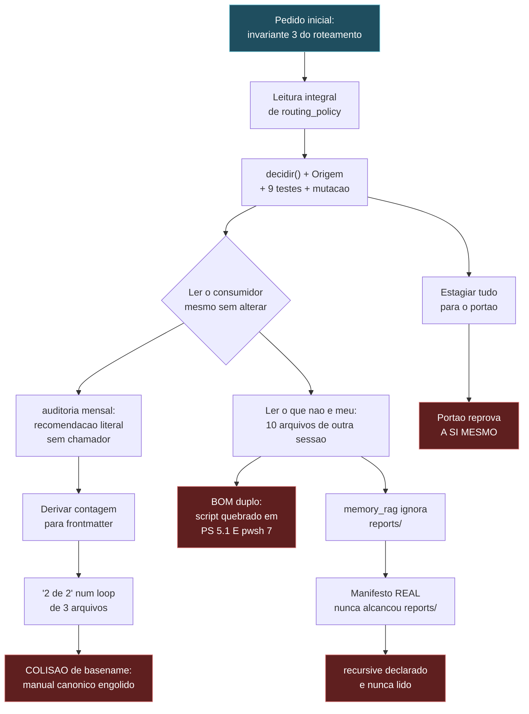

# HANDOFF — Sessao de 2026-08-27: governanca, portoes e ancoras

## 0. O ANTES — estado em que a sessao encontrou o repositorio

Medido, nao lembrado. Commit base `4cce6758`.

| Dimensao | Como estava | Evidencia |
| :--- | :--- | :--- |
| Governanca global | `MODUS_OPERANDI.md` com 176 linhas, camadas nomeando produto em vez de papel | contagem de linhas |
| Roteamento | `rotear()` devolvia `str`; escalonamento negado indistinguivel de sucesso; `Rota.fallback` sem caminho de decisao | leitura integral |
| Portao de commit | `.husky/commit-msg` AUSENTE — Conventional Commits escrito em `.git/hooks/` com `core.hooksPath=.husky`, regra no disco que nunca executava | `git config` |
| Portao de qualidade | Fases 1 e 2 do `cwv_gate` comparando LITERAIS; `$warnings` lido e nunca populado; bypass `SKIP_CWV_GATE` ativo | leitura integral |
| Auditoria mensal | RECOMENDAVA monitorar releases de fronteira com texto fixo; `rotas_suspeitas()` sem chamador; manuais indexados por basename colidente | leitura integral |
| Memoria (RAG) | `reports/` sem fonte no manifesto; `recursive` declarado e nunca lido; filtro por nome solto excluindo `docs/reports/` | manifesto + medicao |
| Registros | Sem frontmatter canonico; sem portao que o exigisse; sem TTL para fato externo | contagem: 67 de 403 `.md` |
| Suite | 49 testes de rota, 405 no projeto | pytest |

---

## 0.1 O PROCESSO — como cada achado apareceu

A sessao nao seguiu um plano linear; seguiu uma **regra**, e a regra produziu a
sequencia. A regra e a secao 1.2: *escopo limita o que se ALTERA, jamais o que
se LE.*



**Nenhum dos quatro achados em vermelho estava no pedido.** Todos vieram de ler
componente que nao era meu, ou de derivar um numero de uma estrutura que ja
existia. Nenhum apareceu como erro — todos apareciam como sucesso.

---

## 0.2 O STATUS ATUAL

| Metrica | Antes | Agora |
| :--- | ---: | ---: |
| Suite de rota | 49 | **58** |
| Suite completa | 405 | **415** |
| Testes novos | — | 19 (9 rota + 10 auditoria) |
| Testes de mutacao | 0 | 2, ambos REPROVAM a mutacao |
| `MODUS_OPERANDI.md` | 176 linhas | **~400 linhas** |
| Corpus do RAG | `reports/` invisivel | 461 arquivos, governanca viva mantida |
| Hook `pre-commit` | 1 etapa | 2 etapas, `EXIT REAL = 0` medido sem pipe |
| Registros com frontmatter | 0 dos meus | 5, todos aprovados pelo portao |

**Nada commitado ate o momento desta secao.**

---

## 1. Objetivo da sessao

Comecou como correcao do servidor local de inferencia e migrou para governanca:
arquitetura de nao-concorrencia entre modelos, taxonomia de repositorios,
indice ancorado, e endurecimento dos portoes de commit.

## 2. Entregue

### 2.1 Governanca — `~/.gemini/MODUS_OPERANDI.md` (176 -> 389 linhas)

| Secao | Conteudo |
| :--- | :--- |
| **1.1** | Autoridade piramidal; neutralidade de fornecedor como regra de escopo; parceria por decreto; a piramide e o que torna a particao exequivel; ambiente nao determina motor |
| **1.2** | Dever de leitura integral (escopo limita o que se ALTERA, nunca o que se LE); piso obrigatorio de registro de discordancia; obrigacao de tratar quando conclusivo; faixa intermediaria |
| **1.3** | Tiers de agente: parceria e universal, papel nao e. Fronteira / assistente pessoal (Copilot) / operacional (locais, subagentes). Desperdicio de fronteira em tarefa repetitiva e FALHA de roteamento |
| **4** | Tornada agnostica: camadas por PAPEL, nao por nome de produto |
| **12** | Etiqueta de repositorios: dois eixos ortogonais (ecossistema x classe), mapa canonico medido, procedimento de identificacao, fronteiras inviolaveis |
| **13** | Indice ancorado: tres classes de decaimento (interno/externo/medido), frontmatter canonico, indice gerado, assinatura multiagente, handoff agnostico, portao de commit, GitHub como agente |

### 2.2 Codigo — `Site/`

- **`scripts/ops/record_anchor_gate.ps1`** (novo) — portao de ancora §13.F.
  Verifica supressor de seguranca sem `Record-Id`, credencial em texto claro,
  frontmatter de registro, e classes de decaimento sem a ancora exigida.
  Opera so sobre conteudo em stage. ASCII puro, parseia em PS 5.1.
- **`.husky/commit-msg`** (novo) — restaura Conventional Commits, que estava
  DESLIGADO: a regra existia em `.git/hooks/commit-msg`, mas
  `core.hooksPath=.husky` e nao havia commit-msg ali.
- **`.husky/pre-commit`** (alterado) — `set -e` + chamada do portao de ancora.
  O `set -e` e obrigatorio: sem ele, acrescentar verificacao ao fim faria a
  anterior deixar de bloquear.
- **`scripts/ops/cwv_gate.ps1`** (alterado, POSTULADO-001 aprovado) — fases 1 e
  2 marcadas `[N/MED]`; `$warnings` declarado (era lido e nunca populado, o
  estado AMARELO era inalcancavel); bypass `SKIP_CWV_GATE` removido.
- **`llm/routing_policy.py`** (alterado) — `Rota` ganhou `ancorado_em` e
  `modelos_citados`; nova funcao `rotas_suspeitas()`; frase ambigua sobre
  "custo marginal" reescrita.
- **`tools/hybrid_router/README.md`** (alterado) — apontava para a copia da raiz
  e para o `.venv` da raiz; corrigido para o proprio modulo.

### 2.3 Registros

- **POSTULADO-001** — fases 1 e 2 do cwv_gate nao medem. ARBITRADO, itens A e B
  aplicados; C e D abertos.
- **POSTULADO-002** — `estimar_roi` nao pondera sensibilidade da classe.
  Registrado, nao implementado (depende de juizo do vertice).

## 3. Nao entregue — pendencias em ordem de efeito

1. **Copia raiz do `hybrid_router`.** `~/.gemini/tools/hybrid_router/` e
   instantaneo pre-endurecimento; o canonico e `Site/tools/hybrid_router/`
   (sob git, mais novo, superset). Evidencia completa levantada; **remocao
   aguarda ordem explicita** por ser destrutiva.
2. ~~**Invariante 3 do roteamento.**~~ **FECHADO em 2026-08-27.** Ver secao 7.
   A **adocao nao e pendencia de codigo, e de arquitetura**: medido em
   2026-08-27, `rotear()` tem um unico chamador de producao e ele nunca
   escalona. Nao ha o que migrar. A pergunta aberta e outra e vem no item 6:
   quem DEVERIA escalonar hoje escalona pelo paradigma competitivo de
   `llm/routing.py`, nao por esta tabela.
2-B. **CURADORIA ESTRUTURAL — proxima frente, autorizada em 2026-08-27.**
   Escopo de `~/.gemini` para baixo, `Site/` inclusive. Nao e limpeza: e
   reconciliacao das estruturas que ja se contradizem entre si, medidas nesta
   sessao. Ordem sugerida, do que destrava mais para o que depende:

   1. **Diretorios homonimos.** Custo ja materializado tres vezes hoje:
      `MODUS_OPERANDI.md` em duas raizes colidindo por basename na auditoria;
      `reports/` casando `docs/reports/` num filtro; `.gemini` dentro de `Site/`.
      Precisa de regra de nomeacao e de um inventario de colisoes.
   2. **Ancoras e indices.** `data/RECORD_INDEX.json` da 13.C nao existe, entao
      dois dos quatro itens do portao 13.F seguem inativos.
   3. **Contexto e memoria.** O manifesto do RAG ficou honesto nesta sessao,
      mas a pergunta de fundo continua: qual corpus a memoria DEVE ter, e nao
      apenas qual ela alcanca hoje por acidente de glob.
   4. **Routing.** Depende do item 6 desta lista: politica declarada
      (`routing_policy`) contra politica executada (`routing.py`).
   5. **Regras mestras, referencias e referenciais.** MODUS_OPERANDI, AGENTS,
      GEMINI, FUNDAMENTOS e os CLAUDE.md por projeto: verificar quem referencia
      quem, e onde a referencia aponta para copia em vez de canonico.
   6. **Imports e exports.** `__all__` incompleto ja apareceu
      (`rotas_suspeitas` faltava); modulo sem consumidor ja apareceu duas vezes.
   7. **Higienizacao e reorganizacao.** So DEPOIS de 1 a 6: mover arquivo antes
      de saber quem o referencia foi o que quebrou a toolchain nesta casa.

   Restricao herdada: remocao e destrutiva e exige ordem explicita, item a item.

3. **Duplicacao intra-Site de camadas de provedor.** `engine/llm_api.py` tem
   `call_anthropic`/`call_openrouter` proprios, duplicando `llm/anthropic.py` e
   `llm/openrouter.py`. `gemma_server` usa a primeira; `agents/` usa a segunda.
4. **`data/RECORD_INDEX.json`** — declarado na §13.C, nao existe. Sem ele, os
   itens 2 e 4 do portao §13.F ficam inativos.
5. **POSTULADO-001 itens C e D** — `SilentlyContinue`->`Stop`, e medicao real de
   CWV via CDP. Enquanto D nao existir, o portao fica AMARELO por design.
6. **Dois paradigmas de roteamento coexistindo.** `llm/routing.py`
   (competitivo, no caminho quente via `orchestrator`) e `llm/routing_policy.py`
   (particao, usado por `core/config.py`). Nao reconciliados.

## 4. Estado do repositorio

```
 M .husky/pre-commit                              <- esta sessao
 M llm/routing_policy.py                          <- esta sessao
 M scripts/ops/cwv_gate.ps1                       <- esta sessao
 M tests/test_routing_policy.py                   <- esta sessao
 M tools/hybrid_router/README.md                  <- esta sessao
?? .husky/commit-msg                              <- esta sessao
?? reports/POSTULADO-001-portao-cwv-fases-1-2-nao-medem.md
?? reports/POSTULADO-002-roi-sem-peso-de-sensibilidade.md
?? reports/HANDOFF-2026-08-27-governanca-e-portoes.md
?? scripts/ops/record_anchor_gate.ps1

 M .vscode/settings.json                          <- OUTRA sessao
 M Microsoft.PowerShell_profile.ps1               <- OUTRA sessao
 M memory_rag.py                                  <- OUTRA sessao
 M nexus.ps1                                      <- OUTRA sessao
 M scripts/cli/nexus.py                           <- OUTRA sessao
 M scripts/llm_inference/run_inference.py         <- OUTRA sessao
 M scripts/ops/Start-NexusDashboard.ps1           <- OUTRA sessao
 M scripts/routines/invoke_scripts_dashboard.ps1  <- OUTRA sessao
 M scripts/setup/Setup-NexusProfile.ps1           <- OUTRA sessao
 M tests/test_cli_nexus.py                        <- OUTRA sessao
?? dashboard.cmd                                  <- OUTRA sessao
?? dashboard.ps1                                  <- OUTRA sessao
```

**NADA COMMITADO.** O operador nao autorizou commit.

**Duas sessoes escreveram neste working tree.** A separacao acima e por autoria
medida, nao presumida: a coluna "esta sessao" e o conjunto que este handoff
registrou em 14:45; o resto apareceu depois e nao foi lido nem auditado aqui.
Nenhum dos arquivos da outra sessao toca roteamento, e a suite completa passa
com os dois conjuntos presentes — mas **um commit unico misturaria as duas
autorias num so registro**, o que a secao 13.D (assinatura multiagente) proibe.
Separar em dois commits antes de commitar.

## 5. Criterio de aceite vigente (do vertice, verbatim)

> *"linha padrao ouro que minimiza chance de erro, aumenta eficiencia e
> excelencia, e inviabiliza retrabalho ou efeitos sistemicos negativos. isso
> vale pra ordem das tarefas tambem."*

## 6. Padrao diagnostico desta base

Cinco instancias do MESMO modo de falha foram encontradas em um dia. Toda vez
que algo "parecia funcionar", era isto:

1. `gemma_server` devolvia HTTP 200 com corpo vazio (todos os tokens em `thinking`).
2. `# noqa: S104 # nosec B104` apagou o achado de bind 0.0.0.0 sem remover a causa.
3. `.husky/commit-msg` ausente: Conventional Commits desligado com a regra escrita no disco.
4. Fases 1 e 2 do cwv_gate comparando literais: verde que nao podia ficar vermelho.
5. `$warnings` lido e nunca populado: o estado AMARELO era inalcancavel.

**Heuristica derivada:** ao encontrar mecanismo que reporta sucesso, perguntar
"o que ele leu para concluir isso?" antes de acreditar. Sinal verde
desconectado e a falha dominante deste repositorio.

---

## 6.1 CALIBRACAO BAYESIANA — o que o acumulo deve mudar no radar

Dez instancias do MESMO modo de falha num dia. Isso nao e coincidencia: e
**prior alto**. A calibracao correta e parar de tratar cada uma como surpresa e
passar a tratar sinal verde como **suspeito por padrao** nesta base.

### As dez instancias, por subtipo

| # | Subtipo | Instancia | Por que nao gritou |
| :--- | :--- | :--- | :--- |
| 1 | valor literal | fases 1-2 do `cwv_gate` comparando constante | comparacao sempre passa |
| 2 | variavel nunca atribuida | `$warnings` lido no veredito | estado AMARELO inalcancavel |
| 3 | regra fora do caminho | `.husky/commit-msg` ausente, regra em `.git/hooks/` | arquivo existe, so nao executa |
| 4 | supressor | `# noqa: S104 # nosec B104` no bind `0.0.0.0` | achado deixou de ser reportado, causa ficou |
| 5 | resposta vazia com 200 | `gemma_server` sem `think:false` | HTTP 200 e sucesso aparente |
| 6 | **prosa que afirma** | auditoria RECOMENDAVA monitorar releases, com literal | recomendacao nao le nada |
| 7 | tipo pobre | `rotear()` devolvendo `str` | escalonamento negado = bytes identicos ao normal |
| 8 | **colisao de chave** | `mo_status[f.name]` com dois `MODUS_OPERANDI.md` | arquivo existe, so nao e o que a tabela diz |
| 9 | **campo declarado e nao lido** | `recursive` no manifesto do RAG | `rglob` sempre recursa |
| 10 | **autorreferencia** | portao reprovando os proprios comentarios | detector se detecta |

### Priors atualizados

1. **P(sinal verde ser real) caiu.** Ao ver "PASS", "OK", "0 violacoes", a
   pergunta obrigatoria e "o que foi LIDO para concluir isso?". Custa segundos e
   pegou 10 defeitos.
2. **P(defeito ser silencioso | defeito existe) ≈ 1 nesta base.** Nenhuma das
   dez apareceu como erro. Auditoria que le output nao encontra nenhuma — so a
   que rastreia a origem do output.
3. **Estrutura indexada tem prior alto de colisao.** `dict[k] = v` nunca
   reclama. Sempre que uma colecao virar dicionario, comparar cardinalidade da
   entrada com a da saida. Custo: uma linha.
4. **Campo declarado tem prior alto de nao ser lido.** Aconteceu com
   `Rota.fallback`, com `recursive`, com `$warnings`. Ao ver um campo de
   configuracao, procurar o `get` antes de confiar nele.
5. **Detector tem prior alto de se detectar.** Regex de deteccao aplicada ao
   arquivo que a documenta produz falso positivo. Aconteceu duas vezes: no
   relatorio que descrevia o achado e no proprio portao.
6. **Numero citado tem prior alto de ter escopo omitido.** "379 .bak" estava
   CERTO; meu "381" media outro recorte. O defeito era o escopo nao declarado,
   nao o numero. Antes de corrigir contagem alheia, reproduzir o recorte.
7. **Medicao propria tem o mesmo prior de defeito que a alheia.** Reportei
   `EXIT=0` duas vezes lendo o status do `grep`. O radar aponta para dentro
   tambem.

### Tres detectores baratos que pagaram nesta sessao

| Detector | Custo | O que pegou |
| :--- | :--- | :--- |
| **Derivar contagem** de uma estrutura em vez de afirma-la | 1 linha | colisao de basename (instancia 8) |
| **Teste de mutacao** apos escrever teste que passa | 2 min | provou que 2 detectores detectam, nao so descrevem |
| **Medir os DOIS estados** de um portao, nao so o verde | 5 min | provou que o amarelo e alcancavel |

---

## 6.2 O QUE APRENDEMOS

**1. Ler o que nao e meu produziu mais valor que executar o que era.**
O pedido era o invariante 3. Ele rendeu uma correcao. Ler componentes fora do
escopo rendeu quatro — colisao de basename, BOM duplo, `recursive` mentiroso e
portao autorreferente. A regra 1.2 nao e cortesia; e o detector mais produtivo
que temos.

**2. Medir antes de acusar salvou um documento correto.**
Contei 381 `.bak` e quase "corrigi" o M.O., que dizia 379. Os 379 excluiam
`node_modules` — o documento estava certo, eu media outro recorte. A mesma
disciplina que atribui culpa corretamente (BOM duplo, confirmado contra o HEAD)
impede de atribui-la erradamente.

**3. A correcao obvia frequentemente e a destrutiva.**
Honrar `recursive: false` era "so obedecer a flag" — e teria removido 39
registros de governanca viva do indice. A correcao certa tinha tres partes
coordenadas. Perguntar "o que isso QUEBRA?" antes de "isso esta certo?".

**4. Mecanismo sem consumidor e consumidor sem necessidade sao o mesmo erro.**
`decidir()` nao foi adotado porque nao ha quem escalone. Criar um chamador para
justificar o mecanismo seria o defeito ao contrario. Registrar a inercia por
desenho e mais honesto que simular adocao.

**5. Aditivo vence substitutivo quando ha base instalada.**
`rotear()` foi preservada byte a byte e reimplementada como wrapper fino sobre
`decidir()`. 49 testes continuaram passando, `core.config` nao mudou, e nao
existem duas logicas de decisao para divergir.

**6. Isencao por caminho cria ponto cego; distincao estrutural nao.**
O portao reprovava a si mesmo. Isentar o arquivo teria funcionado e criado uma
zona sem verificacao no unico lugar onde ela nao pode faltar. A distincao certa
foi estrutural: linha que e so comentario nao suprime nada.

**7. `nao_verificado` e para o que NAO PODE rodar, nao para o que nao rodei.**
Usei o campo como transparencia sobre omissao. O vertice corrigiu. Chave
revogada e limitacao; nao ter executado a suite e escolha.

---

## 7. Invariante 3 — fechado em 2026-08-27

### 7.1 O defeito

`rotear(alvo, escalado=...)` devolvia `str`. Duas informacoes se perdiam:

1. **Escalonamento pedido e nao atendido era mudo.** `rotear("chico",
   escalado=True)` devolvia `"claude-opus-5"` — que E o primario da governanca.
   O chamador julgou a tarefa alem do primario, recebeu o primario, e o valor
   de retorno era **byte a byte identico** ao do caso normal. Vale para as
   quatro classes de topo: GOVERNANCA, ESTRATEGIA, RACIOCINIO_PROFUNDO,
   SESSAO_MULTI_DIA.
2. **`Rota.fallback` nao tinha caminho de decisao.** Era lido so por
   `economia_do_escalonamento`, como substituto do degrau caro — nunca no fluxo
   para o qual foi escrito. Degradacao declarada na tabela e inalcancavel em
   execucao: o mesmo defeito de `$warnings` no `cwv_gate`.

### 7.2 A forma escolhida, e por que nao a obvia

A correcao obvia seria mudar o tipo de retorno de `rotear()`. Foi **recusada**:
quebraria os 49 testes e `core.config._resolver_modelos`, que so precisa do
alias, em troca de nenhum ganho — o problema nunca foi o tipo, foi a ausencia
de procedencia.

O que foi feito, aditivo:

- **`Origem`** (enum) — `PRIMARIO`, `ESCALADO`, `FALLBACK`,
  `ESCALONAMENTO_INDISPONIVEL`. O quarto e o estado que nao tinha nome.
- **`Decisao`** (frozen dataclass) — `modelo`, `origem`, `classe`, `rota`, mais
  `degradado` e `motivo`. `Rota` diz o que a politica OFERECE; `Decisao` diz o
  que ela ENTREGOU e por que.
- **`decidir()`** — caminho unico de decisao, com os dois sinais separados:
  `escalado` (complexidade, julgamento do chamador) e `primario_indisponivel`
  (alcance, medicao do chamador). Esta politica nao mede saude de provedor e
  nao deve medir; por isso o fallback e caminho que o chamador ABRE.
- **`rotear()`** — preservada com assinatura e comportamento identicos,
  reimplementada como **wrapper fino** sobre `decidir()`. Nao e uma segunda
  implementacao: duas logicas paralelas divergiriam em silencio, que e
  exatamente o modo de falha catalogado na secao 6.
- **Aviso em `rotear()`** — so no caso `ESCALONAMENTO_INDISPONIVEL`, o unico em
  que descartar a procedencia esconde algo. `core.config` chama `rotear()` 19
  vezes com `escalado=False`: **zero ruido novo na inicializacao** (medido).

### 7.3 Precedencia entre os dois sinais — decisao com teste de mutacao

Quando `escalado` e `primario_indisponivel` chegam juntos, **complexidade vence
alcance**: havendo degrau acima, o primario nao sera usado, logo a
disponibilidade dele e irrelevante.

A ordem inversa foi testada por mutacao: reprova
`test_complexidade_vence_alcance_quando_os_dois_sinais_chegam` com
`assert 'gemini-3.7-flash' == 'claude-opus-5'` — isto e, mandaria a tarefa
julgada complexa demais para o Sonnet ao degrau **abaixo** dele. O teste detecta
o defeito, nao apenas descreve a implementacao.

### 7.4 O que NAO foi feito

**Nenhum chamador foi migrado.** `core.config` segue em `rotear()`, e nada em
producao consome `Decisao`. A degradacao passou de inexprimivel a **exprimivel**;
ainda nao e **consumida**. Migrar exige decidir o que cada chamador faz ao
receber `degradado=True` — reduzir escopo, avisar, abortar — e isso e politica
operacional, nao refatoracao. Fica como pendencia 2 da secao 3.

Registrar aqui para nao repetir o padrao da casa: mecanismo pronto e sem
consumidor ainda nao e integracao.

---

## 10. INTERLUDIO PÓS-COMPACTAÇÃO — avaliar o que não é de minha autoria

> **Executar isto ANTES de qualquer trabalho novo na próxima janela.**
> Autorizado por Raphael Vitoi em 2026-08-27. Nada abaixo foi resolvido,
> verificado ou tocado por mim, exceto onde a coluna diz o contrário.

### 10.1 Alterações de outra sessão que permanecem NÃO COMMITADAS

Ficaram fora do commit desta sessão por decisão do vértice (§13.D: autoria
misturada num único registro é proibida). **Foram LIDAS diff a diff, não
auditadas em profundidade nem testadas isoladamente.**

| Arquivo | Δ | O que faz | Leitura | Pendência |
| :--- | ---: | :--- | :--- | :--- |
| `scripts/cli/nexus.py` | +129 | comando `dashboard` novo | diff lido | **não auditado** — é o maior delta e não li o arquivo inteiro |
| `scripts/llm_inference/run_inference.py` | +48 | não inspecionado além do diffstat | **NÃO LIDO** | prioridade 1 do interlúdio |
| `Microsoft.PowerShell_profile.ps1` | +16 | roteia `nexus` entre `do.ps1` e `nexus.ps1`; aliases de dashboard | diff lido | `$args[0].StartsWith('-')` quebra se o arg não for string |
| `scripts/setup/Setup-NexusProfile.ps1` | +18 | mesma lógica, duplicada | diff lido | **duplicação**: a mesma função em dois arquivos, sem fonte única |
| `tests/test_cli_nexus.py` | +13 | testa `dashboard --once` | diff lido | ok |
| `.vscode/settings.json` | +2 | `prettier.requireConfig` | diff lido | ok |
| `nexus.ps1` | +1 | adiciona BOM (correto) | diff lido | ok |
| `dashboard.ps1`, `dashboard.cmd` | novos | entrada do dashboard | parse OK | **não lidos** |

### 10.2 Roteiro do interlúdio, em ordem de risco

1. **`run_inference.py` (+48)** — único com alteração substancial e zero
   leitura. Verificar se toca chave de API ou provedor: as chaves deste
   ambiente estão revogadas e nenhum teste pode pressupor chamada real.
2. **`scripts/cli/nexus.py` (+129)** — ler por inteiro, não só o diff.
3. **Duplicação da função `nexus`** entre profile e Setup — decidir a fonte
   única antes que divirjam. É o padrão da instância 1.3 do plano 2-B.
4. **`dashboard.ps1` / `.cmd`** — ler; confirmar que não reintroduzem a
   ambiguidade de raiz do `CLAUDE.md` §1.
5. **Rodar a suíte completa** com o conjunto da outra sessão em stage e o meu
   já commitado: 415 é a linha de base a preservar.
6. **Só então** propor commit separado para essa autoria.

### 10.3 Pendências herdadas que continuam abertas

| # | Pendência | Estado |
| :--- | :--- | :--- |
| 1 | Cópia raiz de `~/.gemini/tools/hybrid_router/` | evidência completa; **remoção é destrutiva e aguarda ordem explícita** |
| 3 | `engine/llm_api.py` duplica `llm/anthropic.py` e `llm/openrouter.py` | não tocado |
| 4 | `data/RECORD_INDEX.json` (§13.C) não existe | 2 dos 4 itens do portão §13.F seguem inativos |
| 5 | POSTULADO-001 itens C e D | `SilentlyContinue`→`Stop`; CWV real via CDP. Portão fica AMARELO por design até D |
| 6 | Dois paradigmas de roteamento | `routing.py` (executa) × `routing_policy.py` (declara). **Destrava a frente 4 do plano 2-B** |
| 9 | `Site/.gemini/` — `.gemini` aninhado dentro de `Site/` | gitignored; ambiguidade de raiz não resolvida |

---

## 11. PROMPT DE CONTINUAÇÃO

```
Retomando o trabalho de governança do NEXUS-CORE-SOTA (~/.gemini/Site).

CONTEXTO
Sessão de 2026-08-27 fechada e commitada (só a minha autoria; a de outra
sessão ficou fora por §13.D). Leia primeiro, nesta ordem:
  1. reports/HANDOFF-2026-08-27-governanca-e-portoes.md
     — seção 0 (o antes), 0.2 (status), 6.1 (calibração bayesiana), 10 (interlúdio)
  2. reports/PLANO-2B-CURADORIA-ESTRUTURAL.md
  3. ~/.gemini/MODUS_OPERANDI.md — seções 1.1, 1.2, 1.3, 12 e 13

PRIMEIRO PASSO, OBRIGATÓRIO
Executar o INTERLÚDIO da seção 10 do handoff antes de qualquer trabalho novo:
avaliar as alterações de outra sessão que seguem não commitadas. Começar por
scripts/llm_inference/run_inference.py (+48), o único com alteração
substancial e zero leitura.

DEPOIS
Frente 2-B, item 1: diretórios homônimos. Declarar o canônico de cada família
de governança. É o que destrava índice, memória e referencial — todos hoje
apontam para escolha arbitrária.

REGRAS QUE VALEM SEMPRE AQUI
- Escopo limita o que se ALTERA, jamais o que se LÊ (M.O. 1.2). Ler o
  componente inteiro, inclusive o que não vou alterar.
- Discordância relevante tem piso obrigatório de registro formal em
  reports/POSTULADO-NNN-*.md. Correção óbvia e conclusiva: obrigação de
  tratar, pedindo permissão antes com contexto exato.
- Sinal verde é suspeito por padrão: perguntar "o que ele LEU para concluir
  isso?". Dez instâncias catalogadas na seção 6.1.
- Contagem medida vence contagem citada — mas reproduzir o RECORTE antes de
  corrigir número alheio.
- nao_verificado é para o que NÃO PODE rodar, não para o que não rodei.
- Remoção é destrutiva: exige ordem explícita do vértice, item a item.
- Nunca medir exit code depois de um pipe.

LINHA DE BASE A PRESERVAR
415 passed na suíte completa. Hook .husky/pre-commit com EXIT REAL = 0
(medir sem pipe). Portão de âncora APROVADO.
```
