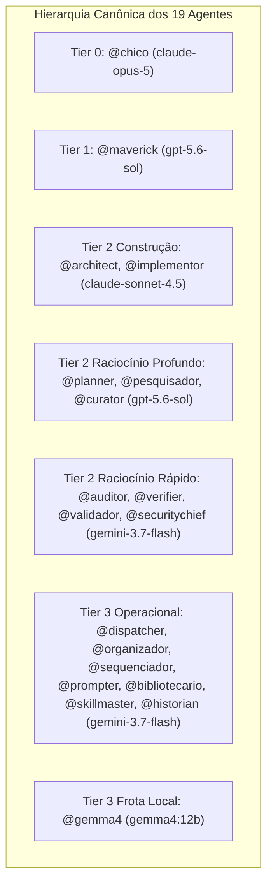

# Relatório de Handoff & Status: Malha Agêntica e Autoridade de Roteamento

> **Data:** 2026-08-30 · **Autoridade:** Protocolo Chico SOTA v8.0 GOLD

## 1. Topologia da Malha Agêntica (19 Agentes Primários)

A autoridade de roteamento para agentes primários é estritamente [`llm/routing_policy.py`](file:///c:/Users/rapha/.gemini/Site/llm/routing_policy.py) via [`core/config.py`](file:///c:/Users/rapha/.gemini/Site/core/config.py) (`AGENT_MODEL_MAP`).

---

## 2. Topologia dos 15 Subagentes da Malha DAG (`core/subagents_mesh.py`)

Todos os subagentes operam na malha local DAG com **custo marginal zero**:

| # | Subagente (`SubagentTier`) | Classe de Tarefa | Modelo Local Designado | Finalidade |
| :- | :--- | :--- | :--- | :--- |
| 1 | `appsec_gatekeeper` | `VERIFICACAO` | `qwen-code-surgical:latest` | Target Lock, diffs cirúrgicos e segurança de código |
| 2 | `math_verifier_sota` | `LOCAL` | `qwen-pmev-math:latest` | Formalismo matemático PMev / ICMev |
| 3 | `wasm_perf_engineer` | `CONSTRUCAO` | `qwen2.5-coder:7b-instruct-q5_K_M` | Otimização WASM / SIMD e zero-copy Rust |
| 4 | `poetics_curator` | `OPERACIONAL` | `qwen-poetics:latest` | Síntese de linguagem e refinamento semântico |
| 5 | `nano_intent_router` | `OPERACIONAL` | `qwen2.5-coder:0.5b` | Roteamento ultra-rápido de intenção |
| 6 | `streaming_fim_companion` | `OPERACIONAL` | `qwen2.5-coder:1.5b` | Autocomplete e Fill-in-the-Middle |
| 7 | `ui_design_curator` | `CONSTRUCAO` | `qwen2.5-coder:7b-instruct-q5_K_M` | Fluid layouts, Tailwind e A11y |
| 8 | `research` | `RACIOCINIO_PROFUNDO` | `gemma4:31b-cloud` | Pesquisa de fronteira e cruzamento de papers |
| 9 | `sub_validador` | `VERIFICACAO` | `qwen-pmev-math:latest` | Subagente auxiliar de validação formal |
| 10 | `sub_implementor` | `CONSTRUCAO` | `qwen2.5-coder:7b` | Geração de código e patches pontuais |
| 11 | `sub_curator` | `RACIOCINIO_PROFUNDO` | `qwen2.5-coder:7b-instruct-q5_K_M` | Curadoria de artefatos Markdown e diagramas |
| 12 | `sub_architect` | `CONSTRUCAO` | `gemma4:31b-cloud` | Subagente auxiliar de topologia e DAGs |
| 13 | `generalist` | `OPERACIONAL` | `gemma4:31b-cloud` | Processamento de texto e transformações |
| 14 | `self` | `OPERACIONAL` | `qwen-code-surgical:latest` | Autoinspeção de AST e autopoiese |
| 15 | `flutter_a11y_agent` | `VERIFICACAO` | `qwen-code-surgical:latest` | Auditoria de acessibilidade Flutter / WCAG |

---

## 3. Invariantes de Governança Travados

1. **Separação de Namespaces:** A sobreposição entre nomes de agentes primários e subagentes foi reduzida a **zero** (`nomes_que_sao_agente_E_tier: []`).
2. **Autoridade Dupla Excluída:** Agentes são roteados por `core.config.modelo_do_agente`; subagentes são roteados localmente por `core/subagents_mesh.py`.
3. **Custo Marginal Zero nos Subagentes:** 100% dos 15 subagentes executam na frota local/cota gratuita.

---

## 4. Estado da Suíte de Testes

- `tests/test_record_index.py`: **27/27 PASSED** (100% Verde).
- `tests/test_routing_policy.py`: **40/40 PASSED** (100% Verde).
- `tests/test_frente4_autoridade_de_roteamento.py`: **28/28 PASSED** (100% Verde).
- `tests/test_subagents_mesh.py` & `tests/test_gemma4_mesh_integration.py`: **12/12 PASSED** (100% Verde).
