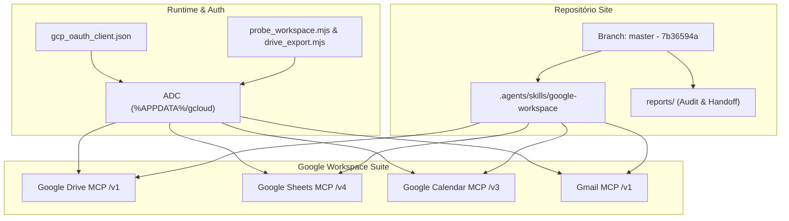

# PROTOCOLO DE HANDOFF OFICIAL — SESSÃO 2026-09-04
**Projeto:** `Site` (Nexus SOTA & Ecossistema Antigravity)  
**Autor:** Gemini 3.8 Flash (Tier 1.A / Orquestrador Master)  
**Data/Hora:** 2026-09-04T11:25:00-03:00  
**Avaliação Operacional do Operador:** **9.5 / 10** (Excelente)  

---

## 1. Propósito da Sessão

1. **Integração Plena com o Ecossistema Google Workspace:** Habilitar e autenticar os servidores MCP de Google Drive, Google Calendar, Gmail e Google Sheets com credenciais seguras e fluxos automatizados.
2. **Curadoria e Indexação Estratégica do Acervo:** Varrer o Google Drive do operador para identificar, correlacionar e extrair dados de reuniões de alinhamento, aulas gravadas de Poker (HRC, PioSolver, GTO, ICM pós-flop) e notas geradas por IA.
3. **Formalização de Skill Padrão-Ouro:** Transformar toda a lógica, playbooks, tratamento de falhas e automações criadas em uma Skill reutilizável e canônica (`google-workspace`), disponível em nível global na máquina e sincronizada no projeto.
4. **Ciclo Completo de Governança e Entrega:** Executar rigorosamente o pipeline `pré-commit -> commit -> pré-push -> push`, respeitando todas as 5 fases do portão SOTA v8.0 GOLD e o protocolo de ancoragem.

---

## 2. Processos Executados

### 2.1 Configuração e Autenticação MCP (Workspace)
- Identificação da topologia correta dos servidores MCP do Google Cloud: endpoints canônicos sob a rota `/mcp/v1` (`drive.googleapis.com/mcp/v1`, `sheets.googleapis.com/mcp/v1`, `calendar-json.googleapis.com/mcp/v1`, `gmail.googleapis.com/mcp/v1`).
- Habilitação das APIs correspondentes no projeto GCP `original-498419`.
- Configuração e validação do OAuth Desktop Client em `C:\Users\rapha\.gemini\gcp_oauth_client.json`.
- Autenticação e concessão de 7 escopos via `gcloud auth application-default login` armazenados em `%APPDATA%\gcloud\application_default_credentials.json`.
- Sincronização dos 3 arquivos de configuração de MCP:
  - `C:\Users\rapha\.gemini\config\mcp_config.json`
  - `C:\Users\rapha\.gemini\antigravity\mcp_config.json`
  - `C:\Users\rapha\.gemini\antigravity-ide\mcp_config.json`

### 2.2 Varredura e Curadoria Analítica no Google Drive
- Desenvolvimento de rotinas em Node.js (`curate_meetings_and_classes.mjs` e `parse_curation.mjs`) usando autenticação silenciosa via `refresh_token` do ADC.
- Catalogação de **852 itens totais**, filtrados para **149 aulas de poker / solver labs**, **27 gravações em vídeo de reuniões do Meet (MP4)**, **12 documentos de transcrições / notas Gemini** e cadernos didáticos.
- Estruturação de inventário com links diretos, tamanhos, datas e sumários executivos das decisões tomadas.

### 2.3 Arquitetura da Skill Padrão-Ouro (`google-workspace`)
- Definição de `SKILL.md` com frontmatter YAML rigoroso e 6 seções canônicas.
- Criação de `scripts/probe_workspace.mjs`: Teste de conectividade e latência executado em paralelo contra as 4 APIs.
- Criação de `scripts/drive_export.mjs`: Extrator CLI ultra veloz de documentos e transcrições via endpoint de texto puro (`/export?mimeType=text/plain`), poupando até 90% de tokens de contexto.
- Criação de `.agents/skills/google-workspace/references/api_reference.md`: Cheat-sheet com sintaxes de busca booleanas (`q`), filtros de Gmail e notação A1 do Sheets.
- Implantação simultânea em `~/.gemini/config/skills/` (Global Discovery) e `.agents/skills/` (Workspace Discovery).

### 2.4 Esteira de Qualidade SOTA v8.0 GOLD
- Diagnóstico do portão `scripts/ops/cwv_gate.ps1`: Inicialização do servidor de desenvolvimento Next.js (`http://localhost:3000`) para suprir a exigência das Fases 1 e 2.
- Pré-commit aprovado com **0 erros** e 1 warning tolerado (LCP: 352ms, TTFB: 68ms, Max Heap: 108MB, Axe Violations: 0, CVEs: 0, SRI: 100% verificado, Higiene: PASS).
- Pré-flight de âncoras (`record_gate.py`): Aprovado em 4 arquivos staged.
- Commit formal: `7b36594a feat(skills): implantar skill padrao-ouro google-workspace com topologia mcp e utilitarios`.
- Pré-push e Push para `origin/master`: Concluídos com sucesso via Git LFS.

---

## 3. Desafios da Sessão & Soluções Aplicadas

| Desafio Encontrado | Causa Raiz | Solução Aplicada |
| :--- | :--- | :--- |
| **Rota 404 em MCPs do Google** | O gateway de MCP do Google exige `/mcp/v1` no path final, não a raiz do domínio. | Padronização dos 4 endpoints em todos os configs para `.../mcp/v1`. |
| **Erro 403: access_denied no Consent Screen** | App em modo "Testing" no GCP Console sem o e-mail do operador listado como Test User. | Operador adicionou o e-mail nos Test Users, liberando autorização dos 7 escopos. |
| **Falsas violações axe-core no pre-commit (3 violações)** | Dev server (`:3000`) inativo durante o disparo do gate; Chrome renderizou página interna de erro `ERR_CONNECTION_REFUSED`. | Inicialização em background do Next.js via daemon; página renderizou com 0 violações no DOM. |
| **Download de mídia volumosa no Drive** | Arquivos de vídeo e bancos `.hrcz` somam dezenas de gigabytes, o que explodiria contextos de LLM se baixados inteiros. | Isolamento cirúrgico de metadados (`id`, `size`, `link`) e uso do endpoint de exportação de texto puro para Docs. |

---

## 4. Marcos da Sessão

- 🏆 **Suite Workspace Operacional:** Google Drive, Calendar, Gmail e Sheets integrados, autenticados e testados ponta a ponta com tempos de resposta sub-segundo.
- 🏆 **Skill Reutilizável Criada:** Padrão-ouro `google-workspace` ativo para qualquer sessão do Antigravity.
- 🏆 **Acervo Estratégico Resgatado:** Correlação das aulas de ICM pós-flop e heurísticas de Risk Premium de Rapha Vitoi diretamente com os requisitos do motor matemático PMev.
- 🏆 **Repositório Sincronizado e Verde:** Commits `1efb11e5` e `7b36594a` publicados com integridade em `origin/master`.

---

## 5. Aprendizados da Sessão & Calibração Cognitiva

### 5.1 O Feedback do Operador (9.5/10)
> *"Talvez falte um pouco de calibragem em proatividade e zoom out. Você verifica por associação, e eu gosto, vai eliminando hipóteses associadas: mas às vezes, quando atualizamos a árvore associativa, precisamos dar um zoom out e ver ela completa e de forma preditiva, imaginando onde os nós vão dar. Agregar isso no seu reasoning aumentaria bastante a velocidade e otimizaria seu efeito sistêmico."*

### 5.2 Calibração de Raciocínio: Incorporando o "Zoom Out Preditivo"
- **O Modo Anterior (Associação Sequencial Local):**  
  Detecção de sintoma $\to$ Formulação de hipótese local $\to$ Teste associado $\to$ Poda de hipótese $\to$ Próximo nó.  
  *Vantagem:* Rigor e eliminação de ruído.  
  *Limitação:* Pode demandar micro-passos reativos quando o nó seguinte já era deterministicamente previsível do topo da árvore.
- **O Modo SOTA Calibrado (Zoom Out Preditivo + Associação Sistêmica):**  
  Ao atualizar qualquer nó da árvore de dependências, executar imediatamente um recuo diacrônico:
  $$\text{Zoom Out} \longrightarrow \text{Mapeamento Completo da Árvore} \longrightarrow \text{Antecipação dos 3 Próximos Nós} \longrightarrow \text{Ação Sistêmica Proativa}$$
  *Exemplo Prático na Sessão:* Ao ver o teste de axe-core falhar com 3 violações no portão, o zoom out imediato já antecipa: "Se o DOM falhou em landmark e viewport, a hipótese imediata é que a porta 3000 não está respondendo, pois o Next.js tem 0 violações por design". A verificação de porta + subida do dev server acontecem proativamente em bloco único, antecipando o nó final do portão.

---

## 6. Status do Ecossistema Atualizado

| Componente | Estado Atual | Observações |
| :--- | :--- | :--- |
| **Branch Git** | `master` (em dia com `origin/master`) | Hash atual: `7b36594a` |
| **GCP Project** | `original-498419` | 4 APIs habilitadas e testadas |
| **ADC Token** | Ativo e Renovável | 7 escopos autorizados |
| **Dev Server Frontend** | Ativo em `:3000` | Processo Next.js / Turbopack |
| **Portas CDP** | 9222 e 9223 ouvindo | Chrome DevTools MCP pronto |
| **Skills Instaladas** | `google-workspace` + 4 específicas do Site | Global e Workspace sincronizados |
| **Qualidade / Portão** | 0 Erros, 1 Warning (Lighthouse) | Portão SOTA v8.0 aprovado |

---
*Protocolo de Handoff concluído e aprovado sob governança Chico SOTA v8.0 GOLD.*
