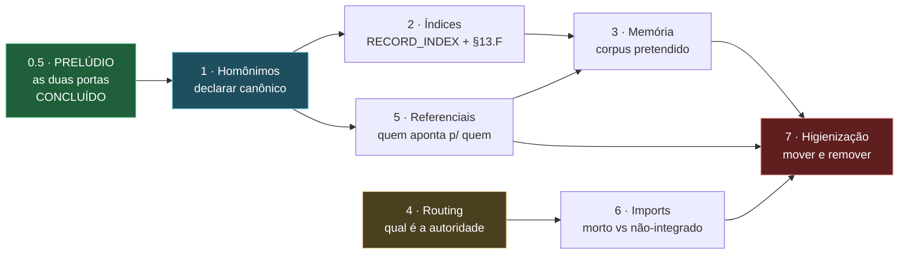

# PLANO 2-B — Curadoria estrutural de `~/.gemini`

> **Autorizado por Raphael Vitoi em 2026-08-27.** Frente subsequente ao trabalho
> de governança e portões da mesma data. Ver
> [HANDOFF-2026-08-27](HANDOFF-2026-08-27-governanca-e-portoes.md).

## 0. Por que isto não é limpeza

Limpeza remove o que sobra. Esta frente **reconcilia estruturas que já se
contradizem entre si** — e a contradição já custou diagnóstico errado quatro
vezes num único dia:

| # | Contradição | Custo medido |
| :--- | :--- | :--- |
| 1 | Dois `MODUS_OPERANDI.md` com o mesmo basename | Auditoria mensal descartava o canônico (39 KB) e reportava os dados do outro (12 KB) como se fossem dele |
| 2 | `reports` como nome solto num filtro | Excluía 20 registros de `docs/reports/` sem ninguém pedir |
| 3 | `recursive: false` declarado e nunca lido | Campo mentia; honrá-lo sem coordenação removeria 39 registros de governança viva |
| 4 | `.gemini` dentro de `Site/` | Ambiguidade de raiz — a mesma que o `CLAUDE.md` §1 já documenta como causa de três diagnósticos errados |

**Nenhuma delas apareceu como erro.** Todas apareceram como sucesso. É por isso
que a ordem abaixo termina em higienização, e não começa por ela.

---

## 0.5. PRELÚDIO — as duas portas, resolvidas antes da frente 1

> **Executado em 2026-08-27**, antes de qualquer movimento estrutural.
> Registrado aqui, e não como pendência solta, porque **os dois eram portas de
> entrada**: um decide como o humano entra no ecossistema, o outro como o
> cliente fala com o modelo. Curadoria estrutural que começa sem as portas
> definidas move móveis num prédio cuja entrada ainda está sendo discutida.

### 0.5.1 A porta do humano — `nexus <texto livre>` era regressão, não escolha

Foi registrado como *"mudou de destino, pode ser intencional"*. A medição
mostrou coisa pior:

```
nexus refatorar o kernel de poker  ->  EXIT=2, "No such command 'refatorar'"
```

O posicional 0 do `do.ps1` é `$Description` (linha 41): **texto livre era o uso
histórico principal — enfileirar tarefa.** A regra *"primeiro argumento sem
hífen vai para o `nexus.ps1`"* mandou esse uso para um erro do Typer.

O discriminador certo não é a presença de hífen. É o **pertencimento ao
conjunto de comandos do Typer** — flags *e* texto livre pertencem ambos ao
`do.ps1`:

| Entrada | Destino |
| :--- | :--- |
| `status`, `dashboard`, `db`, `task` … (os 21 comandos) | `nexus.ps1` |
| `refatorar o kernel` (texto livre) | `do.ps1` — enfileira tarefa |
| `-Web`, `-Execute` (flags) | `do.ps1` |
| sem argumentos | `nexus.ps1` — ajuda do Typer, lista os 21 |

**A lista estática é a dívida que isso cria**, e é a mesma forma do mapa de
modelos Ollama em três cópias divergentes. Barrada por
`tests/test_roteamento_perfil.py`, que compara **as duas cópias** com os
comandos que o Typer de fato registra, verifica que a lista é *consultada* e
não só declarada, e proíbe o retorno da decisão por hífen.

**A duplicação continua** — é o item 1.3 logo abaixo. Mas deixou de poder
divergir em silêncio, que é o pré-requisito para movê-la com segurança.

### 0.5.2 A porta do modelo — eu tinha classificado errado

Registrei que o modo conversacional enviava `system_prompt` **e**
`messages[0]` com o mesmo conteúdo, chamei de *"persona duplicada"* e disse que
resolver exigia levantar o proxy. **As duas afirmações estavam erradas**, e a
leitura do servidor bastou para desfazê-las.

Não há duplicação: `_build_multiturn` só insere um system quando `messages[0]`
**não** é system, e o cliente já põe um lá. O `req.system_prompt` nunca entra
no conteúdo no caminho multi-turn.

O que existe é um **canal lateral**:

```python
# gemma_server._build_inference_options
elif not req.system_prompt:
    params["temperature"] = 0.0
```

A *presença* do campo distingue conversacional (temperatura do modelo, 0.4-0.5)
de agêntico (forçada a 0.0). **A redundância é load-bearing:** quem a
"limpasse" trocaria 0.5 por 0.0 sem que nada acusasse. Travado em
`tests/test_run_inference_contrato.py` e anotado no ponto de uso.

> **Lição que este prelúdio deixa para as frentes 1 a 7:** eu classifiquei um
> não-defeito como defeito lendo só um lado da fronteira. A frente 5 (mapa de
> quem referencia quem) é inteiramente feita de fronteiras assim. Ler os dois
> lados antes de nomear o problema não é rigor opcional ali — é o método.

---

## 1. Diretórios homônimos — inventário medido

### 1.1 `MODUS_OPERANDI.md` existe em 5 lugares

| Bytes | Caminho | Natureza |
| ---: | :--- | :--- |
| **40.028** | `~/.gemini/MODUS_OPERANDI.md` | **CANÔNICO** — governança multiprojeto |
| 12.836 | `Site/MODUS_OPERANDI.md` | governança do projeto |
| 6.743 | `Site/.cerebro/ops-deploy/MODUS_OPERANDI.md` | **cópia exata** do próximo |
| 6.743 | `Site/.claude/MODUSOPERANDI/MODUS_OPERANDI.md` | **cópia exata** do anterior |
| 4.616 | `antigravity/.claude/MODUS_OPERANDI.md` | governança de projeto irmão |

Os dois de 6.743 B são **byte a byte idênticos** (verificado por `cmp`). Nenhum
dos cinco declara qual é o canônico nem aponta para ele.

### 1.2 `extensions/` e `antigravity-cli/plugins/` são espelho exato

**324 arquivos comparados por `cmp`, zero divergências**, mais 76 que só existem
em `extensions/`. É a mesma árvore de plugins mantida em dois lugares.

### 1.3 A cópia perigosa: divergência silenciosa

`Site/skills/superpowers/CLAUDE.md` (7.574 B) e
`extensions/superpowers/CLAUDE.md` (8.506 B) **divergem**. Duplicata idêntica é desperdício; duplicata
divergente é armadilha, porque quem lê uma acredita estar lendo a outra.

### 1.4 Skills desativadas por rename

379 `SKILL.md.bak` (excluindo `node_modules`), **todos órfãos** — nenhum tem
`SKILL.md` ao lado. Não são backup: são a própria skill desligada. 61 ativas.

---

## 1.5 MAPA DE REFERÊNCIA — quem lê qual cópia

> Medido em 2026-08-28. **Nada foi movido, renomeado ou removido.** É a base de
> evidência que transforma as declarações de canônico da frente 1 em decisões
> mecânicas em vez de arbitrárias — `CLAUDE.md` §4: *"presumir que algo é órfão
> e remover já quebrou a toolchain aqui."*

### 1.5.1 Consumidor tem três tipos, e só um deles o `grep` enxerga

Essa distinção é o produto mais importante desta medição. Sem ela, "zero
referências" seria lido como "órfão", e a conclusão estaria errada em três das
cinco famílias.

| Tipo | Como se manifesta | Detectável por |
| :--- | :--- | :--- |
| **Código** | um script abre o caminho explicitamente | `grep` |
| **Manifesto** | declarado em config (`gemini-extension.json`, `rag_ingestion_manifest.json`) | leitura do manifesto |
| **Convenção do runtime** | carregado pelo agente por **nome + localização** (`CLAUDE.md` pelo Claude Code, `GEMINI.md` pelo Gemini CLI) | **invisível ao `grep`** |

**Nenhuma remoção pode se basear apenas na ausência do tipo 1.**

### 1.5.2 `MODUS_OPERANDI.md` — 5 cópias, consumidores resolvidos

| Bytes | Cópia | Código | RAG | Veredito |
| ---: | :--- | :--- | :--- | :--- |
| **40.028** | `~/.gemini/MODUS_OPERANDI.md` | `nexus.py:2156` (handoff), auditoria mensal, `sota_hygiene.py:321` | **FORA** | **CANÔNICO** e mais lido |
| 12.836 | `Site/MODUS_OPERANDI.md` | auditoria mensal (`SITE_ROOT /`) | **FORA** | governança de projeto |
| 6.743 | `Site/.claude/MODUSOPERANDI/…` | nenhum | **DENTRO** | só a memória lê |
| 6.743 | `Site/.cerebro/ops-deploy/…` | nenhum | **FORA** | **órfão real** — zero consumidores dos três tipos |
| 4.616 | `antigravity/.claude/…` | `task_executor.py:604` | n/a | canônico do projeto irmão |

**Achado 1 — a inversão do corpus.** O índice de memória contém a cópia
derivada de 6.743 B e **exclui as duas autoritativas**. Quem consulta a memória
sobre o Modus Operandi recebe o resumo, nunca o manual de 40 KB. As duas
"cópias" gêmeas byte a byte não são equivalentes: uma alimenta a memória, a
outra não alimenta nada.

**Achado 2 — o único órfão verdadeiro de toda a varredura** é
`Site/.cerebro/ops-deploy/MODUS_OPERANDI.md`. Nenhum código, nenhum manifesto,
nenhuma convenção. O diretório `ops-deploy/` é referenciado em prosa
(`project-context.md`) e outros arquivos dele estão no `document_manifest.json`
— mas este não.

### 1.5.3 `CLAUDE.md` — 4 de governança, 7 de componente

| Bytes | Cópia | Consumidor |
| ---: | :--- | :--- |
| 4.796 | `~/.gemini/CLAUDE.md` | **convenção** — carregado toda sessão |
| 3.576 | `Site/CLAUDE.md` | **convenção** — carregado com `cwd=Site`. FORA do RAG |
| 3.483 | `Site/.claude/PROPOSITOS/CLAUDE.md` | só o RAG |
| 2.281 | `antigravity/.claude/CLAUDE.md` | `do.ps1` ×3, `cognitive.py:33`, `task_executor.py:605`, `memory_rag.py:82` — **o mais lido por código de toda a varredura** |

**Achado 3 — o manual canônico erra sobre o próprio diretório.** A §1 do
`~/.gemini/CLAUDE.md`, linha 20, declara `AGENTS.md` na raiz. **Ele não
existe.** É a única inconsistência interna verificável do documento que governa
tudo — e ele é carregado em toda sessão, nas duas cópias (`~/.gemini/` e
`~/.claude/`).

### 1.5.4 `GEMINI.md` — a família de 35 era falsa

30 das 35 ocorrências estão dentro de plugins e são **declaradas por
manifesto**: cada `gemini-extension.json` traz `"contextFileName": "GEMINI.md"`.
Não são cópias concorrentes de governança — são o arquivo de contexto daquele
plugin. Declarar um "GEMINI.md canônico" que as substituísse **quebraria as
extensões**.

> **CORRIGIDO em 2026-08-28 — a chave não é uma, são três.** A medição acima
> procurou o literal `"contextFileName"`. Remedindo com o predicado
> **estrutural** — *existe `gemini-extension.json` irmão cujo texto cita o nome
> do arquivo* — as três grafias aparecem: `contextFileName` (22 ocorrências),
> `contextPath` (2, em `todoist-extension`) e `context` (2, em `co-researcher`).
>
> Sob os 5 basenames de governança e as 70 ocorrências sob a raiz: **26
> declaradas por manifesto, 44 não.** O número muda porque o predicado mudou —
> o antigo dava por declarado qualquer arquivo cujo manifesto irmão tivesse a
> chave, ainda que a chave nomeasse **outro** arquivo. `extensions/superpowers/`
> declara `GEMINI.md`; seu `CLAUDE.md` e seu `AGENTS.md` não são declarados por
> ninguém.
>
> **A consequência é de detector, não de contagem.** Uma regra de nomeação que
> conhecesse só `contextFileName` trataria o `GEMINI.md` do `todoist-extension`
> como cópia concorrente de governança e mandaria renomeá-lo — quebrando a
> extensão. É a mesma família de erro do "nome errado para grandeza real":
> o detector mede uma coisa e o nome promete outra.

Governança real: 5 (raiz 1.476, `Site/` 5.548, `antigravity/` 8.342,
`antigravity-cli/` 3.489, `antigravity-ide/` 4.067). Só a da raiz tem
consumidor de código (`sota_hygiene.py:320`); as outras vivem de convenção.

`FUNDAMENTOS_SOTA.md` é **única**. Não há família — não precisa de declaração.

### 1.5.5 `Site/skills/` — **RETIFICADO em 2026-08-28**

> **A conclusão abaixo estava errada sobre a NATUREZA.** `Site/skills/` não é
> fork nem cópia: são **8 submódulos git** apontando para upstreams públicos
> (`.gitmodules` existe, os 8 são gitlinks modo `160000`, e o `HEAD` de cada um
> bate com o gitlink). Os "53 divergentes" são **versões diferentes**, não
> trabalho editado e perdido.
>
> **Por que errei:** medi `cmp` e `mtime`, que respondem *"são diferentes?"*, e
> pulei `git ls-files -s`, que responde *"o que isto é?"*. A pergunta de
> natureza precede a de diferença.
>
> **O que continua válido:** a árvore que o CLI carrega é `extensions/`, e ela
> está mais velha. **O que muda:** o risco real não são os 53 arquivos de
> versão — são **62 fontes modificados localmente** dentro dos submódulos,
> invisíveis ao `git status` por `ignore = dirty` e destrutíveis por um
> `git submodule update`.
>
> Auditoria completa em
> [AUDITORIA-2026-08-28-skills](AUDITORIA-2026-08-28-skills.md).

O texto original, preservado como registro do que foi medido e do que foi
concluído a mais do que a medição autorizava:

Este é o achado de maior consequência da medição, e o que mais teria sido
destruído por uma limpeza baseada em intuição.

| Medida | Valor |
| :--- | ---: |
| Entradas em `Site/skills/` | 8 |
| Também em `extensions/` | 6 |
| **Só em `Site/skills/`** | **2** (`gemini-cli-security`, `gemini-deep-research`) |
| Arquivos idênticos ao espelho | 79 |
| **Arquivos divergentes** | **53** |
| Divergentes em que `Site/skills` é **mais novo** | **53** |
| Divergentes em que `extensions/` é mais novo | **0** |

`Site/skills/superpowers/CLAUDE.md`: 2026-08-17, 7.574 B.
`extensions/superpowers/CLAUDE.md`: 2026-06-01, 8.506 B.
Dois meses e meio mais novo, e **menor** — editado, não apenas atualizado.

**Achado 4 — a árvore que roda é a velha.** `extensions/` é a árvore que o CLI
gerencia: o registro de habilitação (`extension-enablement.json`) vive dentro
dela. `Site/skills/` não é diretório de skills reconhecido (`Site/.claude/skills`
não existe, nenhum `settings.json` o menciona), não é declarado por manifesto e
não é lido por código. **53 arquivos de trabalho mais recente não são carregados
por nada** — e isso nunca produziu erro, porque o antigo continua funcionando.

**Achado 5 — o espelho é incompleto nos dois sentidos.** Além dos 76 arquivos
que só existem em `extensions/` (já medidos na §1.2), `gemini-cli-security` e
`gemini-deep-research` estão no **ledger de integridade** do CLI — ou seja, o
CLI os instalou — mas **não existem em `extensions/`**: só em
`antigravity-cli/plugins/` e `Site/skills/`.

### 1.5.6 O que a frente 1 já pode decidir, e o que ainda não

**Decidível agora, com evidência:**

1. Canônico de `MODUS_OPERANDI` = a raiz (40 KB) — é a mais lida por código.
2. `Site/.cerebro/ops-deploy/MODUS_OPERANDI.md` é órfão dos três tipos. **Remoção continua exigindo ordem explícita**, mas a evidência está completa.
3. `GEMINI.md` e `CLAUDE.md` de plugin **não entram** na declaração de canônico. A família de governança do `GEMINI.md` tem 5 membros, não 35.
4. `FUNDAMENTOS_SOTA.md` sai da lista de homônimos: é única.
5. O corpus do RAG precisa incluir os dois `MODUS_OPERANDI` autoritativos — hoje indexa só o derivado.

**Ainda não decidível, e por quê:**

| Questão | Falta |
| :--- | :--- |
| `Site/skills/` — promover, fundir ou arquivar os 53 arquivos mais novos? | Saber se o fork foi deliberado. É decisão do vértice, não inferência |
| `AGENTS.md` na raiz — criar ou corrigir o `CLAUDE.md`? | Decidir se a família deve existir na raiz |
| As 2 extensões fora de `extensions/` | Entender se a instalação quebrou ou se o caminho é outro |

> **Estado em 2026-08-28.** Das três, **duas saíram da lista**: `Site/skills/`
> são submódulos (a pergunta "promover ou arquivar" era da categoria errada —
> ver §1.5.5), e o `AGENTS.md` da raiz **foi criado como ponteiro**, o que torna
> verdadeira a declaração da §1 do `CLAUDE.md` canônico. Resta a terceira.
>
> O **item 5** também mudou de forma ao ser executado. Ver §1.6.

---

## 1.6 FRENTE 1 — ENTREGUE em 2026-08-28

O entregável era *"regra de nomeação que proíba basename ambíguo em artefato de
governança, mais um índice que declare o canônico de cada família"*.

**Onde está:** [`data/INDICE_CANONICO_GOVERNANCA.json`](../data/INDICE_CANONICO_GOVERNANCA.json),
guardado por `tests/test_indice_canonico.py` (11 testes, **7 mutações
detectadas com baseline explícita**).

### 1.6.1 A regra não podia ser a proibição simples

Proibir o homônimo por completo quebraria as **duas** coisas que dependem do
nome exato: a convenção de runtime (`CLAUDE.md`, `GEMINI.md` em raiz de escopo)
e as extensões (arquivo de contexto declarado por manifesto — em três grafias,
§1.5.4).

> **Regra:** basename de governança só pode se repetir quando cada cópia é
> exigida, **na própria localização**, por consumidor de tipo `convenção` ou
> `manifesto` — uma por **raiz de escopo**. Cópia adicional fora de raiz de
> escopo tem de estar declarada no índice com papel explícito, ou receber
> prefixo de escopo (`<escopo>-GEMINI.md`).

Raízes de escopo reconhecidas: `.`, `Site`, `antigravity`, `antigravity-cli`,
`antigravity-ide`. Fora de alcance por natureza, não por exceção: vendorizado,
submódulo, espelho de extensão e backup — renomear ali quebraria upstream.

### 1.6.2 O que o índice deliberadamente **não** afirma

Bytes e números de linha entram como informativos e **nenhum teste os afirma**.
Número medido vale na configuração medida; transformá-lo em estrutura produz
portão que reprova por edição legítima. O consumidor em `nexus.py` andou de
`:2156` para `:2172` nesta mesma semana — o teste confere o **arquivo** e a
menção ao basename, nunca a linha.

### 1.6.3 O item 5 mudou de forma ao ser executado

A §1.5.6 pedia *"o corpus do RAG precisa incluir os dois `MODUS_OPERANDI`
autoritativos"*. Executando, **um dos dois é inalcançável por desenho**:

| | Medido |
| :--- | :--- |
| Corpus antes | **470** arquivos |
| Corpus depois | **474** — exatamente `MODUS_OPERANDI.md`, `CLAUDE.md`, `AGENTS.md`, `GEMINI.md` da raiz do projeto |
| Fonte `".."` (o canônico de 40 KB) | **0 arquivos** — `[SEC] Bloqueio de LFI/Traversal` |

`memory_rag.py:288` barra qualquer fonte que escape a raiz do projeto. Incluir
o canônico multiprojeto exigiria **ampliar uma fronteira de segurança** para
satisfazer um item de plano — que é a forma sofisticada de contornar portão, e a
governança proíbe.

Então o item 5 se cumpre pela metade e a outra metade **se declara**: o índice
registra `no_corpus_do_rag: false` com o motivo, e um teste
(`test_a_barreira_de_traversal_do_manifesto_continua_de_pe`) garante que a
barreira continua de pé — para que ninguém "conserte" o corpus derrubando-a.

A enumeração dos quatro arquivos, em vez de `*.md`, também é deliberada:
`"*.md"` recursivo na raiz arrastaria a árvore inteira.

---

## 2. Âncoras e índices

`data/RECORD_INDEX.json`, declarado na §13.C do MODUS_OPERANDI, **não existe**.
Consequência medida: dos quatro itens do portão §13.F, **dois estão inativos** —
não falham, simplesmente não têm o que ler.

> **CORRIGIDO em 2026-08-28 — a §13.F tem seis critérios, não quatro, e o
> buraco era maior.** Sondando um a um: **3 de 7 bloqueavam**. A contagem acima
> foi escrita por leitura, não por medição, e errou para menos nas duas pontas.
> Ver §2.3.1. *(Registro preservado: contagem citada que a medição desmentiu é
> exatamente o que a §4 do `CLAUDE.md` manda declarar, não apagar.)*

É a forma canônica do modo de falha desta casa: regra escrita, portão instalado,
e dois dos quatro critérios sem fonte de dados. O portão passa. Sempre passou.
Mesma família do `commit-msg` que morava em `.git/hooks/` com
`core.hooksPath=.husky` — a regra existia no disco e nunca executava.

### 2.1 O que já se acumulou neste escopo

Esta frente absorve tudo o que apareceu em 2026-08-27 tocando índice e âncora,
em vez de manter itens paralelos:

| Origem | Fato medido | O que a frente 2 tem de resolver |
| :--- | :--- | :--- |
| §13.C do M.O. | `data/RECORD_INDEX.json` não existe | Gerar a partir do frontmatter dos registros |
| §13.F, portão | 2 dos 4 itens inativos por falta do índice | Ligar os dois dormentes e **medir os dois estados** de cada um |
| Portão de âncora | Os outros 2 itens funcionam e reprovam de verdade | Não regredir: são a referência de como os outros dois devem ficar |
| Registros de 27/08 | 5 relatórios com frontmatter canônico já existem (`POSTULADO-001`, `HANDOFF`, `PLANO-2B`, `INTERLUDIO`, `AUDITORIA`) | São o corpus inicial do índice — e o teste de que o gerador lê frontmatter real, não sintético |
| Frente 1 (homônimos) | O índice precisa apontar para o **canônico** de cada família | **Dependência dura:** gerar o índice antes de declarar os canônicos grava a escolha arbitrária em disco |

### 2.2 Duas armadilhas conhecidas, nomeadas antes de começar

1. **Índice gerado é fato MEDIDO** (M.O. §13.A), não interno: vale para a
   árvore no estado em que foi varrida. Precisa de `config_medida`, ou vira
   número citado que ninguém consegue reproduzir.
2. **Verificar contra manifesto real, não sintético.** A validação do
   `memory_rag` nesta mesma sessão usou um manifesto inventado e não detectou o
   conflito da §13; o defeito só apareceu ao medir com o manifesto de verdade.
   O gerador do índice tem de ser exercitado contra `reports/` como está.

**Entregável:** o índice gerado a partir do frontmatter real, os dois itens
dormentes do portão §13.F ativos e **provados nos dois estados**, e um teste que
reprove se o índice divergir dos registros em disco.

**Ordem:** depois da frente 1. A dependência está no grafo da §8.

---

## 2.3 FRENTE 2 — ENTREGUE em 2026-08-28

### 2.3.1 A contagem citada estava errada, e para menos

A §2 acima dizia *"dois dos quatro itens do portão §13.F"*. A §13.F tem **seis
critérios numerados**, não quatro. Medindo — encenando uma violação de cada um
em stage e observando o portão — o estado real era pior do que o citado:

| Critério da §13.F | Antes | Depois |
| :--- | :---: | :---: |
| C1 frontmatter válido, `nao_verificado` presente | BLOQUEIA | BLOQUEIA |
| **C1b frontmatter que nenhum parser lê** | *passa* | **BLOQUEIA** |
| C2a âncora **citada na prosa** | *passa* | *passa* — **por desenho** |
| C2b âncora **declarada** em `caminhos:` | *passa* | **BLOQUEIA** (unidade) |
| C3 TTL externo vencido | *passa* | **BLOQUEIA** |
| C4 `config_medida` divergente | *passa* | **BLOQUEIA** |
| C5a credencial em texto claro | BLOQUEIA | BLOQUEIA |
| C5b ampliação de ACL/CORS | *passa* | **BLOQUEIA** |
| C6 supressor sem `Record-Id` | BLOQUEIA | BLOQUEIA |

**3 de 7 sondas antes; 7 de 8 depois** — e cada bloqueio foi conferido pela
*mensagem*, não só pelo código de saída, depois que a primeira rodada atribuiu
um bloqueio ao critério errado (§2.3.4).

### 2.3.2 O achado que veio de graça: frontmatter presente e ilegível

Ao escrever o gerador, **seis dos dez registros com frontmatter não eram YAML
válido**. Duas causas, nenhuma visível a olho nu:

- `- texto: mais texto` não é string, é **mapa de uma chave** — e quando uma
  linha de continuação segue, nem YAML válido é;
- crase é **caractere indicador** do YAML: `` - `nexus ops maintenance` NAO… ``
  é erro de sintaxe, não texto.

O portão de âncora aprovava os seis, porque confere campo obrigatório com
`^([a-z_]+):`. **Regex vê campo; não vê documento.** Campo presente num bloco
que nenhum parser lê é a forma mais limpa de sinal verde desconectado que esta
base já produziu — e sobreviveu a duas sessões de auditoria justamente porque o
portão dizia APROVADO.

Os seis foram normalizados (60 linhas, `: ` → ` -- `, sem perda semântica), e o
novo portão passa a reprovar a recorrência. Foi por isso que o portão novo é
**Python**: o PowerShell confere linha; ler documento exige parser.

**E a guarda provou o valor em minutos.** Ao escrever esta própria seção,
reintroduzi o defeito **três vezes** — `` `caminhos:` ``, `` `npm run
sota:audit` `` e um `hoje: C2b` — todas em texto que eu acabara de escrever
*sabendo* da armadilha. Não é descuido: crase e dois-pontos são a pontuação
natural de quem documenta código em português, e o frontmatter é o único lugar
do arquivo onde ela é sintaxe. Um formato que trai o autor informado precisa de
guarda, não de disciplina.

### 2.3.3 Três decisões de desenho, cada uma contra uma armadilha conhecida

1. **O índice não é versionado.** A §13.C adverte que "índice mantido em
   paralelo diverge". Cache commitado envelhece no primeiro registro editado sem
   rebuild. Fora do git, a divergência deixa de ser política a policiar e passa
   a ser **impossível por construção**.
2. **O portão não lê o arquivo — importa o módulo e recalcula.** Portão que
   confia em cache herda a idade do cache.
3. **A âncora interna é declarada, nunca inferida da prosa.** A §13.F pede
   marcar SUSPEITO todo registro VIGENTE cujo caminho o commit toque. Inferindo
   da prosa, os handoffs citam `nexus.py` e **todo commit em `nexus.py` exigiria
   superseder o handoff** — o portão travaria o repositório e seria desligado na
   primeira semana, que é o modo de falha descrito na própria docstring do
   portão de âncora. A âncora vive no campo `caminhos:`, que o autor preenche
   quando quer a proteção: entra com raio de explosão **zero** e cresce por
   adoção, igual ao frontmatter. A prosa continua sendo varrida, mas só como
   `caminhos_citados_na_prosa` — **sugestão não é âncora**.

### 2.3.4 O arnês mentiu de novo, e a lição é mais fina desta vez

A primeira rodada de sondas do estado *depois* reportou **8 de 8**, com o C2a
bloqueando — o único que eu havia desenhado para passar. Não bloqueou pelo
critério: o **fixture da própria sonda** trazia
`- nada: este arquivo existe apenas durante a medição`, que é justamente o
defeito da §2.3.2. O portão pegou minha sonda, não o caso.

Conferir só o código de saída teria registrado "C2 ativo" e fechado a frente com
uma afirmação falsa. **Exit code diz que bloqueou; só a mensagem diz por quê.**
Numa bateria em que cada sonda deve disparar um critério *específico*, verificar
a identidade do achado não é zelo — é a diferença entre medir e supor.

### 2.3.5 Estado do índice, medido

```
121 arquivos varridos em docs/ e reports/
  9 VIGENTE · 0 SUSPEITO · 1 OBSOLETO · 111 sem frontmatter
```

O OBSOLETO é o `HANDOFF-2026-08-27`, corretamente aposentado pelo `supersede` do
handoff de 28/08 — a cadeia da §13.B funcionando sem ninguém declarar estado.

**Onde está:** `scripts/ops/record_index.py` (gerador + estados derivados),
`scripts/ops/record_gate.py` (etapa 3 do pre-commit), `nexus index
--rebuild|--suspeitos` (a CLI que a §13.C declara), 18 guardas em
`tests/test_record_index.py`.

---

## 3. Contexto e memória

O manifesto do RAG ficou honesto nesta sessão (fonte para `reports/`, flag
`recursive` obedecida, arquivo morto excluído por subárvore). O corpus foi de
507 para 461 arquivos, com governança viva mantida e `.ARQUIVE` fora.

Mas a pergunta de fundo continua aberta: **qual corpus a memória DEVE ter?** O
atual é o que os globs alcançam, não o que foi decidido. Hoje ele inclui 249
arquivos de código (`*.py`, `*.ps1` recursivos da raiz) — decisão que ninguém
registrou.

### 3.1 O motor era outro do que todo mundo dizia

Medido em 2026-08-28: **`lancedb` não está instalado. `chromadb` está.** O
`memory_rag.py` usa `chromadb.PersistentClient` com embeddings
`ONNXMiniLM_L6_V2`, locais.

"LanceDB" era afirmado em **dez pontos de código vivo** — painel do dashboard,
quatro pontos do `gemma_server`, log de exceção, dashboard de avatares e o
**`system_prompt` entregue ao modelo**, que informava ao LLM ser um *"Motor de
RAG LanceDB"*. Todos corrigidos.

A origem está no `CONTEXT_CHECKPOINT`: `lancedb 0.37.1` foi **benchmarkado**
junto com `pyarrow 25.0.1` e `pyspark 4.2.0` (throughput medido de 54,7k reg/s).
A narração foi escrita para o estado **pretendido** e nunca reconciliada com o
**construído**. Nada acusou, porque nome errado não levanta exceção.

### 3.2 Instalar LanceDB **junto** com o Chroma — a condição inegociável

Foi levantado pelo vértice, e faz sentido técnico: LanceDB tem backend Rust,
formato colunar Arrow/Lance, busca híbrida (vetorial + texto integral),
versionamento de dados e leitura sem cópia. É outra classe de ferramenta, não
um Chroma melhor.

**Mas coexistência aqui tem precedente ruim.** Duas memórias e dois paradigmas
de roteamento já são problema aberto nesta base (frente 4, e a decisão
`supermemory` × `memory_rag` na §3.3). Instalar um terceiro motor "ao lado" sem
partição declarada é reproduzir o padrão pela terceira vez.

**Condição:** a partição de responsabilidade se declara ANTES da instalação, não
depois. A que faz sentido pela natureza dos dados:

| Corpus | Motor | Por quê |
| :--- | :--- | :--- |
| Governança, registros, memória de agente (~460 arquivos textuais) | **ChromaDB** | Pequeno, textual, já funciona, embeddings locais, zero configuração |
| PDFs do Drive (`ingest_drive_pdfs`), séries de benchmark, dados tabulares | **LanceDB** | Volume, colunar, Arrow — é exatamente o domínio dos 54,7k reg/s já medidos |

Sem essa linha escrita e testada, dois motores viram duas verdades.

**Roteiro proposto, em ordem:**

1. Declarar a partição acima (ou outra) num registro — **antes** de `pip install`.
2. Instalar e indexar **só** o corpus da coluna LanceDB. Não duplicar o de Chroma.
3. **Período de sombra medido:** para um conjunto de consultas de referência,
   registrar o que cada motor devolve. Comparação, não impressão.
4. Só então decidir se algum absorve o outro.
5. Guarda: estender `test_o_motor_de_rag_declarado_e_o_instalado` para exigir
   que **cada** motor citado no código esteja instalado **e** tenha corpus
   declarado. Hoje ela já reprova nome sem pacote.

**O que NÃO fazer:** instalar o LanceDB e reindexar o mesmo corpus nos dois. É
como a situação já corrigida termina de volta.

### 3.3 `supermemory` × `memory_rag` — decidido por fronteira, não por qualidade

`gemini-supermemory` faz `POST` do conteúdo para `https://api.supermemory.ai`,
exige `SUPERMEMORY_API_KEY` e não tem modo self-hosted (o *"local development"*
do README é `npm link`). O `memory_rag` é local, zero egresso.

O corpus em questão são POSTULADOs, handoffs, memória de agente e o código deste
repositório. **Mandar isso para SaaS de terceiro é decisão de exfiltração, não
de arquitetura** — e as chaves deste ambiente estão revogadas de propósito.

**`memory_rag` é a autoridade.** Não por ser melhor: por ser o único que
respeita a fronteira.

O que vale importar do `supermemory` são **conceitos, não o serviço** — três que
o `memory_rag` não tem:

- `Site/skills/gemini-supermemory/src/hooks/session-start.js` — injeção
  automática de memória no início da sessão. Hoje o `nexus agent handoff` faz
  isso à mão.
- `Site/skills/gemini-supermemory/src/lib/git-utils.js` — contexto ciente do
  estado do git.
- `Site/skills/gemini-supermemory/src/lib/project-config.js` +
  `container-tag.js` — escopo e etiquetagem por projeto.

> Os caminhos acima apontam para `src/`, não para `dist/`: as duas árvores têm
> os mesmos nomes, e `dist/` é build. Corrigido em 2026-08-28 — a primeira
> versão desta lista citava só o basename, e a segunda apontou para um `hooks/`
> que não contém os arquivos. **Referência só vale medida.**

**Entregável:** declaração explícita do corpus pretendido, com justificativa por
fonte, o manifesto derivado dela — não o contrário — e a partição de motores da
§3.2 escrita antes de qualquer instalação.

---

## 4. Routing

Depende da pendência 6 do handoff e não deve ser atacado antes dela:

- `llm/routing_policy.py` — política **declarada**: partição por classe de
  tarefa, âncoras de decaimento, `decidir()` com procedência.
- `llm/routing.py` — política **executada**: heurística competitiva por score,
  no caminho quente via `orchestrator`.

`decidir()` está correto e **inerte por desenho**, não por esquecimento: medido
em 2026-08-27, nenhum chamador de produção escalona por esta tabela.

**Entregável:** decidir qual das duas é a autoridade. Enquanto não decidir, toda
melhoria em qualquer uma delas tem chance de virar retrabalho.

> **Medido em 2026-08-28, e o enquadramento acima estava errado.** As duas não
> competem — têm tipos diferentes e respondem perguntas diferentes. A pergunta
> real era *"o caminho quente consulta a política?"*, e a resposta é não: 19 de
> 19 agentes e 13 de 13 subagentes divergem. Ver
> [`FRENTE-4-2026-08-28-autoridade-de-roteamento.md`](FRENTE-4-2026-08-28-autoridade-de-roteamento.md).
> O parágrafo acima fica como estava, porque é o que se planejou — corrigi-lo
> apagaria a evidência de que a medição contradisse o plano.

---

## 5. Regras mestras, referências e referenciais

Famílias medidas na raiz: `CLAUDE.md`, `AGENTS.md`, `GEMINI.md`,
`FUNDAMENTOS_SOTA.md`, `MODUS_OPERANDI.md` — dezenas de ocorrências, várias
delas stubs de 9 a 92 bytes (`Site/skills/superpowers/AGENTS.md` tem 9 B).

**Entregável:** mapa de quem referencia quem, e onde a referência aponta para
cópia em vez de canônico. Precedente direto: o `README` do `hybrid_router`
apontava para a cópia da raiz e para o `.venv` errado — corrigido nesta sessão.

---

### 5.1 FRENTE 5 — ENTREGUE em 2026-08-28

#### 5.1.1 O primeiro número era 1511, e não valia nada

Varrendo os 518 `.md` rastreados por citação de caminho: **2586 citações, 1511
que não resolvem.** Detector com 1500 falsos positivos é detector desligado —
então a pergunta virou *o que, dentro disso, é achado?*

Três estreitamentos, cada um derivado do que a medição mostrou:

| Estreitamento | Por quê | Resta |
| :--- | :--- | ---: |
| — | varredura ingênua | 1511 |
| Só corpus **vivo** (`docs/`, `reports/`, raiz; sem `.ARQUIVE`) e citação **com barra** | `Next.js` casa com a extensão `.js`; `Dashboard.ts` é nome, não endereço; prompt de continuidade arquivado cita o que existia **naquele dia** | 46 |
| Só o que **prescreve** — governança da raiz + registros de `reports/` **com frontmatter** | auditoria datada de março citando arquivo que sumiu depois é registro, não podridão | **3** |

**As três são minhas, escritas nesta semana.** Duas citavam
`superpowers/CLAUDE.md` sem dizer qual das duas cópias divergentes; uma citava
`hooks/session-start.js` sem raiz. Corrigidas.

E a correção errou na primeira tentativa: apontei para
`gemini-supermemory/hooks/`, que existe e **não contém** os arquivos — eles
moram em `src/hooks/` e em `dist/hooks/`. **Referência só vale medida**, e isso
inclui a referência que corrige outra.

#### 5.1.2 O falso positivo que sobrou, e por que ele importa

O `GEMINI.md` da raiz do projeto "citava" `implementation\_plan.md`, que não
existe. Só que a citação está dentro de um bloco LaTeX:

```
$$\text{Task List (task.md)} \longrightarrow \text{Implementation Plan (implementation\_plan.md)} \longrightarrow \dots$$
```

Não é referência a arquivo — é o nome de uma etapa num diagrama de ciclo de
vida, e `\_` é escape de LaTeX, não separador. O detector agora rastreia bloco
`$$` e pula. **Sétima vez** nesta base que um detector textual precisa
distinguir *citar* de *afirmar*, e a forma continua sendo a mesma: estado de
bloco, nunca isenção de arquivo.

#### 5.1.3 As 73 citações ambíguas — medidas, não corrigidas

Restam 73 menções por **basename puro** de família de governança: 27 `CLAUDE.md`,
20 `GEMINI.md`, 13 `AGENTS.md`, 13 `MODUS_OPERANDI.md` — nomes que designam de 2
a 5 arquivos diferentes sob a raiz.

**Não viraram portão, e a razão é semântica:** boa parte dessas frases fala da
*convenção* (`"o CLAUDE.md é carregado toda sessão"`), não de um arquivo
específico. Exigir caminho completo em todas produziria prosa pior e um detector
que o autor aprenderia a contornar. Ficam medidas aqui, disponíveis para quem
quiser desambiguar caso a caso.

#### 5.1.4 Quando a forma não separa, quem separa é a declaração

Ao escrever a §5.1.1 acima, o detector reprovou este próprio plano: ele agora
**cita** `superpowers/CLAUDE.md` e `hooks/session-start.js` para dizer que
estavam errados. **Oitava vez** nesta base.

As sete anteriores se resolveram estreitando a forma — pular linha que é só
comentário, rastrear bloco de docstring, ignorar `$$`. Aqui a forma **não
separa**: `X` citado para apontar e `X` citado para dizer *"isto sumiu"* são a
mesma sequência de caracteres, no mesmo tipo de linha.

Então a isenção passa a ser **declarada**, item a item, no frontmatter:

```yaml
referencias_nao_resolviveis:
  - superpowers/CLAUDE.md
  - hooks/session-start.js
```

Não é exceção por arquivo — isso criaria ponto cego justamente no registro que
fala dos caminhos mortos. É exceção **por caminho**, visível na revisão, e um
teste garante que ela não vaza para caminhos não declarados no mesmo documento.
Mesmo princípio do `caminhos:` da frente 2: **quando a inferência não decide, o
autor declara e o portão obedece à declaração, não ao palpite.**

#### 5.1.5 Duas sessões, uma chave duplicada, zero erros

Aplicando o `referencias_nao_resolviveis` acima, o frontmatter deste plano ficou com
**a mesma chave duas vezes** — outra sessão estava editando o repositório em
paralelo e acrescentou o mesmo bloco. `yaml.safe_load` aceita chave repetida em
silêncio: a última vence, a primeira desaparece sem erro.

É a mesma colisão que já fez uma auditoria desta casa **descartar o
`MODUS_OPERANDI.md` canônico de 40 KB e exibir os dados do de 12 KB como se
fossem dele**. Virou o critério **G1c** do portão e um teste sobre todos os
registros.

#### 5.1.6 O que ficou de guarda

`record_gate.py` ganhou o critério **G6**: referência morta em documento que
prescreve, sobre o que está em stage. E `tests/test_record_index.py` ganhou a
varredura completa do recorte prescritivo — o portão garante que ninguém
*aumenta* a dívida; o teste afirma que ela é **zero**.

Provado nos dois estados: sonda com caminho inexistente bloqueia (`EXIT=1`),
`GEMINI.md` com o bloco LaTeX passa.

---

## 6. Imports e exports

Dois defeitos desta classe já apareceram e foram corrigidos:

- `__all__` incompleto: `rotas_suspeitas` e `TTL_ROTA_DIAS` existiam e não eram
  exportados.
- Módulo sem consumidor: `rotas_suspeitas()` não era chamada por ninguém, e a
  auditoria mensal que deveria chamá-la **recomendava por escrito** fazer o que
  ela faz, com texto literal.

**Entregável:** varredura de símbolo público sem `__all__` e de módulo sem
importador, com a distinção entre "ainda não integrado" e "morto".

---

## 7. Higienização e reorganização — POR ÚLTIMO

**Só depois de 1 a 6.** A regra vem do `CLAUDE.md` §4 e foi paga com quebra real
de toolchain nesta casa: *presumir que algo é órfão e remover já quebrou a
toolchain aqui.*

Antes de mover ou remover qualquer arquivo:

1. Verificar quem referencia — com busca por referência real, não substring.
2. Verificar o que está no PATH e o que o manifesto exige.
3. Declarar o canônico antes de tocar na cópia.

**Remoção é destrutiva e exige ordem explícita do vértice, item a item.**

---

## 8. Ordem e dependências



O **prelúdio** precede tudo porque define as duas portas de entrada: se elas
mudam depois, cada decisão tomada abaixo delas precisa ser revisitada.

O item 1 destrava mais coisa que qualquer outro: sem saber qual é o canônico,
índice, memória e referencial ficam todos apontando para escolha arbitrária.
**A frente 2 depende dele por uma razão dura** — gerar o `RECORD_INDEX` antes
de declarar os canônicos grava a escolha arbitrária em disco, e a partir daí ela
deixa de parecer arbitrária.

O item 7 é o único destrutivo, e por isso é terminal.

---

## 9. Critério de aceite (do vértice, verbatim)

> *"linha padrão ouro que minimiza chance de erro, aumenta eficiência e
> excelência, e inviabiliza retrabalho ou efeitos sistêmicos negativos. isso
> vale pra ordem das tarefas também."*
