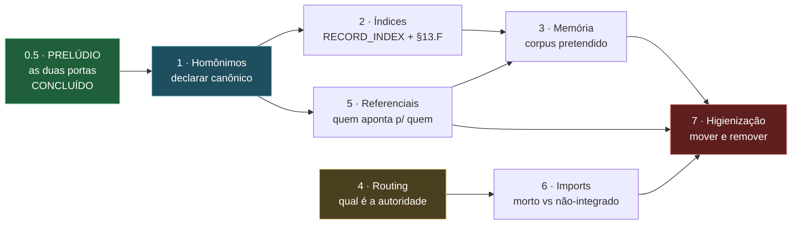

# PLANO 2-B — Curadoria estrutural de `~/.gemini`

> **Autorizado por Raphael Vitoi em 2026-08-27.** Frente subsequente ao trabalho
> de governança e portões da mesma data. Ver
> [HANDOFF-2026-08-27](HANDOFF-2026-08-27-governanca-e-portoes.md).

## 0. Por que isto não é limpeza

Limpeza remove o que sobra. Esta frente **reconcilia estruturas que já se
contradizem entre si** — e a contradição já custou diagnóstico errado quatro
vezes num único dia:

| # | Contradição | Custo medido |
| :--- | :--- | :--- |
| 1 | Dois `MODUS_OPERANDI.md` com o mesmo basename | Auditoria mensal descartava o canônico (39 KB) e reportava os dados do outro (12 KB) como se fossem dele |
| 2 | `reports` como nome solto num filtro | Excluía 20 registros de `docs/reports/` sem ninguém pedir |
| 3 | `recursive: false` declarado e nunca lido | Campo mentia; honrá-lo sem coordenação removeria 39 registros de governança viva |
| 4 | `.gemini` dentro de `Site/` | Ambiguidade de raiz — a mesma que o `CLAUDE.md` §1 já documenta como causa de três diagnósticos errados |

**Nenhuma delas apareceu como erro.** Todas apareceram como sucesso. É por isso
que a ordem abaixo termina em higienização, e não começa por ela.

---

## 0.5. PRELÚDIO — as duas portas, resolvidas antes da frente 1

> **Executado em 2026-08-27**, antes de qualquer movimento estrutural.
> Registrado aqui, e não como pendência solta, porque **os dois eram portas de
> entrada**: um decide como o humano entra no ecossistema, o outro como o
> cliente fala com o modelo. Curadoria estrutural que começa sem as portas
> definidas move móveis num prédio cuja entrada ainda está sendo discutida.

### 0.5.1 A porta do humano — `nexus <texto livre>` era regressão, não escolha

Foi registrado como *"mudou de destino, pode ser intencional"*. A medição
mostrou coisa pior:

```
nexus refatorar o kernel de poker  ->  EXIT=2, "No such command 'refatorar'"
```

O posicional 0 do `do.ps1` é `$Description` (linha 41): **texto livre era o uso
histórico principal — enfileirar tarefa.** A regra *"primeiro argumento sem
hífen vai para o `nexus.ps1`"* mandou esse uso para um erro do Typer.

O discriminador certo não é a presença de hífen. É o **pertencimento ao
conjunto de comandos do Typer** — flags *e* texto livre pertencem ambos ao
`do.ps1`:

| Entrada | Destino |
| :--- | :--- |
| `status`, `dashboard`, `db`, `task` … (os 21 comandos) | `nexus.ps1` |
| `refatorar o kernel` (texto livre) | `do.ps1` — enfileira tarefa |
| `-Web`, `-Execute` (flags) | `do.ps1` |
| sem argumentos | `nexus.ps1` — ajuda do Typer, lista os 21 |

**A lista estática é a dívida que isso cria**, e é a mesma forma do mapa de
modelos Ollama em três cópias divergentes. Barrada por
`tests/test_roteamento_perfil.py`, que compara **as duas cópias** com os
comandos que o Typer de fato registra, verifica que a lista é *consultada* e
não só declarada, e proíbe o retorno da decisão por hífen.

**A duplicação continua** — é o item 1.3 logo abaixo. Mas deixou de poder
divergir em silêncio, que é o pré-requisito para movê-la com segurança.

### 0.5.2 A porta do modelo — eu tinha classificado errado

Registrei que o modo conversacional enviava `system_prompt` **e**
`messages[0]` com o mesmo conteúdo, chamei de *"persona duplicada"* e disse que
resolver exigia levantar o proxy. **As duas afirmações estavam erradas**, e a
leitura do servidor bastou para desfazê-las.

Não há duplicação: `_build_multiturn` só insere um system quando `messages[0]`
**não** é system, e o cliente já põe um lá. O `req.system_prompt` nunca entra
no conteúdo no caminho multi-turn.

O que existe é um **canal lateral**:

```python
# gemma_server._build_inference_options
elif not req.system_prompt:
    params["temperature"] = 0.0
```

A *presença* do campo distingue conversacional (temperatura do modelo, 0.4-0.5)
de agêntico (forçada a 0.0). **A redundância é load-bearing:** quem a
"limpasse" trocaria 0.5 por 0.0 sem que nada acusasse. Travado em
`tests/test_run_inference_contrato.py` e anotado no ponto de uso.

> **Lição que este prelúdio deixa para as frentes 1 a 7:** eu classifiquei um
> não-defeito como defeito lendo só um lado da fronteira. A frente 5 (mapa de
> quem referencia quem) é inteiramente feita de fronteiras assim. Ler os dois
> lados antes de nomear o problema não é rigor opcional ali — é o método.

---

## 1. Diretórios homônimos — inventário medido

### 1.1 `MODUS_OPERANDI.md` existe em 5 lugares

| Bytes | Caminho | Natureza |
| ---: | :--- | :--- |
| **40.028** | `~/.gemini/MODUS_OPERANDI.md` | **CANÔNICO** — governança multiprojeto |
| 12.836 | `Site/MODUS_OPERANDI.md` | governança do projeto |
| 6.743 | `Site/.cerebro/ops-deploy/MODUS_OPERANDI.md` | **cópia exata** do próximo |
| 6.743 | `Site/.claude/MODUSOPERANDI/MODUS_OPERANDI.md` | **cópia exata** do anterior |
| 4.616 | `antigravity/.claude/MODUS_OPERANDI.md` | governança de projeto irmão |

Os dois de 6.743 B são **byte a byte idênticos** (verificado por `cmp`). Nenhum
dos cinco declara qual é o canônico nem aponta para ele.

### 1.2 `extensions/` e `antigravity-cli/plugins/` são espelho exato

**324 arquivos comparados por `cmp`, zero divergências**, mais 76 que só existem
em `extensions/`. É a mesma árvore de plugins mantida em dois lugares.

### 1.3 A cópia perigosa: divergência silenciosa

`superpowers/CLAUDE.md` existe em `Site/skills/` (7.574 B) e em `extensions/`
(8.506 B) — e **diverge**. Duplicata idêntica é desperdício; duplicata
divergente é armadilha, porque quem lê uma acredita estar lendo a outra.

### 1.4 Skills desativadas por rename

379 `SKILL.md.bak` (excluindo `node_modules`), **todos órfãos** — nenhum tem
`SKILL.md` ao lado. Não são backup: são a própria skill desligada. 61 ativas.

**Entregável do item 1:** regra de nomeação que proíba basename ambíguo em
artefato de governança, mais um índice que declare o canônico de cada família.

---

## 2. Âncoras e índices

`data/RECORD_INDEX.json`, declarado na §13.C do MODUS_OPERANDI, **não existe**.
Consequência medida: dos quatro itens do portão §13.F, **dois estão inativos** —
não falham, simplesmente não têm o que ler.

É a forma canônica do modo de falha desta casa: regra escrita, portão instalado,
e dois dos quatro critérios sem fonte de dados. O portão passa. Sempre passou.
Mesma família do `commit-msg` que morava em `.git/hooks/` com
`core.hooksPath=.husky` — a regra existia no disco e nunca executava.

### 2.1 O que já se acumulou neste escopo

Esta frente absorve tudo o que apareceu em 2026-08-27 tocando índice e âncora,
em vez de manter itens paralelos:

| Origem | Fato medido | O que a frente 2 tem de resolver |
| :--- | :--- | :--- |
| §13.C do M.O. | `data/RECORD_INDEX.json` não existe | Gerar a partir do frontmatter dos registros |
| §13.F, portão | 2 dos 4 itens inativos por falta do índice | Ligar os dois dormentes e **medir os dois estados** de cada um |
| Portão de âncora | Os outros 2 itens funcionam e reprovam de verdade | Não regredir: são a referência de como os outros dois devem ficar |
| Registros de 27/08 | 5 relatórios com frontmatter canônico já existem (`POSTULADO-001`, `HANDOFF`, `PLANO-2B`, `INTERLUDIO`, `AUDITORIA`) | São o corpus inicial do índice — e o teste de que o gerador lê frontmatter real, não sintético |
| Frente 1 (homônimos) | O índice precisa apontar para o **canônico** de cada família | **Dependência dura:** gerar o índice antes de declarar os canônicos grava a escolha arbitrária em disco |

### 2.2 Duas armadilhas conhecidas, nomeadas antes de começar

1. **Índice gerado é fato MEDIDO** (M.O. §13.A), não interno: vale para a
   árvore no estado em que foi varrida. Precisa de `config_medida`, ou vira
   número citado que ninguém consegue reproduzir.
2. **Verificar contra manifesto real, não sintético.** A validação do
   `memory_rag` nesta mesma sessão usou um manifesto inventado e não detectou o
   conflito da §13; o defeito só apareceu ao medir com o manifesto de verdade.
   O gerador do índice tem de ser exercitado contra `reports/` como está.

**Entregável:** o índice gerado a partir do frontmatter real, os dois itens
dormentes do portão §13.F ativos e **provados nos dois estados**, e um teste que
reprove se o índice divergir dos registros em disco.

**Ordem:** depois da frente 1. A dependência está no grafo da §8.

---

## 3. Contexto e memória

O manifesto do RAG ficou honesto nesta sessão (fonte para `reports/`, flag
`recursive` obedecida, arquivo morto excluído por subárvore). O corpus foi de
507 para 461 arquivos, com governança viva mantida e `.ARQUIVE` fora.

Mas a pergunta de fundo continua aberta: **qual corpus a memória DEVE ter?** O
atual é o que os globs alcançam, não o que foi decidido. Hoje ele inclui 249
arquivos de código (`*.py`, `*.ps1` recursivos da raiz) — decisão que ninguém
registrou.

**Entregável:** declaração explícita do corpus pretendido, com justificativa por
fonte, e o manifesto derivado dela — não o contrário.

---

## 4. Routing

Depende da pendência 6 do handoff e não deve ser atacado antes dela:

- `llm/routing_policy.py` — política **declarada**: partição por classe de
  tarefa, âncoras de decaimento, `decidir()` com procedência.
- `llm/routing.py` — política **executada**: heurística competitiva por score,
  no caminho quente via `orchestrator`.

`decidir()` está correto e **inerte por desenho**, não por esquecimento: medido
em 2026-08-27, nenhum chamador de produção escalona por esta tabela.

**Entregável:** decidir qual das duas é a autoridade. Enquanto não decidir, toda
melhoria em qualquer uma delas tem chance de virar retrabalho.

---

## 5. Regras mestras, referências e referenciais

Famílias medidas na raiz: `CLAUDE.md`, `AGENTS.md`, `GEMINI.md`,
`FUNDAMENTOS_SOTA.md`, `MODUS_OPERANDI.md` — dezenas de ocorrências, várias
delas stubs de 9 a 92 bytes (`Site/skills/superpowers/AGENTS.md` tem 9 B).

**Entregável:** mapa de quem referencia quem, e onde a referência aponta para
cópia em vez de canônico. Precedente direto: o `README` do `hybrid_router`
apontava para a cópia da raiz e para o `.venv` errado — corrigido nesta sessão.

---

## 6. Imports e exports

Dois defeitos desta classe já apareceram e foram corrigidos:

- `__all__` incompleto: `rotas_suspeitas` e `TTL_ROTA_DIAS` existiam e não eram
  exportados.
- Módulo sem consumidor: `rotas_suspeitas()` não era chamada por ninguém, e a
  auditoria mensal que deveria chamá-la **recomendava por escrito** fazer o que
  ela faz, com texto literal.

**Entregável:** varredura de símbolo público sem `__all__` e de módulo sem
importador, com a distinção entre "ainda não integrado" e "morto".

---

## 7. Higienização e reorganização — POR ÚLTIMO

**Só depois de 1 a 6.** A regra vem do `CLAUDE.md` §4 e foi paga com quebra real
de toolchain nesta casa: *presumir que algo é órfão e remover já quebrou a
toolchain aqui.*

Antes de mover ou remover qualquer arquivo:

1. Verificar quem referencia — com busca por referência real, não substring.
2. Verificar o que está no PATH e o que o manifesto exige.
3. Declarar o canônico antes de tocar na cópia.

**Remoção é destrutiva e exige ordem explícita do vértice, item a item.**

---

## 8. Ordem e dependências



O **prelúdio** precede tudo porque define as duas portas de entrada: se elas
mudam depois, cada decisão tomada abaixo delas precisa ser revisitada.

O item 1 destrava mais coisa que qualquer outro: sem saber qual é o canônico,
índice, memória e referencial ficam todos apontando para escolha arbitrária.
**A frente 2 depende dele por uma razão dura** — gerar o `RECORD_INDEX` antes
de declarar os canônicos grava a escolha arbitrária em disco, e a partir daí ela
deixa de parecer arbitrária.

O item 7 é o único destrutivo, e por isso é terminal.

---

## 9. Critério de aceite (do vértice, verbatim)

> *"linha padrão ouro que minimiza chance de erro, aumenta eficiência e
> excelência, e inviabiliza retrabalho ou efeitos sistêmicos negativos. isso
> vale pra ordem das tarefas também."*
