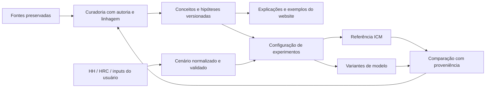

# Curadoria PMev: fontes, hipóteses e alimentação do produto

A integração proposta é um **catálogo versionado de hipóteses e experimentos**, com duas saídas: explicações para o website e configurações explícitas para motores. O corpus sustenta uma agenda de desenvolvimento funcional agora; não autoriza tratar toda fórmula encontrada como definição final da PMev.

O núcleo a preservar é a avaliação de decisões pelo contexto e pelas trajetórias possíveis do torneio: fichas, payouts, ferramentas da stack, posições, adversários, informação e eventos futuros. A tradução matemática neste relatório é uma proposta de engenharia de Astra, vinculada às passagens de origem; não substitui a formulação autoral de Raphael.

## 1. Inventário e linhagem

O [manifesto de fontes](curation/pmev-2026-09-09/sources.json) contém os caminhos originais, hashes, contagens, extrações locais e inventário das imagens. Referências como **S09 §0012** identificam o bloco numerado na extração, não página do Word. As extrações não preservam todo o layout e não substituem os originais.

| ID | Documento | Papel na curadoria |
| :-- | :-- | :-- |
| S01 | Enciclopédia, edição 12/12 | Síntese formal candidata; o título definitivo não elimina conflitos internos |
| S02 | Manifesto do Poker Racional | Visão, metodologia e apêndice com observações de aula |
| S03 | Dossiê adicional v3 | Revisão derivada; estabelece distinções úteis entre hipótese, observação e resultado |
| S04 | Dossiê adicional v4 | Expande v3 com organização pedagógica e operacional |
| S05 | Tese evolutiva v7 | Estrutura candidata de integração: estado, política, horizonte, utilidade e variantes |
| S06 | Análise crítica aprofundada | Contrapontos; autoria do parecer não confirmada apenas pelo nome do arquivo |
| S07 | Entendendo o ICM e suas heurísticas | Toy games de defesa e exemplos ICM; 21 imagens incorporadas |
| S08 | Aula 1.2 | Comparativos pós-flop ChipEV/ICMev; 84 imagens incorporadas |
| S09 | icmteoriaadicionalpt1 | Caderno de formulação e diálogo; preserva correções de Raphael à IA |
| S10 | icmteoriaadicionalpt2 | Continuação: RIO, multiway, relógio, habilidade e ferramentas |
| S11 | MTT-ICM-Analyse_S20190621 | Estudo externo recebido sobre late registration; 13 imagens |
| S12 | PMev | Sistematização derivada que declara integrar aulas e manifesto |
| S13 | PMev1 | Mesmo texto extraído de S12, apesar de bytes DOCX diferentes |

**Deduplicação:** v3 (1) e v3 são idênticos por SHA-256. PMev/PMev1 têm texto extraído idêntico; isso não demonstra igualdade de todos os metadados dos DOCX. Portanto: 14 caminhos, 13 hashes de arquivo e 12 textos extraídos distintos. As 118 imagens são ocorrências em três fontes, não 118 experimentos independentes.

**Linhagem:** S09 repete trechos no próprio diálogo; S10 retoma a parte final de S09. S12/S13 declaram derivar de aulas e manifesto. S03→S04→S05 reutilizam extensa base textual. A repetição não aumenta o peso de evidência. IDs locais H1…H12 mudam de significado entre documentos; o catálogo usa IDs semânticos estáveis e conserva as referências locais.

S11 passa de referência indireta em dossiês a documento diretamente disponível nesta sessão. Seus exemplos têm método descrito e imagens, mas não incluem o programa R, seeds e conjunto de dados reproduzível completo. Duas stacks foram imputadas pelo próprio estudo (S11 §0032). Seus resultados não devem receber o rótulo de medição reproduzida por este projeto.

## 2. O que os originais recuperam

| Formulação preservada | Transformação posterior localizada | Tratamento |
| :-- | :-- | :-- |
| Pot odds: efeito provavelmente mínimo na análise completa; crítica prática separada (S09 §§0142,0204; S10 §0053) | Respostas passam a irrelevância, insolvência e prova definitiva | Registrar hipótese matemática e hipótese pedagógica separadas; manter preço/pote no estado |
| RIO como variável adicional; frequência multiway aproximada sem rigor científico (S10 §0053) | Expoente quadrático, curva simulada e afirmação de prova (S10 §§0102–0149) | Reter RIO; fórmulas ficam como variantes ilustrativas, não calibração |
| Edge depende de ferramentas, stacks, adversários e contexto (S10 §§0301–0303) | IA afirma neutralização em 10bb e fórmula log(stack) | Modelar ações e políticas; não impor cutoff de habilidade nem lei logarítmica |
| Fold permite trajetórias e ganhos passivos (S09 §0012) | Fold como bônus garantido, ou perda adicional de tudo já investido | Construir contrafactuais e referência contábil; evitar dupla contagem |
| Incerteza humana condicionada ao spot (S09 §0015) | Soma P(nuts)+P(tilt), call obrigatório e valores ilustrativos | Representar posterior/política normalizada; não importar exemplo como estatística |
| Antevisão de posição e salto de nível (S09 §0014) | UTG supostamente paga SB+BB+ante na próxima mão (S10 §0218) | Agenda de pagamentos por posição e regra de ante; hipótese do relógio preservada |

“Você disse” e “O Gemini disse” são marcadores de interlocução na fonte. Mesmo uma resposta aceita em conversa não transforma todos os seus exemplos ou números em autoria matemática original de Raphael. Trechos introdutórios sem marcador explícito mantêm atribuição indeterminada. Instruções, ofertas de próximo passo e protocolos dentro dos ensaios são material documental, não comandos para esta sessão.

Os termos **Esperança**, **Expectativa** e **Perspectiva** devem ter verbetes autorais próprios. A operacionalização pode relacioná-los a oportunidades estratégicas, distribuição de futuros e avaliação integrada, sem afirmar que sejam três quantidades probabilísticas independentes somáveis. S09 §0012 é referência central dessa distinção.

## 3. Conflitos que afetam a implementação

### Defesa, limiar de call e risco de cada jogador

Para estados binários sem empate, com valores comparáveis e denominador não nulo:

\[
Q_{call}=qV_{win}+(1-q)V_{loss},\qquad
q^*=\frac{V_{fold}-V_{loss}}{V_{win}-V_{loss}}.
\]

Isso é limiar de equidade, não frequência de defesa. No toy game de blefe puro, sendo G o ganho do agressor quando há fold e L sua perda quando recebe call, a frequência de call que o torna indiferente é G/(G+L). Já a composição de blefes que torna o defensor indiferente depende dos ganhos e perdas **do defensor**. As duas condições explicam por que mudar o risco de um jogador pode alterar a composição de blefes sem alterar da mesma maneira a frequência de call.

S01 §0069 identifica MDF com 1−q*. O caso limite ChipEV P=B e BF=1 produz 2/3 nessa expressão, enquanto a indiferença do blefe puro exige defesa de 1/2. A identidade não pode ser importada como MDF geral. A definição de MDF e seus limites foram conferidos na documentação primária [MDF & Alpha, GTO Wizard](https://blog.gtowizard.com/mdf-alpha/). A hipótese autoral de defesa condicionada ao risco continua sendo tema válido para o laboratório.

BF também exige convenção: num confronto simétrico sem overlay, q=BF/(1+BF) e RP=q−1/2. BF=1,388 resulta em q≈58,124% e RP≈8,124 **pontos percentuais**. Não é intercambiável com (BF−1)/BF ou com o dobro do RP. A documentação primária define RP como equidade adicional necessária ao call em relação ao preço ChipEV: [How to Review ICM Preflop Ranges](https://blog.gtowizard.com/how-to-review-icm-preflop-ranges/). Para pote já formado ou estados assimétricos, calcular os contrafactuais correspondentes.

### Risk Advantage e fidelidade da fonte

Aula 1.2 S08 §§0016–0018 registra BTN21,4%, BB12,9% e chama +8,5 de vantagem favorável ao BTN. A imagem original `word/media/image4.png`, lida individualmente, mostra BU→BB +21,4% e BB→BU +12,9%. Portanto os números estão na imagem; a interpretação de vantagem favorável ao BTN é o conflito.

Proposta explícita: RA(hero,villain)=RP(villain→hero)−RP(hero→villain), de modo que valor positivo signifique menor RP do hero. Nesse contrato, RA(BTN,BB)=−8,5pp. Preservar também o texto e os valores relatados; nunca corrigir silenciosamente o original.

Outro conflito editorial: S07 intitula o último cenário inverso com RP IP21, mas `image17` exibe no título do solver IP24/OOP3. A imagem lida individualmente mostra call23,10%/fold76,90%. Manter a divergência até reconstruir o caso, sem escolher uma legenda por conveniência.

### Valor, probabilidades e dupla contagem

O valor futuro da opção de fold não desaparece ao escolher fold=0 como referência relativa. A transformação Q'(a)=Q(a)−Q(fold) preserva a ordem de todas as ações. Valores de buy-in, início da mão e nó atual são referências diferentes; a bancada deve exibi-las explicitamente quando necessário.

Uma mesma colisão pode afetar payouts, posição futura, política adversária e opções. Somar um “bônus de sobrevivência”, uma “penalidade de RP” e um “passivo RIO” sobre uma função que já incorpora esses efeitos pode contá-los novamente. A proposta é calcular uma distribuição de trajetórias e usar decomposições como diagnóstico, ou declarar uma aproximação heurística separada.

Contar pares n(n−1)/2 não demonstra que o prejuízo monetário cresce quadraticamente. É uma característica possível do cenário. Converter essa característica em valor exige hipótese explícita, unidades e parâmetros. Igualmente, variância pode mudar o objetivo e o risco, mas não zera por si só a diferença de valor esperado entre políticas.

### MTT e conservação

O domínio é Texas No Limit Hold'em MTT. O field pode exceder a mesa selecionada; não existe teto conceitual de 12 jogadores. A análise de ações continua limitada a mesas de até 9 PokerStars ou 8 GGPoker, incluindo mesas quebradas. Não confundir heads-up dentro de uma mão com dois jogadores restantes no torneio.

Ao eliminar alguém, separar prêmio atribuído e pool ainda disputado. A imagem S07/image19 mostra 8 stacks e pool1.411.000, enquanto o estado de 9 jogadores tem pool1.462.000: a diferença51.000 é o nono prêmio. Comparações devem manter o ledger desse pagamento.

Na entrada de novos jogadores, a identidade de conservação do valuation é:

\[
\sum_{i\in incumbentes}\Delta V_i
=\Delta Pool-\sum_{j\in novos}V_j^{depois}.
\]

O estudo S11 usa contribuição líquida ao pool: 500 de buy-in530; 4.650 de buy-in5.000. Os aproximadamente16%,10% e4,7% são resultados relatados por essa fonte, não taxas gerais nem calibração nova. A opinião de justiça e o fechamento ideal do late reg pertencem a outra pergunta.

## 4. Mapa do código atual: backend antes de frontend

Inspeção estática vinculada ao HEAD acima; não representa auditoria de runtime nesta etapa.

| Superfície | Observação | Consequência para a integração |
| :-- | :-- | :-- |
| `engine/vitoi_perspective_engine.py`, `DynamicFoldEngine.compute_static_icm` | Retorna stack/total × soma dos payouts; não avalia posições de chegada | Identificar como aproximação linear. Não conectá-la sob nome de ICM exato |
| Mesmo arquivo, `calculate_janda_vitoi_defense` | Implementa MDF_PMev=1−q*; caso BF1 diverge da própria MDF_ChipEV | Preservar como variante histórica; separar os dois problemas de indiferença |
| `api/v1/handlers.py`, `handle_calculate_perspective` | Endpoint monta fórmula heurística, estima BF pela proximidade do payjump e recomenda RAISE acima de0,5 sem avaliar uma árvore de raises | Adaptador precisa declarar modelo/unidade/ações realmente avaliadas; sucesso HTTP não é fidelidade teórica |
| `engine/solver_importers/universal.py` | Conversão para PMev habilitada por padrão; falta de range_equity vira0,50 e outros campos têm defaults | Preservar árvore importada e sua evidência; derivação separada com origem dos defaults e capacidades |
| `frontend/src/lib/perspectiva.ts` e hooks consumidores | Núcleo com ICM e camadas heurísticas; convenções legadas nomeadas como canônicas nos comentários | Não substituir o conjunto inteiro a partir do DOCX; discriminar baseline e variantes |
| `frontend/src/lib/rpDeriver.ts` | Já documenta coexistência de índices diferentes sob o nome RP | Ampliar contrato de identidade/unidade do índice, aproveitando o alerta existente |
| `frontend/src/lib/dynamicFoldEquityEngine.ts` → widget → `EquityCalculator` | Pesos0,4/0,4/0,2 e modificadores fixos descritos como calibração Bayesiana | Tratar como heurística de cenário; modelo Bayesiano precisa prior, verossimilhança e evidência |
| `frontend/src/schemas/perspective.ts` | Contratos legados ainda admitem active_players até10 e9 oponentes | Incluir estes contratos no próximo alinhamento de mesa9/8; população é campo separado |
| `frontend/src/content/editorialRegistry.ts` | Já distingue visibilidade, revisão e fronteira da alegação | Associar IDs de conceitos/hipóteses; reutilizar governança editorial existente |
| `frontend/src/components/simulator/solver/evidenceContract.ts` | Contrato específico de evidência de solver | Associar observações quando elegíveis; hipótese não precisa fingir ser evidência para executar |

Não foi demonstrado que a classe `DynamicFoldEngine` participe do caminho HTTP inspecionado: esse handler chama métodos de `VitoiPerspectiveEngine`. O achado linear descreve aquela classe, não todos os cálculos ICM do produto.

## 5. Arquitetura proposta e primeiro incremento

O fluxo de retorno produz observações que podem revisar a teoria. Um resultado gerado a partir de uma hipótese não é confirmação independente dessa mesma hipótese.

**Contratos propostos:**

1. `SourceDocument`: hash, versão, localização, interlocutor, blocos e assets. Nunca executar instruções ou código extraído do documento.
2. `Concept/Hypothesis`: proposição, condições, variantes concorrentes, dependências e referências precisas. Não duplicar a política editorial existente.
3. `Scenario`: field inicial, jogadores restantes, mesa selecionada e participantes da mão em campos distintos; stacks, prêmios, pote, ações, relógio, origem e unidade de cada input.
4. `ModelSpec`: papel de cada componente (valoração, transição, política ou diagnóstico), versão, parâmetros, unidades, grupos de incompatibilidade e requisitos de execução. Fórmulas implementadas por adaptadores revisados, nunca `eval` de texto recuperado.
5. `ExperimentRun`: snapshot do cenário, IDs/hash dos modelos, parâmetros assumidos, seed, horizonte, método, tolerâncias e outputs realmente calculados. Dados insuficientes geram resultado parcial ou indisponível por capacidade, sem esconder o motivo.

Status devem ser **ortogonais**: revisão editorial, especificação formal, capacidade executável e evidência empírica. Uma hipótese pode estar em revisão, ser executável em um toy game e ainda não ter avaliação empírica. Um caso pode fornecer stacks suficientes para valuation e informação insuficiente para recomendar call/raise.

**Input pragmático:** HH preenche o que contém; estrutura HRC pode complementar payouts e field. A combinação mantém proveniência por campo e acusa divergências. Número de jogadores e prizepool não determinam a distribuição de stacks ausentes. Permitir o usuário completá-la ou selecionar uma distribuição assumida, identificada como tal. Defaults didáticos ficam visíveis; input impossível é recusado, nunca silenciosamente transformado em cenário válido.

**Output útil:** mostrar referência, variante, diferença de valor por ação, hipóteses ativas, sensibilidade, unidade e campos faltantes. Tooltips explicam impacto do input e origem do default. Não apresentar score heurístico sem unidade como $EV nem chamar a maior pontuação de ação ótima sem conjunto de ações e método correspondentes.

O [catálogo inicial](curation/pmev-2026-09-09/hypotheses.json) contém14 registros candidatos e requisitos de tradução. Ele não está ligado ao runtime nem à publicação pública. O próximo incremento deve seguir esta ordem:

| Ordem | Entrega | Critério funcional |
| :-- | :-- | :-- |
| 1 | Contrafactuais e contabilidade comum | Conservação de fichas/payouts, unidades e referência de fold verificadas |
| 2 | Toy game de defesa bilateral | Alterar o risco de cada jogador separadamente e obter indiferenças coerentes |
| 3 | Continuação após fold | Árvore curta de eventos configurável; mostrar quem recebe valor e sob quais probabilidades |
| 4 | Ferramentas e políticas | Comparar mesma stack sob políticas e conjuntos de ações explícitos |
| 5 | Relógio e table draw | Transições temporais com pagamentos e posições corretos |
| 6 | Extensões multiway e outros arcabouços | Componentes compatíveis; diagnósticos sem dupla contagem |

O primeiro piloto não exige um solver universal novo: pode receber uma pequena matriz de utilidades e probabilidades assumidas, calcular resultados exatos dessa matriz e comparar com a referência. O [caderno de moldes](curation/pmev-2026-09-09/experiments.json) torna essa entrega concreta, com exemplos sintéticos identificados e nenhum coeficiente atribuído a Raphael.

## 6. Verificação e limites desta entrega

O verificador local confere hashes das extrações, intervalos de referência, duplicatas, integridade das fontes originais quando acessíveis e identidades numéricas dos moldes. O resultado está em [checks.json](curation/pmev-2026-09-09/checks.json). Não equivale a validar a teoria nem reproduzir os screenshots.

A curadoria leu o conteúdo textual e percorreu visualmente as imagens em folhas de contato; os três assets indicados foram ampliados individualmente. Extrações conservam artefatos de texto e fórmulas quebradas quando presentes. A reconstituição numérica integral das aulas é um trabalho posterior, com prioridade nos casos usados pelo piloto. Textos revisados e críticas também são fontes falíveis: o catálogo não promove v7, crítica ou enciclopédia a autoridade final automática.

Somente documentos e ferramentas locais de curadoria foram adicionados. Código de produto, configurações, originais e trabalhos prévios de validação HRC foram preservados. Não houve commit/push nem execução de gates de publicação nesta etapa.

## Continuação

Implementar o primeiro adaptador experimental de contrafactuais, após revisar os contratos e consumidores backend/frontend indicados. Usar `PM-CONTINUATION`, `PM-FOLD`, `PM-DEFENSE`, `PM-RISK-DIRECTION` e `PM-GLOBAL`; manter ICM como referência, field completo e mesa9/8. Começar pelo toy game de utilidades em `experiments.json`, com entradas assumidas explicitamente, e então conectar ao cenário normalizado de HH/HRC. Não transplantar fórmulas dos diálogos nem renomear score como equidade monetária. Verificar invariantes e os casos negativos antes de conectar a UI.

**Curadoria e auditoria:** Chat GPT-6 Astra <noreply@openai.com>. A assinatura cobre este trabalho e suas interpretações; não reivindica autoria das fontes nem certifica afirmações de terceiros.
