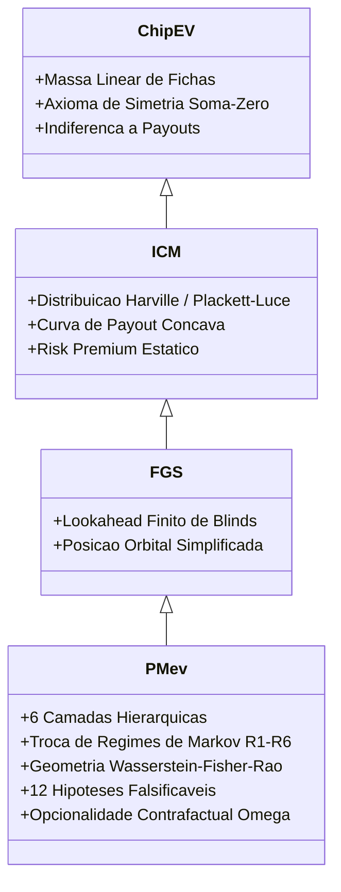

# Curadoria Canônica Master: Acervo Google Drive de Poker & PMev

> **Data da Sessão:** 13 de Setembro de 2026  
> **Escopo:** Mapeamento exaustivo, taxonomia e curadoria analítica dos elementos teóricos, matemáticos e estratégicos de Poker e da Teoria da Perspectiva Matemática (PMev) no Google Drive de Raphael Vitoi.
> **Limite da integração:** as contagens de Drive/discos abaixo pertencem à execução paralela de origem. A auditoria Sol × Hermes verificou a coerência com contratos e arquivos locais, mas não reexecutou APIs, solvers ou a enumeração multi-disco.

---

## 1. Sumário Executivo da Varredura

A varredura sistemática executada sobre o Google Drive via Google Drive API v3 e Application Default Credentials (ADC) processou **4.021 itens** (1.726 itens capturados no primeiro escalão de queries estruturadas e 2.295 arquivos expandidos a partir de 54 pastas dedicadas).

```mermaid
flowchart TD
    classDef main fill:#1e293b,stroke:#38bdf8,stroke-width:2px,color:#fff;
    classDef cluster fill:#0f172a,stroke:#64748b,stroke-width:1px,color:#e2e8f0;
    classDef highlight fill:#0284c7,stroke:#38bdf8,stroke-width:2px,color:#fff;

    A["Google Drive: 4.021 Itens Mapeados"] :::main --> B["Camada 1: PMev Core & Axiomática<br/>45 Documentos Mestre"] :::highlight
    A --> C["Camada 2: Evidência Pós-Flop & ICM Multidimensional<br/>Entendendo o ICM, Aula 1.2, Tratados, Relatórios HRC"] :::cluster
    A --> D["Camada 3: Epistemologia & Poker Racional<br/>Manifesto, Arcabouço, EDM, Textual Protocol"] :::cluster
    A --> E["Camada 4: Coaching de Elite & Masterclasses<br/>Ole Schemion, Fabi, Empi, FT Reviews"] :::cluster
    A --> F["Camada 5: Solvers, Ranges & Ferramentas<br/>GTO+, Piosolver, ICM Visualizer, Caveman"] :::cluster
    A --> G["Camada 6: Hand Histories & Raw Databases<br/>WPN, PS, 888, iPoker - Acervo Bruto"] :::cluster
```

### Distribuição Quantitativa do Acervo

| Cluster Temático | Volume de Itens | Tipos de Documento Predominantes | Impacto no Motor PMev |
| :--- | :--- | :--- | :--- |
| **1. Núcleo Axiomático PMev** | 45 | Google Docs, DOCX, Markdown, PDF | **Crítico / Direto** (Fundação Axiomática) |
| **2. ICM & Risk Premium** | 82 | Docs teóricos, Planilhas, Pastas de Aulas | **Muito Alto** (Parâmetros e Toy Games) |
| **3. Poker Racional & Epistemologia** | 18 | Docs, PDFs, Manuscritos de Livros | **Alto** (Modelagem Conceitual & EDM) |
| **4. Coaching de Elite & Masterclasses** | 24 | Gravações MP4, PPTX, Docs de Anotações | **Alto** (Heurísticas Práticas de FT) |
| **5. Planilhas, Ferramentas & Solvers** | 48 | Google Sheets, XLSX, Solvers (.gto, .cfr) | **Médio/Alto** (Validação Numérica) |
| **6. Hand Histories & Trackers** | 3.804 | TXT, DAT, XML, PHH (WPN, PS, iPoker, 888) | **Contextual** (Data Lake para MDA) |

---

## 2. O Grande Núcleo Axiomático PMev

O achado de maior magnitude da varredura é a existência do tratado unificado e dos arcos sequenciais da **Enciclopédia Magna da Teoria da Perspectiva Matemática (PMev) e Poker Racional**, de autoria de Raphael Vitoi (19 de agosto de 2026), acompanhado pelos seus dossiês científicos evolutivos.

### 2.1 A Enciclopédia Magna e a Família Aninhada Canônica

A teoria PMev consolida o fechamento axiomático que transcende as limitações estáticas do Independent Chip Model (ICM) e do Future Game Simulation (FGS), estabelecendo a hierarquia aninhada:

$$\mathcal{M}_{\text{ChipEV}} \subset \mathcal{M}_{\text{ICM}} \subset \mathcal{M}_{\text{FGS}} \subset \mathcal{M}_{\text{PMev}}$$



### 2.2 As Seis Camadas da Arquitetura PMev

1. **Camada Estática (Baseline ICM):** Modelo de Harville / Plackett-Luce sobre payouts estruturados e distribuição global de stacks.
2. **Camada Dinâmica ($\text{PMev-D}$):** Efeito erosivo do relógio $\tau_t$ (iminência dos blinds $t-3$), posição orbital, órbitas restantes e Stack-to-Pot Ratio ($\text{SPR}$).
3. **Camada Institucional ($\text{PMev-T}$):** Rebalanceamento dinâmico de mesas, fusão de mesas e teorema de conservação em Late Registration ($\sum \Delta V_i = -B_{\text{entry}}$).
4. **Camada Comportamental ($\text{PMev-B}$):** Assimetria informacional, AQRE (Asymmetric Quantal Response Equilibrium) com parâmetro de racionalidade $\lambda_j$ e shrinkage Bayesiano via MDA.
5. **Camada de Trajetória ($\text{PMev-O}$):** Opcionalidade contrafactual do stack ($\Omega(S_t) = V^*(S_t) - V^{\mathcal{A}_{\text{restrito}}}(S_t)$) e valor relativo de fold ($V_{\text{fold}}$ não nulo).
6. **Supermodelo Total ($\text{PMev-F}$):** Lookahead em horizonte finito $H$ truncado na função de valor terminal $\Phi = V_{\text{ICM}}$.

### 2.3 Espaço de Regimes de Markov ($\mathcal{R}_t$)

O ciclo de vida do torneio é formalizado como um processo estocástico com salto de regimes:

$$\mathcal{R}_t \in \{ \text{R}_1: \text{Early/Rebuy}, \; \text{R}_2: \text{Middle}, \; \text{R}_3: \text{Bolha}, \; \text{R}_4: \text{ITM/Laddering}, \; \text{R}_5: \text{Mesa Final}, \; \text{R}_6: \text{Heads-Up Final} \}$$

* **$\text{R}_1$ (Rebuy/Add-on):** Utilidade localmente convexa ($BF \approx 1$), favorecendo acumulação e redistribuição elástica.
* **$\text{R}_3$ & $\text{R}_5$ (Bolha e FT):** Hiper-concavidade extrema ($BF \gg 1,5$), emergência do "Pacto Silencioso" entre chip leaders e colapso de frequências de call.
* **$\text{R}_6$ (Heads-Up Final):** Desaparecimento de externalidades de terceiros; a função de utilidade colapsa rigorosamente de volta ao ChipEV linear.

---

## 3. O Ledger Consolidado das 12 Hipóteses Falsificáveis ($H_1$ a $H_{12}$)

O corpus recuperado no Drive estabelece formalmente os critérios de refutação científica das 12 hipóteses centrais da PMev:

| ID | Enunciado da Hipótese | Baseline de Comparação | Desenho Experimental / Dataset | Critério Estrito de Falsificação |
| :--- | :--- | :--- | :--- | :--- |
| **$H_1$** | **Superioridade Preditiva OOS** | $\text{PMev-0}$ / $\text{FGS}$ | Holdout temporal por eventos independentes | $\mathbb{E}[\mathcal{L}_{\text{PMev-D}}^{\text{OOS}}] \ge \mathbb{E}[\mathcal{L}_{\text{ICM}}^{\text{OOS}}]$ |
| **$H_2$** | **Mediação do Resíduo de Kim** | Modelo de Kim (2025) | Regressão linear hierárquica em 9.958 eventos | $\beta_{\text{stack}}$ não atenua com inclusão de $\mathbf{Z}_{\text{PMev}}$ ($p > 0,05$) |
| **$H_3$** | **Erosão Temporal ($t-3$)** | Solver sem relógio ($\Delta t = \infty$) | Solves pareados $S^{(0)}(15\text{m})$ vs. $S^{(1)}(2\text{m})$ | $\Delta Q(\text{open}) \le 0$ na iminência dos blinds |
| **$H_4$** | **Subversão da MDF no River** | $\text{MDF}_{\text{GTO}} = \frac{P}{P+B}$ | Solves pareados de river variando payouts | Defesa converge para MDF tradicional ignorando Bubble Factor |
| **$H_5$** | **Amortização da Edge por Stack** | Modelo de Edge Constante | MDA (>10M mãos) estratificado por stack | $\Delta \text{ROI}(10\text{bb}) \approx \Delta \text{ROI}(100\text{bb})$ |
| **$H_6$** | **Exploitabilidade via AQRE** | Node-lock fixo e Nash | Backtesting histórico com split temporal | Política AQRE apresenta regret superior ou $EV$ inferior |
| **$H_7$** | **Opcionalidade do SPR** | $\Omega(s) \equiv 0$ | Simulação pareada de trajetórias contrafactuais | $\Omega(s) \le 0$ para $S_{\text{eff}} \ge 40\text{bb}$ |
| **$H_8$** | **Downward Drift de Sizings** | Árvores em ChipEV | Solves pareados HRC ChipEV vs. ICMev | Frequência de apostas $\ge 50\%$ do pote inalterada |
| **$H_9$** | **Conservação em Late Reg** | Valor nulo de entrada | Monte Carlo em Python com seeds fixas | Desvio $\sum \Delta V_i + B_{\text{entry}} \neq 0$ além do erro amostral |
| **$H_{10}$** | **Pacto Silencioso em FT** | Estratégia em ChipEV | Solves HRC pré-flop com short stacks presentes | Frequência de 3-bet entre líderes inalterada |
| **$H_{11}$** | **Insolvência de Pot Odds** | Decisão linear por Odds | Teste experimental cego com profissionais | Decisões por Pot Odds têm desempenho idêntico à PMev |
| **$H_{12}$** | **Parcimônia Paramétrica** | $\text{PMev-0}$ e $\text{PMev-D}$ | Critérios de informação (AIC e BIC) | $\text{BIC}(\text{PMev-F}) > \text{BIC}(\text{PMev-D})$ |

---

## 4. Dossiês Científicos e Revisão Teórica

### 4.1 Dossiê Técnico v7: Transição Epistemológica ICMev $\rightarrow$ PMev
O arquivo `PMev_Dossie_Tese_Evolutiva_ICMev_para_PMev_v7.docx` (ID: `1QW5Gwg6WXlr1W0VnX08XSlUxWJM4Lr4c`) documenta a evolução da tese:
* **Crítica ao Dogmatismo:** A tese não prega que "o ICM está errado", mas que o ICM é um caso estático degenerado de um sistema dinâmico mais amplo.
* **Evidência reportada por Kim (2025):** o corpus atribui ao benchmark sobre 9.958 eventos e 33.478 jogadores resíduos sistemáticos compatíveis com variáveis omitidas. A integração local não reproduziu o estudo nem converte essa referência em prova da PMev.
* **A Curadoria de Chen & Ankenman (2006) e Janda (2013):** Formalização da separação estrita entre valor da mão e valor no torneio, com a utilidade modelada como função côncava sobre os prêmios.

### 4.2 Tratado de Mecânica de Jogo: Arquitetura Multidimensional do ICMev pós-Flop
Presente nos IDs `1_36RJZ6kqs3AmOqzGtD7ErCmTwF0bWaW1YMW4YxjPno` e `1dhXHsvyg3DFLCqZRQCRB5nm1H-HGw7Ejtpu0rnqLel0`:
* **Bunching Recursivo Global:** O HRC modela a probabilidade condicional de toda a mesa integrando recursivamente o perfil de descarte (folding) dos jogadores anteriores, enquanto o GTO Wizard clássico foca nos intervenientes ativos.
* **Dedução do Risk Premium Bilateral:**
  $$q_{\text{ICM}} = \frac{BF}{BF + r}, \quad q_{\text{chip}} = \frac{1}{1 + r}, \quad RP = q_{\text{ICM}} - q_{\text{chip}} = \frac{r(BF - 1)}{(BF + r)(1 + r)}$$
  *(onde $r = w/l$ é a razão risco-recompensa do pote).*

### 4.3 O Díptico de Evidência Autoral e as Heurísticas Avançadas de ICM (Raphael Vitoi)

> *Nota Canônica de Curadoria:* A menção prévia a um toy game atribuído a terceiros decorreu de um artefato residual em cache proveniente de um push anterior. O conteúdo autêntico, soberano e integral é de autoria exclusiva de **Raphael Vitoi**, materializado nos dois documentos centrais originais em `Downloads/` (preservados em `docs/research/pmev/`) e enriquecido pelos manuscritos teóricos adicionais:

1. **`Entendendo o ICM e suas heurísticas.docx` (5,72 MB):**
   * Ledger em [`docs/research/pmev/ENTENDENDO_ICM_HEURISTICAS_LEDGER.md`](file:///c:/Users/rapha/.gemini/Site/docs/research/pmev/ENTENDENDO_ICM_HEURISTICAS_LEDGER.md) (201 parágrafos, 26.000 caracteres).
   * Formulação do Toy Game clássico de river em board neutro ($22223$), com IP $\{AA, QQ, JJ\}$ vs OOP $\{KK\}$.
   * Análise comparativa ChipEV ($1-a = 50\%$ de defesa) vs. ICMev (onde o OOP atinge o "Teto do RP" intransponível).
   * **Inversão de RP e Dinâmica Relacional da FT:** Quando o IP possui maior RP (RP 21 vs OOP 3), o OOP — mesmo com risco quase nulo — **amplia seu fold para até 80%**, pois dobrar o rival dissipa a pressão do líder sobre o organismo da mesa final. Cálculos matemáticos validados com Dan Almeida.

2. **`Aula 1.2.docx` (31,3 MB):**
   * Ledger em [`docs/research/pmev/AULA_1_2_EVIDENCE_LEDGER.md`](file:///c:/Users/rapha/.gemini/Site/docs/research/pmev/AULA_1_2_EVIDENCE_LEDGER.md) (329 parágrafos, 97 figuras e nós gráficos pareados HRC Pós-Flop vs. GTO Wizard).
   * FT 9-Max Vanilla \$11, bordo $K\diamondsuit J\clubsuit T\spadesuit$, BTN (38 BB) vs. BB (53 BB), comprovando em solver multidimensional:
     - Assimetria estrita de Risk Premium: $\text{RP}(\text{BTN}) = 21,4\%$ vs $\text{RP}(\text{BB}) = 12,9\%$ ($\Delta\text{RP} = +8,5$ p.p.).
     - *Downward Sizing Drift:* colapso para leads pequenos (25% do pote).
     - *Bunching Recursivo Global:* condicionamento aos folds dos 7 jogadores ausentes na mão.
     - *Desconstrução da Inércia do Chip Leader:* neutralização da passividade em FT.

3. **Absorção dos Manuscritos Teóricos Adicionais (`icmteoriaadicionalpt1.txt` e `pt2.txt`):**
   * **Teorema do EV do Fold Positivo:** Em ChipEV puro, $EV_{\text{fold}} = -\text{antes} = -0,125\text{ BB}$. Em ICM, contudo, **$EV_{\text{fold}}$ pode ser estritamente POSITIVO** ($\mathbb{E}[\text{fold}] > 0$), pois foldar do MP com short stacks à frente significa "passar a vez", preservando capital e potencializando que os adversários colidam e sejam eliminados, capturando payjumps passivos sem assumir risco.
   * **A Cadeia dos Quatro Tempos:** $\text{ICMev (Snapshot)} \rightarrow \text{Esperança Matemática (Lógica)} \rightarrow \text{Expectativa Matemática (Probabilidade)} \rightarrow \text{Perspectiva Matemática (Decisão Fechada)}$.
   * **Reverse Implied Odds (RIO) como Antimatéria das Pot Odds:** Pot odds operam como um "cavalo de Troia" que mascara o passivo estrutural futuro. Em cenários de ICM, o overcall no river é apenas o sintoma; a negligência das RIO no flop/turn é a causa primária.
   * **FGS com Relógio $t-3$, Table Draw e Taxa de Desvio Emocional:** Antecipação do salto de blinds, rotação de assentos e calibração para erros cognitivos sob alta pressão.

---

## 5. Inventário dos Principais Documentos Curados

| Título no Google Drive | ID do Arquivo | Formato / MIME | Relevância |
| :--- | :--- | :--- | :--- |
| **Enciclopédia PMev Edição Magna Definitiva 12/12** | `1jJUFjarnNOM32uEieJcc3utLGRK5z9Wt-Pk47b6LYt0` | Google Doc | **Padrão-Ouro Axiomático** |
| **Enciclopédia PMev Edição Magna (DOCX)** | `1y8nRXxpxYF5mk0V-ph22Z_VagUSJaR8d` | DOCX | Backup Canônico |
| **Enciclopédia Teórica PMev (Raphael Vitoi)** | `1mh9O7ZGBUV3vjEBxV9VWp4A6Cyh5wJPKkYyk1tDnDK8` | Google Doc | Prosa Teórica Estendida |
| **Enciclopédia PMev Arcos 1 a 10** | *Múltiplos IDs (`1uQu...` a `1vt4...`)* | Google Docs | Capítulos Modulares |
| **Dossiê Tese Evolutiva ICMev para PMev v7** | `1QW5Gwg6WXlr1W0VnX08XSlUxWJM4Lr4c` | DOCX | Fundamentação Acadêmica |
| **Dossiê Incorporação Científica v4** | `1SjbVGOJkx2kYf34w9sNJD9mPRm4nS5fV` | DOCX | Evidências Adicionais |
| **Relatório Benchmark HRC 30bb BF 3.2** | `1ZdfaXvikEc_CvY9pOt4XjA978tFeaXgq` | PDF | Caso Prático de Over-fold |
| **Relatório Benchmark HRC 15bb BF 3.2** | `1qargBrGgJzxeO373jfUFtRasUPVKQT_S` | PDF | Caso Prático Short Stack |
| **Tratado Arquitetura Multidimensional ICMev pós-Flop** | `1_36RJZ6kqs3AmOqzGtD7ErCmTwF0bWaW1YMW4YxjPno` | Google Doc | Bunching e Solvers |
| **Entendendo o ICM e suas Heurísticas (V2 Curada)** | `1LSN-lH099OA2e-UEA2Ywaa3vqQKnrBXFrYjgjyrttoU` | Google Doc | Dinâmica Relacional da FT |
| **Aula 1.2: Estudo Pareado HRC vs. GTO Wizard (Raphael Vitoi)** | `docs/research/pmev/AULA_1_2_EVIDENCE_LEDGER.md` | DOCX / MD | **Matriz Pós-Flop Soberana (97 nós)** |
| **Entendendo o ICM e suas Heurísticas (Raphael Vitoi)** | `docs/research/pmev/ENTENDENDO_ICM_HEURISTICAS_LEDGER.md` | DOCX / MD | **Matriz Conceitual de Toy Games** |
| **Teoria Adicional de ICM pt1 & pt2 (Raphael Vitoi)** | `docs/research/materials/icmteoriaadicionalpt1.txt` | TXT | **EV Fold Positivo, FGS t-3 & RIO** |
| **Manifesto do Poker Racional** | `1FAJJ7pYdILgBCCYMMUUXudhhFnhhZk24MkatIZmXAJw` | Google Doc | Visão Geral do Jogo |
| **Arcabouço Teórico do Poker Racional** | `1xx87gQyaQ0vD4L8ZACDt0UXWuqYi3DTbDnL745iI4ng` | Google Doc | Métrica EDM e Exploração |
| **ICM Visualizer - Public** | `1UVuGNMw-q8vP-S1lX_oUgUZfYTZoe0nB1Mka8MVdCJY` | Planilha | Visualização Numérica |
| **Caveman GTO** | `1t60eWefRc8aXwDshayFCzPpiiFx7_uxtK3QGooF8X4I` | Planilha | Heurísticas Simplificadas |
| **GTO Calculator** | `1iXhAdkMbNaj4Vmhwp40cNC3tfG13lc9MIBcXO9MrFXk` | Planilha | Cálculos de Equidade |
| **Hermiones Ranges** | `1n7sb_CsR4x7XmZuS4SAspem2wHrxa9P9hARsGp82JuU` | Planilha | Ranges de Estudo |
| **Nash Shove Chart** | `17oMM-Tl29We_5BFb16kDjmRSI0ywvokjckKz-DVT1S8` | Planilha | Tabelas Push/Fold |
| **Pasta de Masterclasses Ole Schemion** | *Múltiplos IDs (`1iHl...`, `1t9u...`, etc.)* | Pastas / MP4 / PPTX | Aulas de High Stakes |

---

## 6. Mapeamento Direto com a Base Local (`Site/engine/`)

As 12 hipóteses da Enciclopédia Magna possuem pontos candidatos de articulação com módulos Python locais. A correspondência só se torna integração funcional quando há consumidor de runtime, contrato de cenário/unidade, redução de baseline e teste observável:

| Módulo do Motor Local | Hipótese Correspondente | Status de Implementação | Próxima Ação Recomendada |
| :--- | :--- | :--- | :--- |
| `engine/pmev_spec.py` | **$H_3$ (Erosão), $H_4$ (MDF River), $H_7$ (SPR)** | Tipagem e contratos estritos ativos | Incorporar formalismo Wasserstein-Fisher-Rao |
| `engine/pmev_late_registration.py` | **$H_9$ (Conservação em Late Reg)** | Algoritmo Monte Carlo testado | Alimentar com estruturas reais de torneio do Drive |
| `engine/pmev_pipeline.py` | **$H_1$ (Predição OOS), $H_{12}$ (Parcimônia)** | Pipeline modular ativo | Implementar cálculo de AIC/BIC para $\text{PMev-D}$ |
| `engine/pmev_controlled_experiments.py` | **$H_3$, $H_4$, $H_8$ (Sizings)** | Experimentos com sementes fixas | Calibrar com Toy Game de RP Invertido e os 97 nós da Aula 1.2 |
| `tests/test_pmev_spec.py` | Invariantes de conservação de fichas e probabilidades | Evidência histórica no corpus; não reexecutada nesta integração | Adicionar asserts para teto de call sob RP assimétrico |

---

## 7. Recomendações e Próximos Passos de Integração

1. **Ingestão do Toy Game de RP Invertido e dos 97 Nós da Aula 1.2 no Motor Local:**
   Criar cenários de teste em `engine/pmev_controlled_experiments.py` espelhando a dinâmica de bluffcatchers com assimetria de RP ($IP_{RP}=3$ vs $OOP_{RP}=9$, e $IP_{RP}=18$ vs $OOP_{RP}=3$) e o downward sizing drift.
2. **Consolidação dos 10 Arcos da Enciclopédia:**
   Exportar os textos dos Arcos 1 a 10 para `docs/research/pmev/enciclopedia/` como acervo de consulta offline indexado.
3. **Calibração do Módulo de Late Reg ($H_9$):**
   Utilizar os dados de payouts reais catalogados nas planilhas para validação de conservação da identidade $\sum \Delta V_i = -B_{\text{entry}}$.
4. **Data Lake de Hand Histories (3.804 arquivos):**
   Manter no Drive / nuvem, criando apenas um conector pontual de streaming se necessário para treinar o estimador comportamental AQRE ($H_6$).


---

## 8. Adendo: Varredura Multi-Disco (conteúdo retirado do repositório público)

Esta seção listava, por unidade (C:, D:, E:, F:, G:), caminhos, nomes de arquivos e
acervos pessoais: solves, masterclasses, cursos, bibliotecas de ranges e um banco de
anotações de jogadores. O `Site` é público, e inventário de ambiente é material de
reconhecimento. Por decisão do Tier 0 em 2026-09-13, o detalhe saiu da árvore versionada.

* Total agregado declarado pela varredura de origem: 143.702 itens relevantes.
* As âncoras estão preservadas localmente em
  `.agents/skills/poker-pmev-knowledge-engine/local/anchors.json`, ignorado pelo git.
* O histórico remoto anterior a esta correção não foi reescrito: reescrever não remove
  objetos servidos por SHA e quebraria 16 branches e 10 PRs abertos
  (`reports/REGISTRO-2026-09-13-verificacoes-drive-aula12-hh-e-privacidade.md`).
* Medido na mesma data: o save `BOLHA BTN 40 BB 55 posflop.hrcz` **não** é o spot da
  Aula 1.2 (8 assentos com stacks de 16 a 55 bb e 18 jogadores fora da mesa, contra os
  9 assentos do Table Draw) e não traz versão nem indicador de convergência.

---

## 9. Parecer integrado das auditorias Sol × Hermes

| Proposição | Parecer integrado | Destino |
| :--- | :--- | :--- |
| A cadeia ChipEV → ICMev → Esperança → Expectativa → Perspectiva → PMev deve ser refletida semanticamente | **Adotada como composição de operadores tipados e auditáveis.** | Contrato formal no arcabouço; implementação futura por gateway. |
| Composição reduz variância a cada camada | **Rejeitada como fato.** Uma composição pode contrair ou amplificar erro; exige ablação e propagação de incerteza. | Hipótese experimental, sem target pré-fixado. |
| `Valor = Expectativa × (1-P(ruína))` | **Rejeitada como fórmula geral.** Pode duplicar o desconto de ruína e ignora payout terminal já assegurado. | Substituída por esperança total sobre estados terminais. |
| Modelo composicional é “oráculo” e garante estabilidade | **Rejeitada.** Engine é estimador versionado com limites, não oráculo. | UI e documentação devem exibir método, evidência e incerteza. |
| Métricas 98,5%, 88%, 96%, 0,3%, 0,05 e `<200 ms` | **Não admissíveis como desempenho atual.** Não vieram acompanhadas de amostra, unidade estatística, baseline ou execução. | Guardadas somente como propostas a rederivar após benchmark. |
| `core/autopoiesis_engine.py` entrega autocura | **Parcialmente confirmado no código.** Há sincronização, remoção de temporários e checkpoint WAL; ativação e sucesso ponta a ponta não foram medidos. | Separar capacidade implementada, runtime ativo e resultado verificado. |
| `engine/llm_api.py` possui resiliência | **Confirmado estruturalmente.** Há circuit breaker, backoff e distribuição do ponto inicial entre chaves. | Testar falha/recuperação sem expor credenciais. |
| `engine/sota_triad_mesh.py` executa Exa → Stitch → Jules | **Divergência crítica.** O método atual constrói um plano e retorna `convergence_rate=1.0`/`verified=True`; ele não demonstra execução externa das três fases. | Trocar sucesso sintético por estados `PLANNED`, `DISPATCHED`, `VERIFIED` baseados em recibos reais. |
| “Python 3.12” descreve o backend atual | **Falso no checkout auditado.** `.venv` executa Python 3.14.6 e `.python-version` declara 3.14. | Corrigido no parecer; não rebaixar o ambiente. |
| “50 ocorrências” de memoização | **Métrica não reproduzida.** A busca atual encontrou 241 referências em 54 arquivos TS/TSX; contagem de tokens não prova mau uso. | Perfilar apenas componentes tocados e registrar render desperdiçado antes/depois. |
| 97 figuras/nós equivalem a 97 pares reproduzíveis | **Falso.** O fixture local contém 7 `EvidencePair`; nenhum satisfaz hoje toda a proveniência de reprodução. | Preservar os 97 como corpus e promover pares somente após build/e-Nash/unidade. |

### Integração operacional aprovada

O fluxo de continuidade fica definido como:

```text
corpus curado
  -> registro de hipóteses
  -> contrato de cenário e unidade
  -> EvidencePair com proveniência
  -> gateway de experimento
  -> operadores PMev compostos
  -> paridade Python/TypeScript/WASM
  -> benchmark e ablação
  -> apresentação com incerteza
```

O modelo aditivo existente permanece como baseline/heurística versionada; não é
apagado nem promovido a teoria final. A composição entra incrementalmente,
começando pela identidade de redução `PMev-0 = ICMev` e pelo tratamento correto
de estados terminais. O parecer completo e o plano de continuidade estão em
`reports/AUDITORIA-2026-09-13-integracao-paralela-pmev-engines.md`.
