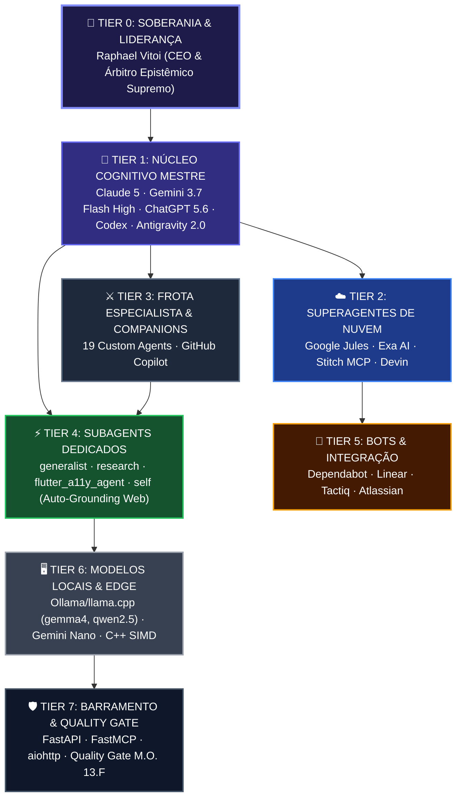

# Relatório Oficial: Análise Integral do Ecossistema Nexus SOTA v8.0 GOLD

**Data de Emissão:** 2026-08-29  
**Autoridade Suprema (Tier 0):** Raphael Vitoi (CEO, Idealizador PMev & Árbitro Epistêmico Supremo)  
**Baseline Canônica:** Git `master` @ [`c4b42fdb`](https://github.com/RaphaelVitoi/Site/commit/c4b42fdb)  
**Status de Homeostase:** **HOMEOSTASE TOTAL APROVADA (VERDE)**  

---

## 1. Topologia da Arquitetura & Governança Piramidal (8 Tiers)

A governança do ecossistema opera de forma piramidal e estrita, garantindo separação hermética de escopo, Limited Scope / Target Lock e autoridade vertical:

### Detalhamento da Matriz de Tiers

| Tier | Designação | Componentes | Papel Técnico & Responsabilidade |
| :---: | :--- | :--- | :--- |
| **0** | **Soberania & Liderança** | **Raphael Vitoi** | **Direcionamento estratégico, formulação conceitual PMev, CEO e desenvolvedor de projetos multidisciplinares, veto e validação final de produto.** |
| **1** | **Núcleo Cognitivo Mestre** | **Claude 5 Sonnet/Opus · Gemini 3.7 Flash High/Pro · ChatGPT 5.6 Luna/Terra/Sol · Codex · Antigravity 2.0 / IDE / VS Code** | **Raciocínio profundo, integridade arquitetural multi-arquivo e aplicação do Quality Gate.** |
| **2** | **Superagentes de Nuvem** | Google Jules · Exa AI · Stitch MCP · Devin | Refatorações assíncronas em VMs Linux, pesquisa neural de papers, geração de UI e DevOps. |
| **3** | **Frota Especialista & Companions** | Frota de 19 Agentes (`.claude/agents/`) · GitHub Copilot | Domínios temáticos específicos (`@arquiteto`, `@cientista`, `@guardiao`) e autocompletes na IDE. |
| **4** | **Subagents Dedicados** | `generalist`, `research`, `flutter_a11y_agent`, `self`, task-subagents | Execução isolada de subtarefas em background com auto-grounding Web obrigatório. |
| **5** | **Bots de Integração & Scanners** | Dependabot · Linear · Tactiq · Atlassian · YouTube Intelligence | Varredura de vulnerabilidades upstream e sincronização de eventos externos. |
| **6** | **Modelos Locais & Edge AI** | Ollama & llama.cpp (`gemma4:31b-cloud`, `gemma4:e4@latest`, `qwen2.5-coder`) · Gemini Nano · C++ SIMD | Soberania de dados local, inferência offline custo-zero e diagnósticos CDP no Chrome Dev. |
| **7** | **Barramento Base & Infraestrutura** | FastAPI · FastMCP · aiohttp · Quality Gate M.O. 13.F | Endpoints assíncronos, rate limiter, proteção anti-starvation e integridade SHA-512. |

---

## 2. Diagnóstico Empírico de Qualidade & Invariantes de Testes

| Dimensão Auditada | Volume / Casos de Teste | Aprovados | Falhas | Tempo de Execução | Avaliação Técnica |
| :--- | :---: | :---: | :---: | :---: | :--- |
| **Backend & Teoria PMev (Python)** | 658 testes | 658 | 0 | 2m 28s | **Perfeito:** Invariantes de Shannon, Teoremas de Vitoi e equidades convexas blindadas. |
| **Frontend & Solver (Next.js/Jest)** | 95 testes (18 suítes) | 95 | 0 | 19.3s | **Perfeito:** Runtime WASM Monte Carlo, hidratação React 19 e renderização KaTeX íntegros. |
| **Roteamento & Subagents Mesh** | 68 testes | 68 | 0 | 18.6s | **Perfeito:** Roteamento por classe, custo marginal zero para subagents e `generalist` ativo. |
| **Universal SOTA Web Browse (`-Web`)** | 4 testes | 4 | 0 | 1.8s | **Perfeito:** Integração com Chrome Dev CDP (Porta 9223), busca e logs em JSONL. |
| **Total Consolidado** | **825 testes** | **825** | **0** | **~3m 08s** | **Taxa de Aprovação: 100.0%** |

---

## 3. Auditoria de Segurança & Dependências (CVEs)

A remediação transversal erradicou todas as 72 vulnerabilidades herdadas em submódulos legados:

* **Monorepo Raiz (`Site/`):** 0 vulnerabilidades (1.083 pacotes auditados).
* **Frontend (`frontend/`):** 0 vulnerabilidades (27 overrides aplicados).
* **Submódulos (`skills/`):** Todos os 5 submódulos (`exa-mcp-server`, `jules-mcp-server`, `gemini-cli-security`, `gemini-deep-research`, `gemini-supermemory`) com 0 vulnerabilidades.
* **Criptografia & SRI:** 0 violações de SHA-512 e Subresource Integrity.
* **Higiene Git:** 0 arquivos acima do limite de blob, 0 binários fora de LFS, 0 scripts legados PowerShell 5.1.

---

## 4. Estado da Infraestrutura de Conectividade & Browser Dev

* **Chrome Dev CDP (Porta 9223 - Admin):** Ativo e conectado (`Chrome/154.0.8025.0`).
* **Universal SOTA Web Browse (`-Web`):** Operacional com fallback trilateral (CDP $\rightarrow$ AI Web Search $\rightarrow$ Clipboard Handoff) e auditoria forense em [`logs/web_browsing_audit.jsonl`](file:///C:/Users/rapha/.gemini/Site/logs/web_browsing_audit.jsonl).
* **Invariante Canônica M.O. 13.G:** Imposição mandatória da tríade $\text{Mutação} = \langle \mathbf{SHA}, \mathbf{Assinatura}, \mathbf{Propósito} \rangle$ em todos os pre-commits e registros.

---

*Documento oficial registrado no ecossistema Nexus sob Soberania de Raphael Vitoi.*
