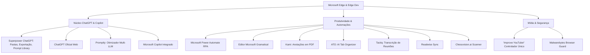

# PLANO ARQUITETURAL OFICIAL — SUÍTES ESPECIALIZADAS DE NAVEGADORES
## SOTA v8.0 GOLD — GOVERNANÇA RAPHAEL VITOI

**Data de Elaboração:** 2026-08-23 (01:25 Horário Local)  
**Governança Suprema (Tier 0):** Raphael Vitoi (Fundador, CEO PokerRacional, Criador do trueicm.com, AHSD/QI 136, TBP, TDAH, Hipótese PMev)  
**Arquiteto do Sistema (Tier 1):** Chico (Super-Admin / Arquiteto SOTA v8.0 GOLD)

---

## 1. RESPOSTA DIRETA: RECOMENDAÇÕES ANTERIORES DO SISTEMA

As recomendações técnicas formuladas na auditoria anterior basearam-se no princípio da **Não-Colisão Termodinâmica de Scripts no DOM**:

1. **Erradicação de Conflitos no YouTube (Cluster 1):**
   - *Problema:* 6 extensões (`Improve YouTube!`, `Enhancer for YouTube`, `Magic Actions`, `YouTube Quick Controls`, `Adblock para YouTube`, `Volume Master`) disputavam o mesmo elemento `<video>` e os mesmos atalhos de teclado.
   - *Recomendação:* Consolidar no **`'Improve YouTube!'`** como único controlador canônico e desativar as extensões sobrepostas.
2. **Modernização e Higiene de Bloqueadores (Cluster 2):**
   - *Problema:* Bloqueadores legados hipertróficos com source maps (AdBlock ocupando 328 MB) gerando latência de I/O.
   - *Recomendação:* Adotar **`uBlock Origin Lite`** (MV3 declarativo, ~2 MB) para anúncios e **`Malwarebytes Browser Guard`** para proteção de ameaças (sem colisão de regras).
3. **Desconflito de Reescrita de UI em LLMs (Clusters 3 e 4):**
   - *Problema:* `Superpower for Gemini` e `Pastas Gemini` injetando simultaneamente árvores concorrentes na barra lateral do Gemini; `Superpower ChatGPT`, `StylerGPT` e `Promptly` disputando a caixa de entrada do ChatGPT.
   - *Recomendação:* Selecionar uma única suíte dominante por plataforma de IA, eliminando duplicatas funcionais.
4. **Purificação de Resíduos e Perfis Órfãos:**
   - *Problema:* Versões antigas retidas pelo auto-updater do navegador (ex: `Tactiq 3.1.6570_0` coexistindo com `3.1.6675_0`).
   - *Recomendação:* Limpeza física atômica dos diretórios de versões legadas.

---

## 2. ADAPTAÇÃO ESTRATÉGICA: SUÍTES ESPECIALIZADAS POR NAVEGADOR

Para eliminar ambiguidades e maximizar a potência cognitiva e técnica, o ecossistema é cindido em duas suítes complementares:

```
┌────────────────────────────────────────────────────────────────────────────────────────┐
│               DISTRIBUIÇÃO ESPECIALIZADA DE SUÍTES SOTA v8.0 GOLD                      │
├──────────────────────────────────────────┬─────────────────────────────────────────────┤
│ 🔵 MICROSOFT EDGE & EDGE DEV             │ 🟡 GOOGLE CHROME & CHROME DEV               │
│ "ChatGPT & Copilot Enterprise Suite"     │ "Gemini & Claude Scientific Suite"          │
├──────────────────────────────────────────┼─────────────────────────────────────────────┤
│ • Foco: OpenAI ChatGPT + MS Copilot      │ • Foco: Google Gemini + Anthropic Claude    │
│ • Automação Desktop & RPA (Power Autom.) │ • Pesquisa Científica (SciGemini, YouMind)  │
│ • Edição Avançada de Documentos (Kami)   │ • Google Cloud & Workspace (Cloud Captains) │
│ • Correção Gramatical (Editor Microsoft) │ • Bloqueio Declarativo Padrão (uBlock Lite) │
└──────────────────────────────────────────┴─────────────────────────────────────────────┘
```

---

## 3. COMPOSIÇÃO DETALHADA DA SUÍTE EDGE (CHATGPT & COPILOT)

*Navegadores:* Microsoft Edge (`Default`) e Microsoft Edge Dev (`Default`)



### Regras de Desconflito no Edge:
* ❌ **Desativar `Superpower for Gemini`** no Edge (preservando-o exclusivamente no Chrome).
* ❌ **Desativar `Enhancer for YouTube` e `YouTube Quick Controls`** no Edge, deixando `'Improve YouTube!'` no controle absoluto.

---

## 4. COMPOSIÇÃO DETALHADA DA SUÍTE CHROME (GEMINI & CLAUDE)

*Navegadores:* Google Chrome (`Default`) e Google Chrome Dev (`Default`)

```mermaid
graph TD
    ChromeSuite[Google Chrome & Chrome Dev] --> AICoreC[Núcleo Gemini & Claude]
    ChromeSuite --> SciGCP[Pesquisa Científica & Cloud]
    ChromeSuite --> DevSecC[DevTools, Mídia & Segurança]
    
    AICoreC --> ClaudeOficial[Claude Oficial Anthropic]
    AICoreC --> SGemini[Superpower for Gemini™: Folders & Prompts]
    AICoreC --> SciGem[SciGemini: Pesquisa Científica & LaTeX]
    AICoreC --> YouMindC[YouMind: Claude & Gemini Clipper/Notes]
    AICoreC --> PromptlyC[Promptly: Prompt Refiner]
    
    SciGCP --> CloudCapt[Admin Tools by Cloud Captains]
    SciGCP --> MboxV[Mbox Viewer]
    SciGCP --> GDocs[Google Docs Offline]
    SciGCP --> KnowtC[Knowt: AI Notes & Flashcards]
    SciGCP --> TactiqC[Tactiq AI Notes]
    SciGCP --> ReadwiseC[Readwise Sync]
    
    DevSecC --> uBlockC[uBlock Origin Lite MV3]
    DevSecC --> MBGC[Malwarebytes Browser Guard]
    DevSecC --> ImpYTC['Improve YouTube!' Controlador Único]
    DevSecC --> JSONVC[JSON Viewer Pro]
    DevSecC --> ViewportC[Responsive Website Testing Toolkit]
```



### Regras de Desconflito no Chrome:
* ❌ **Desativar `Pastas Gemini`** no Chrome (eliminando a concorrência direta com `Superpower for Gemini™`).
* ❌ **Desacoplar o `ChatGPT`** do Chrome (preservando-o exclusivamente na suíte Edge).
* ❌ **Desativar `YouTube Quick Controls`** no Chrome, mantendo `'Improve YouTube!'`.

---

## 5. BENEFÍCIOS SISTÊMICOS DA ESPECIALIZAÇÃO

1. **Zero Colisão no DOM:** Nenhum script disputará seletores CSS ou mutações de layout no Gemini ou no ChatGPT.
2. **Eficiência de Memória:** Cada navegador carrega estritamente os nós e background workers necessários ao seu fluxo de trabalho principal.
3. **Isolamento de Contexto Cognitivo:**
   - **Edge:** Estação de criação, redação, automação de tarefas diárias e diálogos aprofundados via GPT/Copilot.
   - **Chrome:** Estação de pesquisa científica, exploração matemática (PMev/LaTeX), engenharia Google Cloud e orquestração Claude/Gemini.

---
*Plano arquitetural homologado por Chico SOTA v8.0 GOLD sob governança suprema de Raphael Vitoi.*
