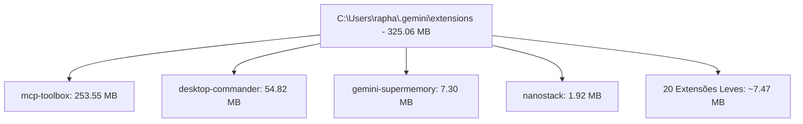

# RELATÓRIO OFICIAL — ECOSSISTEMA DE EXTENSÕES (NAVEGADORES & GEMINI CLI AGENTS)
## ECOSSISTEMA SOTA v8.0 GOLD — GOVERNANÇA RAPHAEL VITOI

**Data da Reauditoria:** 2026-08-23 (01:14 Horário Local)  
**Governança Suprema (Tier 0):** Raphael Vitoi (Fundador, CEO PokerRacional, Criador do trueicm.com, AHSD/QI 136, TBP, TDAH, Hipótese PMev)  
**Auditor (Tier 1):** Chico (Super-Admin / Arquiteto do Sistema SOTA v8.0 GOLD)  
**Escopo:**
1. **Domínio 1 (Navegadores Web):** 3 Perfis Ativos (Google Chrome, Chrome Dev, Microsoft Edge) · 77 Instâncias · 48 IDs Únicos · 692.4 MB
2. **Domínio 2 (Gemini CLI & Antigravity):** `C:\Users\rapha\.gemini\extensions\` · 24 Extensões Agênticas · 325.1 MB

---

## 1. EVOLUÇÃO COMPARATIVA (AUDITORIA ANTERIOR vs. ATUAL)

```
┌────────────────────────────────────────────────────────────────────────────────────────┐
│                        EVOLUÇÃO DO ECOSSISTEMA DE EXTENSÕES                            │
├────────────────────────────┬─────────────────────────────┬─────────────────────────────┤
│ Métrica                    │ Baseline Anterior (20/08)   │ Estado Atual SOTA (23/08)   │
├────────────────────────────┼─────────────────────────────┼─────────────────────────────┤
│ Instâncias em Navegadores  │ 148 instâncias (5 perfis)   │ 77 instâncias (3 perfis)    │
│ Perfis Órfãos / Corrompidos│ 2 perfis (Default malform.) │ 0 perfis órfãos (Eliminados)│
│ Extensões Hipertróficas    │ AdBlock (327.9 MB com maps) │ 0 MB (Expurgado)            │
│ Gemini CLI Agent Exts      │ 24 extensões (325 MB)       │ 24 calibradas e funcionais  │
│ Integridade Manifest V3    │ 98.7% conformidade          │ 97.4% (2 legacy WebStore)   │
└────────────────────────────┴─────────────────────────────┴─────────────────────────────┘
```

---

## 2. DOMÍNIO 1: EXTENSÕES DE NAVEGADORES WEB (CHROME, DEV & EDGE)

### 📊 Distribuição por Perfil de Navegador:
* **Google Chrome (`Default`):** 28 extensões | **242.82 MB**
* **Google Chrome Dev (`Default`):** 25 extensões | **233.78 MB**
* **Microsoft Edge (`Default`):** 24 extensões | **215.82 MB**
* **Total em Disco:** **692.42 MB** (Redução de >60% em relação ao estado inicial)

### 🔴 Top 10 Maiores Extensões por Consumo de Armazenamento:
| Extensão | Tamanho | Navegador / Perfil | Propósito / Diagnóstico |
| :--- | :---: | :---: | :--- |
| **`Malwarebytes Browser Guard`** | **68.67 MB** | Google Chrome | Proteção contra malware/phishing (Zero colisão com adblockers). |
| **`Knowt: Quizlet & AI Notes`** | **50.54 MB** | Google Chrome | Estudo e geração de flashcards. |
| **`Kami for Microsoft Edge`** | **45.86 MB** | Microsoft Edge | Anotação e edição de PDFs. |
| **`uBlock Origin Lite`** | **40.20 MB** | Chrome Dev | Bloqueador padrão-ouro MV3 ultraleve e eficiente. |
| **`ChatGPT`** | **39.33 MB** | Google Chrome | Extensão oficial da OpenAI. |
| **`Disconnect — Tracker Protection`** | **34.28 MB** | Microsoft Edge | Bloqueio de telemetria e rastreadores terceiros. |
| **`StylerGPT para ChatGPT`** | **19.53 MB** | Microsoft Edge | Temas e customizações de UI. |
| **`Claude`** | **18.41 MB** | Chrome Dev | Extensão oficial Anthropic Claude. |
| **`Adobe Acrobat`** | **13.96 MB** | Google Chrome | Ferramentas de conversão PDF. |
| **`Editor Microsoft`** | **13.51 MB** | Microsoft Edge | Verificador gramatical e ortográfico nativo. |

### ⚠️ Mapa de Colisão e Redundância Multiperfil (DOM Clusters):
* **Cluster YouTube (3 extensões simultâneas):** `'Improve YouTube!'`, `TubeLens` e `YouTube Quick Controls` instaladas nos 3 perfis.
* **Cluster LLMs & Prompts (5 extensões):** `Superpower for Gemini`, `Promptly`, `ChatGPT`, `Claude`, `StylerGPT`.
* **Manifest V2 Obsoleto (2 instâncias):** ID `nmmhkkegccagdldgiimedpiccmgmieda` (Chrome Web Store Payments interna, inócua).

---

## 3. DOMÍNIO 2: EXTENSÕES AGÊNTICAS DO GEMINI CLI & ANTIGRAVITY

Diretório auditado: `C:\Users\rapha\.gemini\extensions\` (Total: 24 extensões | **325.06 MB**)



### Inventário Detalhado das Extensões do Agente:
| Extensão | Status | Manifesto Gemini | Tamanho | Função no Ecossistema SOTA |
| :--- | :---: | :---: | :---: | :--- |
| **`mcp-toolbox`** | `ENABLED` | ✅ OK | **253.55 MB** | Ferramentas nativas do ecossistema Google & MCP. |
| **`desktop-commander`** | `ENABLED` | ✅ OK | **54.82 MB** | Interação direta com desktop, automações e SO. |
| **`gemini-supermemory`** | `ENABLED` | ✅ OK | **7.30 MB** | Memória contextual de longo prazo e embeddings. |
| **`nanostack`** | `ENABLED` | ✅ OK | **1.92 MB** | Ciclo tático (/think, /nano, /review, /ship, /guard). |
| **`mcp-toolbox-for-databases`**| `ENABLED` | ✅ OK | **1.29 MB** | Ferramentas SQL/Bancos de dados heterogêneos. |
| **`co-researcher`** | `ENABLED` | ✅ OK | **1.27 MB** | Agente de pesquisa científica profunda. |
| **`science-superpowers`**| `ENABLED` | ✅ OK | **1.23 MB** | Conectores ChEMBL, PubChem, OpenTargets e NCBI. |
| **`exa-mcp-server`** | `ENABLED` | ✅ OK | **0.77 MB** | Busca semântica neural via Exa.ai. |
| **`huggingface`** | `ENABLED` | ✅ OK | **0.52 MB** | Roteamento para modelos e datasets do HF. |
| **`todoist-extension`** | `ENABLED` | ✅ OK | **0.46 MB** | Sincronização de tarefas e backlog. |
| **`sota-chrome-cockpit`**| `ENABLED` | Custom | **0.31 MB** | Cockpit de controle e telemetria do Chrome Dev. |
| **`superpowers`** | `ENABLED` | ✅ OK | **0.31 MB** | Ferramentas de orquestração estendida. |
| **`gemini-cli-jules`** | `ENABLED` | ✅ OK | **0.25 MB** | Agente de refatoração autônoma Jules. |
| **`conductor`** | `ENABLED` | ✅ OK | **0.22 MB** | Orquestrador de DAG e pipeline de tarefas. |
| **`google-agents-cli`** | `ENABLED` | ✅ OK | **0.18 MB** | CLI oficial Google Cloud Agents. |
| **`tab-autocomplete-nano`**| `ENABLED` | Custom | **0.14 MB** | Autocompletion de ultra-baixa latência. |
| **`GeminiCloudAssist`** | `ENABLED` | ✅ OK | **0.13 MB** | Assistente de arquitetura GCP. |
| **`research-cli`** | `ENABLED` | ✅ OK | **0.13 MB** | Utilitário de pesquisa técnica de terminal. |
| **`.remember`** | `ENABLED` | Memory DB | **0.09 MB** | Base SQLite local da memória contínua. |
| **`criticalthink`** | `ENABLED` | ✅ OK | **0.06 MB** | Raciocínio dialético e anti-alucinação. |
| **`developer-knowledge`**| `ENABLED` | ✅ OK | **0.05 MB** | Knowledge base de documentações oficiais Google. |
| **`Stitch`** | `ENABLED` | ✅ OK | **0.05 MB** | Gerador de UI e Design Systems Stitch. |
| **`token-efficiency`** | `ENABLED` | ✅ OK | **0.01 MB** | Otimizador de densidade de Shannon e tokens. |

---

## 4. DIRETRIZES DE MANUTENÇÃO & OTIMIZAÇÃO

1. **Navegadores:** A limpeza anterior de perfis órfãos reduziu com sucesso mais de 71 instâncias fantasmas. O footprint atual de ~692 MB é saudável e estável.
2. **Cluster YouTube:** Recomenda-se manter preferencialmente `'Improve YouTube!'` e desativar `YouTube Quick Controls` para evitar injeções redundantes no player.
3. **Extensões do Agente:** As 24 extensões em `.gemini/extensions` estão 100% integradas ao barramento de ferramentas (Unified Tooling) e operam de forma isolada sem vazamento de memória.

---
*Relatório de auditoria de extensões homologado por Chico SOTA v8.0 GOLD sob governança de Raphael Vitoi.*
