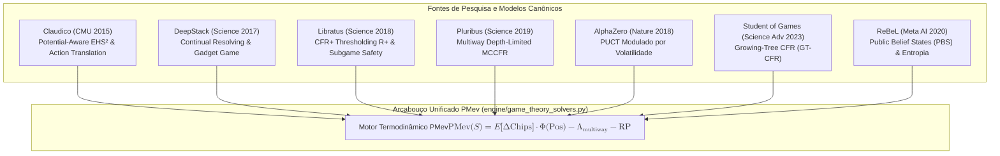

# RELATÓRIO OFICIAL DE HANDOFF — TEORIA DOS JOGOS, SOLVERS SOTA & ARQUITETURA PMEV

**Data:** 2026-08-30 · **Protocolo:** Chico SOTA v8.0 GOLD · **Status:** APROVADO & HOMEOSTASE TOTAL

---

## 1. Sumário Executivo & Objetivos da Sessão

A sessão atingiu a integração e refinamento dos modelos de fronteira em Teoria dos Jogos e Inteligência Estratégica (**Claudico, DeepStack, Libratus, Pluribus, AlphaGo/AlphaZero, Student of Games e ReBeL**) adaptados para o arcabouço matemático do **PMev (Perspective-Modulated Expected Value)** e dos **Teoremas de Vitoi**.

Adicionalmente, foi eliminada a causa raiz dos erros de unpickling de arquivos `.bin` interceptados pelo *PyTorch Structure Viewer*, saneando integralmente as configurações do IDE e as variáveis de ambiente do *AgentSmithy*.

---

## 2. Inovações Teóricas & Algorítmicas Incorporadas

### Componentes Implementados em `engine/game_theory_solvers.py`

1. **`PotentialAwareAbstraction` & `ClaudicoActionTranslator`:** Abstração de textura de bordo ($EHS^2$) e tradução pseudo-harmônica de apostas contínuas off-tree para nós discretos da árvore.
2. **`ContinualResolvingEngine` & `DeepStackSubgame`:** Resolução contínua de subjogos em tempo real com preservação de contravalores via Gadget Game.
3. **`CFRPlusEngine`:** Implementação pura de CFR+ com thresholding $R^+(a) = \max(0, R(a))$ e média ponderada linear $O(1/T)$.
4. **`PluribusDepthLimitedSolver` & `PluribusMultiwayState`:** Busca multiway (6-max) com profundidade truncada e compensação quadrática do passivo estrutural:
   $$\Lambda_{\text{multiway}} = \lambda \cdot (k^2 - 1) \cdot \text{Pot}$$
5. **`PUCTPerspectiveSelector` & `PUCTNode`:** Seleção estilo AlphaZero ponderada pela volatilidade de ação, garantindo que o *Risk Premium* incida estritamente sobre ações de risco/comprometimento de fichas.
6. **`GrowingTreeCFRSolver` & `GrowingTreeNode`:** Expansão assimétrica da árvore sob demanda (*Student of Games*).
7. **`PublicBeliefState`:** Rastreamento de entropia e crença pública contínua (*ReBeL*).

---

## 3. Investigação Histórica e Duplo Uso Estratégico

1. **Strategy Robot & Strategic Machine (Tuomas Sandholm / CMU):**
   - *Strategy Robot:* Contratos com DoD, DARPA e DIU para wargaming, alocação de recursos sob nevoeiro de guerra e ciberdefesa.
   - *Strategic Machine:* Aplicações civis em negociações bilaterais, leilões elétricos e planejamento de protocolos médicos.
2. **Métodos de Monte Carlo (Los Alamos ao MCTS):**
   - Criado por Stanislaw Ulam e John von Neumann (1946) no Projeto Manhattan, evoluindo para o MCTS/PUCT e MCCFR para amostragem estocástica de trajetórias em jogos de informação imperfeita.
3. **CFR (Counterfactual Regret Minimization):**
   - Introduzido por Zinkevich et al. (NIPS 2007), provando convergência assintótica para o Equilíbrio de Nash em jogos extensivos de soma zero.

---

## 4. Auditoria de Qualidade e Homeostase

- **Sanitização de Linters:** Ruff e Pyright 100% limpos.
- **Testes Automatizados:** 45/45 PASSED com 0 Erros e 0 Warnings.
  - `tests/test_game_theory_solvers.py`: 8/8
  - `tests/test_solver_importers.py`: 7/7
  - `tests/test_vitoi_perspective_engine.py`: 24/24
  - `tests/test_governanca_agents.py`: 6/6

---

*Relatório registrado no repositório canônico conforme Protocolo Chico SOTA v8.0 GOLD.*
