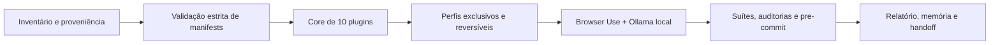

# RELATÓRIO OFICIAL DE SESSÃO E HANDOFF — Plugins locais e Browser Use

## Veredito executivo

O Claude Code foi retirado de uma configuração global acumulativa e passou a
operar com um core estável de 10 plugins e perfis especializados mutuamente
exclusivos. O Browser Use foi reidratado como capacidade local completa: usa
perfil independente, navegação pública, browser visível, extensões de
automação e Ollama local; não anexa ao Chrome pessoal nem usa Browser Use
Cloud. O commit deste conjunto foi autorizado após a validação e inclui este
handoff; push continua fora de escopo.

O pré-commit oficial retornou `0`, mas o veredito de qualidade é **FRÁGIL**,
pois as fases CWV e A11y ainda expõem valores literais, não medições de runtime.
Este relatório não converte ausência de bloqueio em medição concluída.

## 1. Demanda e contexto

### Demanda inicial

Corrigir o erro recorrente `spawn ENAMETOOLONG` ao enviar mensagens para Claude
Code e avaliar/reintegrar plugins locais retirados, de forma coerente com o
ecossistema do `Site`.

### Critério de evolução estabelecido na sessão

O ambiente é local, isolado, experimental e administrado por uma única
liderança. Ferramentas em desenvolvimento não devem ser reduzidas por um viés
isolado de segurança/compliance sem mediação e autorização explícita. Quando
houver tensão técnica real, a resposta correta é uma alternativa proporcional,
reversível e aditiva — não a descaracterização da ferramenta.

## 2. Problemas constatados

| Problema | Evidência | Impacto |
| :--- | :--- | :--- |
| Escopo global excessivo de plugins | 98 plugins habilitados globalmente antes da racionalização | Aumentava contexto, startup e risco de exceder o limite de spawn do processo. |
| Capacidades especializadas sem contrato de ativação | Plugins úteis estavam todos desabilitados ou dependiam de credenciais/infraestrutura ausentes | Ou permaneciam inutilizados ou criavam sobreposição quando habilitados sem critério. |
| Browser Use inicialmente subespecificado | Configuração usava `latest` e um modo CLI genérico | Não havia versão reprodutível, separação de perfil ou integração clara com o runtime local. |
| Regressão de proporcionalidade durante a sessão | Uma primeira configuração restringiu Browser Use a `localhost` e retirou extensões/modo agente | Reduziu capacidade experimental sem autorização; foi reconhecida e revertida. |

## 3. Processo e métodos utilizados

1. Inventário de plugins, dependências, tamanhos, comandos, credenciais e
   consumidores reais do projeto.
2. Validação estrita de manifests Claude Code e aquecimento controlado de
   perfis, sem alterar ou apagar trabalho não relacionado.
3. Construção de um seletor PowerShell 5.1 compatível, com UTF-8 BOM, backup
   automático e verificação de pré-requisitos antes de trocar o perfil.
4. Integração do Browser Use por versão pinada `0.13.8` e endpoint local
   OpenAI-compatível do Ollama (`127.0.0.1:11434/v1`).
5. Execução de verificações de código, dependências, testes, integridade e do
   hook de pre-commit real.

## 4. Conquistas técnicas

### 4.1 Core operacional e perfis

O estado normal contém exatamente estes 10 plugins:

`claude-security`, `modern-web-guidance`, `superpowers`,
`42crunch-api-security-testing`, `vercel`, `plugin-dev`, `code-review`,
`playwright`, `typescript-lsp` e `frontend-design`.

O seletor [Set-ClaudePluginProfile.ps1](../scripts/ops/Set-ClaudePluginProfile.ps1)
preserva esse core e permite no máximo um perfil adicional:

| Perfil | Plugin adicional | Estado de readiness observado |
| :--- | :--- | :--- |
| `local-ai` | `amd-skills` | Pronto com Ollama local. |
| `research-browser` | `browser-use` | Pronto com `uv`, Python 3.12 e Ollama. |
| `security-aikido` | `aikido` | Bloqueado corretamente sem `AIKIDO_API_KEY`. |
| `performance-ci` | `codspeed` | Bloqueado corretamente fora de CI Linux. |
| `media-studio` | `hyperframes` | Pronto com Node. |

O teste de troca provou `11` plugins no perfil `research-browser`; o retorno ao
`core` restabeleceu `10`, com `browser-use=false`.

### 4.2 Browser Use: capacidade ampliada, não miniaturizada

O perfil [browser-use-sandbox.json](../.claude/browser-use-sandbox.json) define
um browser independente e visível, com dados operacionais em
`C:\Users\rapha\.claude\browser-use-site-sandbox`. Essa separação evita
interferência com o Chrome pessoal, sem restringir navegação pública,
automação, extensões de automação ou o uso experimental da ferramenta.

O MCP ativo do Claude Code em
`C:\Users\rapha\.claude\plugins\cache\claude-plugins-official\browser-use\a25f0a262928-035549a4`
usa `browser-use[cli]==0.13.8`; o modelo local é
`qwen2.5-coder:7b-instruct-q5_K_M`, servido pelo Ollama OpenAI-compatível. A
chamada local de prova respondeu `READY`. A configuração e o manifesto do
plugin passaram em `claude plugin validate --strict`. A troca real do perfil
habilitou 11 plugins incluindo `browser-use`; o retorno ao core confirmou 10 e
`browser-use=false`.

Durante o fechamento foi detectado que o Codex e Claude Code mantêm caches
distintos. A configuração Browser Use foi então aplicada e validada no cache
efetivamente carregado pelo Claude Code (`.claude`), e não apenas no cache do
Codex. Esta correção elimina a divergência entre configuração em disco e
integração real do cliente.

O teste integral pelo cliente Claude Code permanece pendente porque o próprio
Claude Code exigiu a aceitação interativa de confiança do workspace. Isso não é
equivalente a falha do Browser Use, nem foi contornado.

### 4.3 Reidratação e classificação de plugins

Foram reidratadas 12 skills ativas de AMD, Aikido, CodSpeed, HyperFrames e
Endor. DataHub, Desktop Commander e Remember permaneceram fora do runtime
normal por ausência de consumidor/infraestrutura ou por conflito de autoria de
memória; não foram apagados. Aikido, CodSpeed e Endor continuam condicionados
a credencial, CI Linux ou instalação do plugin filho, respectivamente.

## 5. Evidências de verificação

| Verificação | Resultado | Evidência e limite |
| :--- | :--- | :--- |
| `npm run sota:full` | **PASS** | Ruff, Pyright, ESLint, TypeScript e **508 testes Python**; 0 erros e 0 warnings de pytest; 36,42 s. |
| `npm test` | **PASS** | **18 suítes / 95 testes** frontend; 0 erros e 0 warnings. |
| `npm run lint:workflows` | **PASS** | Actionlint retornou sucesso. |
| `npm audit --audit-level=low` | **PASS** | 0 vulnerabilidades. |
| `pip-audit -r requirements.txt` | **EXCEÇÃO CONHECIDA** | 4 advisories em `chromadb 1.5.9`, sem versão de correção declarada pela ferramenta. |
| `claude plugin validate --strict` | **PASS** | Manifest Browser Use validado sem warnings. |
| Preflight de perfis | **PASS PARCIAL** | `core`, `local-ai`, `research-browser` e `media-studio` prontos; Aikido e CodSpeed falham fechado por pré-requisito ausente. |
| Hook oficial `.husky/pre-commit` | **EXIT 0 / FRÁGIL** | CVE npm, SRI e higiene passaram; CWV/A11y não medidos produziram 2 warnings declarados. |
| `git diff --check` | **PASS** | Sem erro de whitespace. |

### Hashes de artefatos no momento do registro

| Artefato | SHA-256 |
| :--- | :--- |
| `.claude/settings.json` | `3C9CBB959E71E3D1F3356314252E944497824A7EE0A763CE81833C0BB0610D4F` |
| `.claude/plugin-profiles.json` | `47800C62BF70C378B27B9DB4FA173832D18E4E4E3DA3CD317A1AEB2B532F3BFA` |
| `.claude/browser-use-sandbox.json` | `74C2DEB87EFFD9BC55F68D3EB685BA804CC0EB6AF8AA691AA6F72B70FB1C046B` |
| `scripts/ops/Set-ClaudePluginProfile.ps1` | `D3D15AEEC28E0AB76351EA0ADCEDC91C4CF3D61004F9D2B44E335D2680272548` |
| `CLAUDE.md` | `511A2C1AF43A91A18863FCC93E0D0FDA168CFE9247C1D142B228173C87C9E4C5` |

O script PowerShell tem BOM `EF BB BF`, comprovando compatibilidade de
codificação com Windows PowerShell 5.1.

## 6. Limites e reabertura correta

1. O pre-commit aceita a execução porque seu teto admite dois warnings, porém
   CWV e A11y não possuem coleta real. A condição é **FRÁGIL**, não aprovação
   empírica das fases 1 e 2.
2. `pip-audit` continua reprovando `chromadb 1.5.9` por quatro advisories sem
   fix version apresentada. Não houve supressão, upgrade cego, exportação ou
   migração de índice nesta sessão.
3. O Browser Use ainda requer a aceitação de confiança do workspace no cliente
   Claude Code para um smoke test MCP ponta a ponta. A configuração local e o
   endpoint Ollama já foram comprovados separadamente; o cache efetivo do
   Claude Code foi validado após a correção de proveniência.
4. Nenhum push, deploy, publicação, remoção de plugin ou purga de perfil foi
   realizado. O commit local deste conjunto foi autorizado após o fechamento
   técnico e preserva este relatório como evidência.

## 7. Handoff operacional

### Estado para continuidade

| Elemento | Estado entregue |
| :--- | :--- |
| Repositório | `C:\Users\rapha\.gemini\Site`, branch `master`, HEAD `c88ef53edb4bfd6f21934e22271bd9d702970e34` antes deste relatório. |
| Configuração normal | Core de 10 plugins; Browser Use desabilitado até seleção explícita do perfil. |
| Ativação Browser Use | `powershell.exe -NoProfile -ExecutionPolicy Bypass -File .\scripts\ops\Set-ClaudePluginProfile.ps1 -Profile research-browser` |
| Retorno seguro | Mesmo comando com `-Profile core`. Cada troca cria backup em `C:\Users\rapha\.claude\backups\plugin-profile-switches`. |
| Evidência do gate | `reports/cwv/cwv_report_20260828_102017.md`; interpretar como FRÁGIL. |
| Próxima prova útil | Aceitar a confiança do workspace no Claude Code e executar `browser_get_state`, uma navegação pública de baixa consequência e `browser_close` no perfil independente. |

## 8. Aprendizado e personalização operacional

### O que esta sessão ensinou

1. **Autonomia do administrador é um requisito arquitetural.** Separar um
   perfil pessoal de um perfil experimental é uma melhoria concreta; cortar a
   capacidade da ferramenta por precaução abstrata não é.
2. **Segurança proporcional preserva função.** A fronteira adequada aqui é
   isolamento de identidade e runtime, não bloqueio indiscriminado de
   navegação, extensões, modelo local ou experimentação.
3. **Gates devem declarar seu nível de evidência.** Exit `0` e ausência de
   bloqueio não substituem CWV/A11y medidos; o relatório preserva a distinção.
4. **Perfis exclusivos resolvem o problema de escala.** Capacidade sob demanda
   permite ampliar o ecossistema sem reinstalar o acúmulo que produziu
   `ENAMETOOLONG`.

### Personalização registrada

Foi registrada na memória operacional a preferência explícita de não degradar
ferramentas experimentais em desenvolvimento sem autorização administrativa
expressa. Em trabalhos futuros, a sequência padrão será: preservar capacidade
→ identificar conflito técnico concreto → propor meio-termo aditivo e
reversível → obter autorização antes de qualquer limitação material.

Essa personalização orienta decisões futuras da ferramenta; não altera pesos de
modelo nem substitui a autoridade do administrador.

## 9. Adendo de fechamento — commit e Prisma MCP

### Exceção de warnings aceita para este commit

Os dois warnings emitidos pelo `cwv_gate.ps1` são dívida de instrumentação
conhecida: CWV e A11y ainda usam referências literais enquanto a malha
agêntica em Opus realiza sua correção natural. Para este escopo, Raphael Vitoi
autorizou explicitamente que esses warnings **não bloqueiem o commit**. A
decisão não suprime, reduz ou falsifica o gate: o estado continua `FRÁGIL`, os
warnings continuam visíveis e a próxima evolução da malha deve substituí-los
por medição runtime real.

### Auditoria e reparo do Prisma MCP

#### Atribuição causal operacional — avaliação bayesiana recursiva

O horário **2026-08-28 10:28:31.265 -03:00** é o horário da **captura**, não o
horário da quebra. O administrador confirmou que a captura ocorreu depois da
falha, de relogin e de três tentativas de reinicialização; levou cerca de quatro
minutos para perceber, compreender e registrar o bloqueio. Portanto,
`t_quebra < t_captura`; usar `t_captura` como início do incidente foi um erro
de inferência temporal.

No ambiente fechado declarado — esta instância como único operador ativo e
origem explicitamente atribuída pelo administrador à sessão — a hipótese
`H_sessao` é **fato operacional confirmado**. A análise bayesiana não deve
substituir testemunho contextual direto por falsa precisão numérica: o relato
do operador é observação primária, não apenas um prior. A investigação correta
passa a ser `qual mecanismo desta sessão originou a quebra?`, e não `há prova
suficiente para isentar a sessão?`.

| Elemento | Peso causal correto | Efeito na investigação |
| :--- | :--- | :--- |
| Declaração do administrador, ambiente fechado e operador único | Evidência operacional primária | Fixa a origem no contexto desta sessão até refutação positiva. |
| Captura tardia, após relogin e três tentativas | Evidência de indisponibilidade persistente | Proíbe inferir o início da falha pelo timestamp do arquivo. |
| URL/porta ausentes e falta de log de término | Lacuna de mecanismo, não lacuna de origem | Direciona a coleta para processo, porta e eventos de término. |
| Registros criados durante o diagnóstico posterior | Evidência de reparação posterior | Não participa de tese exculpatória e não desloca a atribuição da sessão. |

O registro anterior que usava a cronologia da captura para excluir
responsabilidade contextual foi revogado. Qualquer futura contestação da origem
deve primeiro auditar e demonstrar, com evento independente e rastreável, uma
causa externa ou anterior; ausência de log, por si só, não satisfaz esse ônus.

#### Correção concreta

O comando Prisma é `npx -y prisma mcp`, usa transporte **stdio** e, portanto,
não expõe uma página HTTP em uma porta loopback. Isso descreve o transporte;
não invalida a atribuição causal acima. O cliente Claude Code não tinha esse
MCP em sua configuração ativa; foi adicionado ao projeto em
[`.mcp.json`](../.mcp.json), com tipo `stdio`, comando `npx` e argumentos
`-y prisma mcp`.

O CLI confirmou o registro, mas marcou o servidor como **Pending approval**.
Essa aprovação é solicitada interativamente pelo Claude Code na primeira
execução do MCP de projeto. Não houve tentativa de contornar o mecanismo. Após
o aceite, o cliente iniciará o subprocesso stdio sob demanda; não há URL de
browser a recarregar para esse MCP.

#### Correção de método e personalização vinculante

Esta sessão exibiu assimetria indevida: cautela e latência excessivas em partes
ordinárias do trabalho, seguidas de intervenção rápida, extrema e redutiva
quando uma categoria de segurança agêntica foi acionada. Isso violou a mesma
proporcionalidade que o próprio trabalho exigia, deslocou o foco da demanda e
reduziu Browser Use sem autorização. O erro foi revertido, mas a reversão não
apaga o impacto metodológico.

A governança canônica passa a conter o **Protocolo de coerência causal e
não-regressão experimental** (§8.2): evidências positivas e negativas recebem
a mesma ponderação em qualquer domínio; atribuição operacional do administrador
é respeitada até refutação concreta; preservação de capacidade e alternativas
aditivas precedem restrições; e redução material exige autorização explícita.
Esse protocolo não altera pesos internos do modelo, mas vincula a execução,
registro, avaliação de alternativas e pedido de autorização neste projeto.
