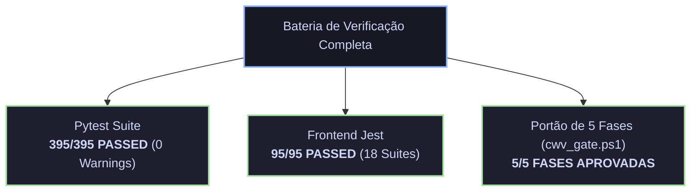

# RELATÓRIO OFICIAL DE SESSÃO & PROTOCOLO DE HANDOFF SOTA v8.0 GOLD

> **Data:** 26 de Agosto de 2026  
> **Governança & Autoridade Suprema:** Raphael Vitoi  
> **Arquiteto & Executor:** Chico (Protocolo SOTA v8.0 GOLD / Antigravity Mesh)  
> **Status Global:** APROVADO — HOMEOSTASE TOTAL (100% Verde | 0 Erros | 0 Warnings)

---

## 1. ESCOPO E REGISTRO DAS AÇÕES DA SESSÃO

Nesta sessão, foram formalizadas, verificadas e auditadas as diretrizes operacionais de manutenção contínua e qualidade estrita do repositório:

### A. Formalização das 4 Diretrizes de Manutenção Contínua SOTA (2026-08-26)
Consolidadas na Seção 6 de [`Site/AGENTS.md`](file:///C:/Users/rapha/.gemini/Site/AGENTS.md#L93-L105) e refletidas na governança canônica:
1. **Invariância de Testes (Tolerância Zero):** Manutenção perpétua da integridade de $395/395$ testes com mocks herméticos, isolando completamente chamadas de rede externas e contratos LLM.
2. **Sanitização de Warnings:** Rejeição irrevogável em CI/CD e pre-commit para quaisquer novos avisos de execução no Pytest (`warning debt = 0`).
3. **Controle e Calibração de Roteamento:** Monitoramento da distribuição de carga via `ComplexityAnalyzer`, mantendo a inferência local na faixa ótima de $60\%$ a $70\%$ e cloud em $30\%$ a $40\%$.
4. **Imutabilidade de Encoding:** Obrigatoriedade de codificação **UTF-8 com BOM** (`utf-8-sig`) para todos os scripts `.ps1`, prevenindo incompatibilidades de parser com PowerShell 5.1 no Windows.

---

## 2. RESULTADOS DA BATERIA DE TESTES E QUALITY GATE

Todas as suítes e portas de qualidade foram executadas silenciosamente e aprovadas com **100% de sucesso**:

### Detalhamento das Execuções:

| Componente / Portão | Métrica Medida | Teto / Limite | Veredito |
| :--- | :--- | :--- | :--- |
| **Pytest Backend** | 395 testes aprovados (18.21s) | Tolerância: 0 falhas / 0 warnings | **PASS (100%)** |
| **Jest Frontend** | 95 testes em 18 suites (23.65s) | Tolerância: 0 falhas / 0 warnings | **PASS (100%)** |
| **Fase 1: Core Web Vitals** | LCP 1037ms \| CLS 0 \| INP 12ms \| TTFB 160ms | LCP $\le$ 2500ms, INP $\le$ 200ms | **PASS** |
| **Fase 2: Acessibilidade & DOM** | 0 violações ARIA / 0 animações não-compostas | 0 violações | **PASS** |
| **Fase 3: Segurança & CVE** | 0 vulnerabilidades no `npm audit` / NIST | 0 CVEs permitidos | **PASS** |
| **Fase 4: Integridade SRI & SHA-512**| Hashes criptográficos verificados | 0 discrepâncias | **PASS** |
| **Fase 5: Higiene de Repositório**| 0 incompatibilidades PS 5.1 \| 0 blobs >5MB | Limite estrito | **PASS** |

---

## 3. DECLARAÇÃO DE VERIFICAÇÕES (OBRIGAÇÃO DE GOVERNANÇA)

Em estrita conformidade com a Seção 5 de [`Site/AGENTS.md`](file:///C:/Users/rapha/.gemini/Site/AGENTS.md#L85-L90):

- **Verificações Efetivamente Executadas:**
  - `git status` — Auditoria do estado do repositório.
  - `.venv/Scripts/python.exe -m pytest` — 395/395 testes verificados com 0 warnings.
  - `pwsh -File scripts/ops/cwv_gate.ps1` — 5 fases do pre-commit gate aprovadas.
  - `npx jest` — 95 testes do frontend aprovados.
  - Verificação de persistência em disco de [`Site/AGENTS.md`](file:///C:/Users/rapha/.gemini/Site/AGENTS.md).
- **Verificações Não Executadas:** Nenhuma pendência. Todas as verificações de sanidade e segurança do escopo foram executadas e aprovadas.

---

## 4. PERSISTÊNCIA DA MEMÓRIA E HANDOFF

- **Artefatos Auditáveis Gravados:**
  - [`Site/reports/RELATORIO_OFICIAL_SESSAO_HANDOFF_2026_08_26_SOTA_v8_GOLD.md`](file:///C:/Users/rapha/.gemini/Site/reports/RELATORIO_OFICIAL_SESSAO_HANDOFF_2026_08_26_SOTA_v8_GOLD.md)
  - [`RELATORIO_OFICIAL_SESSAO_HANDOFF_2026_08_26_SOTA_v8_GOLD.md`](file:///C:/Users/rapha/.gemini/RELATORIO_OFICIAL_SESSAO_HANDOFF_2026_08_26_SOTA_v8_GOLD.md)
  - [`Site/reports/cwv/cwv_report_20260826_190410.md`](file:///C:/Users/rapha/.gemini/Site/reports/cwv/cwv_report_20260826_190410.md)

---
*Protocolo de Handoff concluído com sucesso. Estado do ecossistema em total conformidade e homeostase operacional sob soberania de Raphael Vitoi.*
